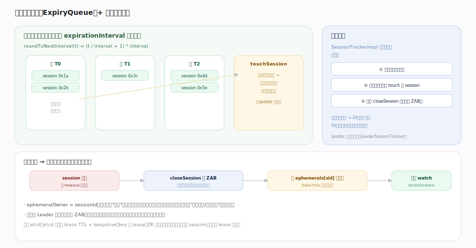
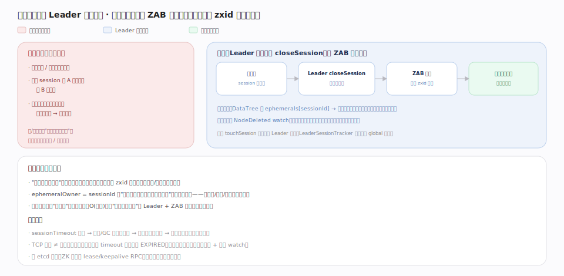

# ZooKeeper 原理 · 支撑主线 · 会话与临时节点

> **定位**：会话与临时节点是 ZooKeeper 的**协调生命周期机制**——把"客户端连接的存活"变成"可被全集群感知的成员状态"（对应 etcd 的 Lease，但 ZK 绑连接而非显式租约）。session 是 ephemeral 节点与 watch 的宿主：会话过期 → 临时节点删、watch 清。它依赖 [[ZAB 原子广播]]（closeSession 走共识全序回收）、驱动 [[数据树 DataTree]] 的 ephemerals 索引、触发 [[Watch 机制]]。核实基准：`server/SessionTrackerImpl.java`、`server/ExpiryQueue.java`、`server/quorum/{LeaderSessionTracker,LocalSessionTracker}.java`（3.10.0-SNAPSHOT）。

## 一、分桶过期 + 临时节点回收

**会话**：客户端握手分得全局 `sessionId` + 协商 `timeout`（存 `sessionsWithTimeout` `SessionTrackerImpl.java:53`，`createSession` `:261`）。ZK 用**分桶（bucketing）**高效管理海量会话过期：

- **分桶算法**：把每个会话的过期时刻**向上对齐到 `expirationInterval` 的整数倍**——`roundToNextInterval(t) = (t/interval + 1)*interval`（`ExpiryQueue.java:53`）。同一时间窗内到期的会话落进同一个桶。
- **续期即移桶**：`touchSession`（`:179`）在收到心跳/请求时按新超时算出新桶、把会话从旧桶移到后面的桶（`ExpiryQueue.update` `:84`）。
- **过期线程**：`SessionTrackerImpl` 本身是一个线程（`:45`），循环"等到下一个桶到点 → 取出该桶所有未续期会话 → 发起 `closeSession`"。批量处理整桶使成本是 O(桶数) 而非 O(会话数)。

**临时节点回收**是一条因果链：session 过期 → `closeSession` 走 **ZAB** 全序广播（各节点一致回收）→ 按 DataTree 的 `ephemerals[sessionId]` 索引批量删除该会话的临时节点 → 触发 `NodeDeleted` watch。`ephemeralOwner = sessionId` 是临时节点归属的标记——**会话在节点在、会话亡节点删**，这是 ZK 用于故障检测/成员感知/选主的机制根。

## 深化 · 为什么过期由 Leader 裁决

会话过期若各节点各自判定，会因时钟/网络差异导致同一临时节点在不同副本上存亡不一致。ZK 让 **Leader 统一裁决**（`LeaderSessionTracker`）：过期经 `closeSession` 事务走 ZAB 全序广播，所有节点在**同一 zxid 点**一致删除该会话（按 `ephemerals[sessionId]` 索引）并触发 `NodeDeleted` watch。心跳 `touchSession` 也汇聚到 Leader 续期。这保证"临时节点存在性"本身也是强一致的——分桶只解决"何时判"，"如何一致地删"由 Leader + ZAB 保证。

## 拓展 · 会话相关机制

| 机制 | 说明 | 锚点 |
|---|---|---|
| 分桶过期 | 过期时刻对齐到 interval 整数倍，整桶批量检查 | `ExpiryQueue.java:53/84` |
| 心跳续期 | CONNECTED 时约每 timeout/3 发 PING | `SessionTrackerImpl.touchSession:179` |
| 会话迁移 | TCP 断连可重连到集群另一台，sessionId 不变 | Learner/ZooKeeperServer 重连握手 |
| local session | 只读/轻量会话可不经 ZAB 全局广播（优化） | `LocalSessionTracker` |
| ephemeralOwner | 临时节点 = sessionId，持久 = 0 | `DataNode.stat` |
| timeout 夹取 | 被夹在 [2×tickTime, 20×tickTime] | ZooKeeperServer min/maxSessionTimeout |

## 调优要点（关键开关）

- `tickTime`（默认 2000ms）：`expirationInterval` 基准；也定 minSessionTimeout=2×tick、maxSessionTimeout=20×tick。
- 客户端 `sessionTimeout`：太小→网络抖动即过期→临时节点误删（锁误释放）；太大→故障感知慢。按网络与 GC 停顿留裕量。
- `zookeeper.localSessionsEnabled` + `localSessionsUpgradingEnabled`：开启本地会话减轻 leader 负担（大量只读客户端场景）。
- 客户端要处理 `SessionExpired`：必须重建会话 + 重建临时节点 + 重挂 watch。

## 常见误区与工程要点

- **以为 TCP 断开 = 会话结束**：断连仅进入重连；只有超 timeout 未续期才 EXPIRED。反之 GC 长停顿可能触发过期。
- **依赖临时节点做锁却设过小 timeout**：抖动导致会话过期 → 锁临时节点被删 → 多个客户端同时以为持锁。
- **会话恢复后不重挂 watch**：过期重建的新会话不继承旧 watch，需重新注册。
- **把 session 当 etcd lease**：ZK 无显式租约对象/KeepAlive RPC，绑的是连接生命周期。

## 源码锚点（3.10.0-SNAPSHOT · master 53a78e3）

| 论断 | 锚点 |
|---|---|
| SessionTrackerImpl 是独立线程，扫过期桶 | `server/SessionTrackerImpl.java:45` |
| sessionsWithTimeout：sessionId → 协商 timeout | `server/SessionTrackerImpl.java:53` |
| sessionExpiryQueue：分桶过期队列 | `server/SessionTrackerImpl.java:51` |
| createSession：分配全局 sessionId | `server/SessionTrackerImpl.java:261` |
| ExpiryQueue 分桶算法主体 | `server/ExpiryQueue.java:35` |
| update：把会话过期时刻向上对齐到 expirationInterval、落桶 | `server/ExpiryQueue.java:84` |
| 心跳到期对齐（roundToNextInterval 落桶起点） | `server/ExpiryQueue.java:50` |
| 会话过期→closeSession 走 ZAB 全序回收 | `server/quorum/Leader.java:1295`（propose）|
| 回收删该会话所有临时节点（ephemerals 索引） | `server/DataTree.java:154`、`server/DataTree.java:534` |
| 临时节点创建时绑 ephemeralOwner=sessionId | `server/DataTree.java:410` |
| 会话回收同时清 watch | `server/watch/WatchManager.java:46` |

## 一句话总纲

**会话与临时节点是 ZooKeeper 的协调生命周期机制：客户端握手得全局 sessionId + 协商 timeout，CONNECTED 时约每 timeout/3 发 PING 心跳续期；服务端用分桶过期——把过期时刻对齐到 expirationInterval 整数倍、整桶批量检查、touchSession 续期即移桶，使海量会话过期成本为 O(桶数)；会话超时未续期则由 Leader 统一发起 closeSession 走 ZAB 全序回收，按 DataTree 的 ephemerals[sessionId] 索引批量删该会话的临时节点并触发 NodeDeleted watch。ephemeralOwner=sessionId 让"会话在节点在、会话亡节点删"成为强一致事实——这是分布式锁/选主/成员感知的根基，与 etcd 显式 lease 不同，ZK 绑的是连接生命周期。**
