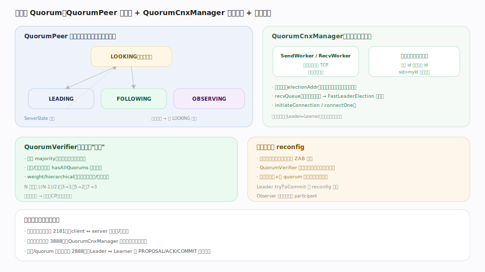

# ZooKeeper 原理 · 支撑主线 · 集群与 Quorum

> **定位**：集群与 Quorum 是 ZooKeeper 的**成员协调与拓扑层**——管理每个节点的角色状态机、选举通信、"过半"的定义与动态成员变更（对应 etcd 的成员与集群）。它为 [[ZAB 原子广播]] 提供选举通信（QuorumCnxManager）与过半判定（QuorumVerifier）、承载 [[会话与临时节点]] 的 local/global 会话拓扑。核实基准：`server/quorum/{QuorumPeer,QuorumCnxManager,QuorumVerifier,QuorumMaj}.java`（3.10.0-SNAPSHOT）。

## 一、状态机 + 选举连接 + 过半 + 重配置

- **QuorumPeer 状态机**：每个节点跑一个主循环，在四态间流转（`ServerState` 枚举 `QuorumPeer.java:578`）——**LOOKING**（选举中，调 `lookForLeader`）、**LEADING**（当选 leader）、**FOLLOWING**（跟随，投票+服务读）、**OBSERVING**（观察者，不投票只同步+读）。Leader 失联过半则回 LOOKING 重选。
- **QuorumCnxManager**（`QuorumCnxManager.java:99`）：选举**专用**通信层。每对节点维持一条 TCP（`SendWorker`/`RecvWorker` 收发投票），收到的投票入 `recvQueue`（`:167`）供 `FastLeaderElection` 消费。**去重连接**：为避免两节点互相发起造成双向连接，规则是**只有 server id 较大者主动连较小者**——`receiveConnection` 里若入站方 `sid > self.getMyId` 就关闭该入站连接（`:510`），让高 id 侧重新发起（`initiateConnection:371` / `connectOne:653`）。
- **QuorumVerifier**：定义什么叫"过半"。默认 `QuorumMaj`（投票成员的严格多数）；选举收敛与 `tryToCommit` 都问它 `hasAllQuorums`。也支持带权/分层（不同机房加权）。N 节点容忍 ⌊(N-1)/2⌋ 故障；**过半不可用即停写**（CP：宁停不错）。
- **动态重配置 reconfig**：增删成员作为特殊事务经 ZAB 提交，`QuorumVerifier` 带版本号；变更期间**新旧配置都要过半双确认**（`Leader.tryToCommit` 对 reconfig 特判，`:970` 内），避免切换脑裂；Observer 可动态提升为 participant。

## 深化 · 三类通信通道

ZK 集群有三条互不相同的通信通道，配置与故障排查常混淆：

| 通道 | 默认端口 | 用途 |
|---|---|---|
| 客户端 | 2181 | client ↔ server 请求/响应 |
| quorum / 数据 | 2888 | Leader ↔ Learner 的 PROPOSAL/ACK/COMMIT 与同步 |
| 选举 | 3888 | QuorumCnxManager 交换投票（LOOKING 期） |

`server.N=host:2888:3888` 配置里的两个端口就是"数据端口:选举端口"。

## 拓展 · 角色与组件

| 组件/角色 | 职责 | 锚点 |
|---|---|---|
| QuorumPeer | 节点状态机主循环 | `QuorumPeer.java`：ServerState:578、run 主 switch |
| QuorumCnxManager | 选举连接收发 + 去重 | `QuorumCnxManager.java:99`（:510 去重、:167 recvQueue） |
| QuorumVerifier / QuorumMaj | 过半判定 | `QuorumVerifier.java` / `QuorumMaj.java` |
| Learner / LearnerHandler | Follower/Observer 与 Leader 的同步 | `Learner.java` / `LearnerHandler.java` |
| Observer | 非投票，扩读吞吐 | `Observer.java` / `ObserverZooKeeperServer.java` |

## 调优要点（关键开关）

- 节点数用**奇数**（3/5/7）；偶数不增容错反增开销。
- `initLimit` / `syncLimit`：连接与同步的 tick 上限——大数据集/慢网调大。
- 跨机房用 Observer 或分层 quorum（weight）扩读、隔离投票延迟。
- `reconfigEnabled`：开启动态重配置（默认关，生产按需开）。
- 选举端口/数据端口必须放行（防火墙常只放 2181 导致集群起不来）。

## 常见误区与工程要点

- **只放行 2181**：忘了 2888/3888，集群无法选主/复制。
- **偶数节点**：4 节点仍只容 1 故障，浪费；用奇数。
- **以为 Observer 参与投票**：Observer 不投票、不计 quorum，只同步+读。
- **手改配置文件扩缩容**：应使用 reconfig（经 ZAB 双 quorum 确认），手改易脑裂。
- **过半挂了还期望能写**：CP 系统在失去 quorum 时停写，属预期行为。

## 源码锚点（3.10.0-SNAPSHOT · master 53a78e3）

| 论断 | 锚点 |
|---|---|
| QuorumPeer 主循环 run 在四态间流转 | `server/quorum/QuorumPeer.java:882` |
| ServerState 枚举 LOOKING/LEADING/FOLLOWING/OBSERVING | `server/quorum/QuorumPeer.java:578` |
| QuorumCnxManager：选举专用通信层（每对节点一条 TCP、大 sid 主动连） | `server/quorum/QuorumCnxManager.java:99` |
| 过半判定 QuorumMaj.containsQuorum（ackSet.size > n/2） | `server/quorum/flexible/QuorumMaj.java:140` |
| LOOKING 期投票选主 FastLeaderElection.lookForLeader | `server/quorum/FastLeaderElection.java:907` |
| 选票比较 totalOrderPredicate（epoch→zxid→sid） | `server/quorum/FastLeaderElection.java:717` |
| 当选后 Leader.lead 建立与 follower 的复制拓扑 | `server/quorum/Leader.java:632` |
| Follower.followLeader 连 leader、同步、进 broadcast | `server/quorum/Follower.java:71` |
| Leader 侧每 follower 一个 LearnerHandler 线程 | `server/quorum/LearnerHandler.java:66` |
| 过半 Ack 即 commit（tryToCommit/processAck） | `server/quorum/Leader.java:970`、`server/quorum/Leader.java:1054` |
| CommitProcessor 串行化提交、保 FIFO 客户端序 | `server/quorum/CommitProcessor.java:77` |

## 一句话总纲

**集群与 Quorum 是 ZooKeeper 的成员协调层：每个节点跑 QuorumPeer 状态机在 LOOKING/LEADING/FOLLOWING/OBSERVING 间流转，QuorumCnxManager 用选举专用 TCP（3888）收发投票并靠"仅高 server id 主动连低 id"去重双向连接，QuorumVerifier（默认 majority）定义过半、被选举收敛与 tryToCommit 共用，N 节点容 ⌊(N-1)/2⌋ 故障、失去过半即停写（CP）；reconfig 把增删成员作为 ZAB 事务提交、变更期新旧配置双 quorum 确认防脑裂。集群有客户端(2181)/数据(2888)/选举(3888)三条独立通道——用奇数节点、放行全部端口、跨机房用 Observer 扩读，是运维要害。**
