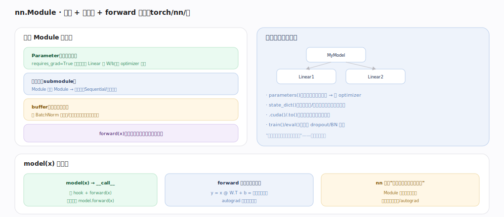

# PyTorch 核心原理 · 接口主线 · 建模与训练

> **定位**：最高层用户接触面——用 `nn.Module` 组织带权重的模型、用训练循环学习。它把张量编程 + 自动微分封装成"搭模型 + 训模型"的工作流，连接**自动微分引擎**、**数据加载**、**分布式训练**、**编译栈**多个能力域。核实基准：官方源码 `pytorch/src`。

## 一、nn.Module：参数 + 子模块 + forward 的树

一个 Module 装：**Parameter**（可学权重，requires_grad 张量，被 optimizer 更新）、**子模块**（Module 嵌 Module 组成树）、**buffer**（非学习状态如 BatchNorm 均值/方差，随模型保存不更新）、**forward(x)**（用户重写的前向计算）。树结构带来"一次操作递归作用于整棵模型"的红利：`parameters`（收集所有权重交 optimizer）、`state_dict`（导出/加载权重）、`.cuda/.to`（递归搬设备）、`train/eval`（切换 dropout/BN 行为）。调用 `model(x)` 走 `__call__`（跑 hook + forward，别直接 `.forward`），forward 里就是一串可微张量算子、autograd 顺手建反向图——**nn 只是"张量算子的有状态封装"，计算仍落到张量/autograd**。

---

## 二、训练循环：五步闭环

几乎所有训练脚本的骨架：① DataLoader 取一批 `(x,t)` 搬 GPU（worker 后台预取）→ ② 前向 `y=model(x)` 建图、`loss=loss_fn(y,t)` → ③ `opt.zero_grad` 清梯度（`.grad` 默认累加）→ ④ `loss.backward` autograd 引擎遍历图填每个参数 `.grad` → ⑤ `opt.step` 按 `.grad` 更新参数（SGD/Adam）→ 下一批循环。三大配角：**DataLoader**（批+shuffle+多 worker 预取喂满 GPU）、**loss_fn**（把预测与标签算成标量 loss 作反向起点）、**optimizer**（持有参数引用、用 `.grad` 按算法更新，含动量/学习率）。

---

## 拓展 · 建模训练常用件

| 类别 | 常用 | 说明 |
|---|---|---|
| 层 | Linear/Conv2d/LayerNorm/Embedding | nn.Module 子类 |
| 损失 | CrossEntropyLoss/MSELoss | 输出标量 loss |
| 优化器 | SGD/Adam/AdamW | 持参数、更新 |
| 学习率 | lr_scheduler | 调 lr 曲线 |
| 数据 | Dataset/DataLoader | 见数据加载能力域 |
| 加速 | @torch.compile / DDP | 见编译栈/分布式 |

---

## 调优要点（关键开关）

- 训练/推理切 `model.train` / `model.eval`（BN/dropout 行为不同）。
- 混合精度 `torch.autocast` + `GradScaler` 省显存提速。
- 一行 `model = torch.compile(model)` 通常显著提速（见编译栈）。
- 多卡包 `DistributedDataParallel`（见分布式训练）。
- `DataLoader(num_workers=N, pin_memory=True)` 避免数据饥饿。

---

## 常见误区与工程要点

- **直接调 `model.forward(x)`**：绕过 hook；应 `model(x)`。
- **忘 eval**：推理时 BN/dropout 仍按训练行为 → 结果错。
- **loss 记录拖图**：用 `loss.item` 取标量，否则整张图不释放、显存涨。
- **optimizer 没拿到全部参数**：自定义 Module 要正确注册 Parameter/子模块才被 `parameters` 收集。

---

## 一句话总纲

**建模与训练把张量 + autograd 封装成工作流：nn.Module 以"参数 + 子模块 + buffer + forward"组成树、一次操作（parameters/to/train）递归作用全模型，model(x) 的 forward 就是可微算子串；训练是五步闭环——取批→前向建图→清梯度→backward 填 .grad→optimizer 更新，配 DataLoader/loss_fn/optimizer 三配角，并可叠加 autocast/torch.compile/DDP 加速与扩展。**
