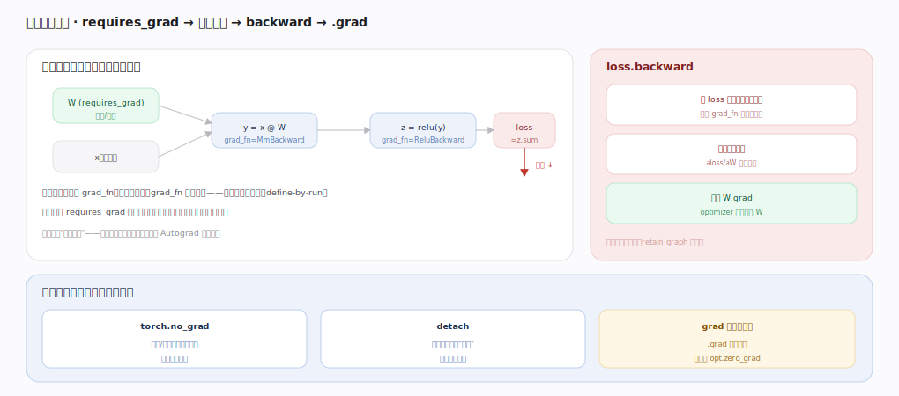

# PyTorch 核心原理 · 接口主线 · 自动微分

> **定位**：让张量计算"可求导"的用户接触面——设 `requires_grad`、前向自动建反向图、`backward` 得梯度。它是训练的核心，强依赖**自动微分引擎**（图与遍历）与 **Dispatcher**（Autograd key 建节点）。核实基准：官方源码 `pytorch/src`。

## 一、requires_grad → 前向建图 → backward → .grad

**前向**：涉及 `requires_grad=True` 张量的每个可微算子边算边连反向图——输出张量带 `grad_fn`（谁生成它、记住输入），如 `y=x@W` 得 `MmBackward`、`z=relu(y)` 得 `ReluBackward`，图自动连成（define-by-run，不需预先声明）；不涉及梯度的算子不建节点（省开销）。**backward**：`loss.backward` 从 loss 沿反向图逆序遍历，每个 grad_fn 算局部梯度、链式法则累积，把 `∂loss/∂W` 写进叶子张量的 `.grad`，optimizer 据此更新；图默认用完即释放（`retain_graph` 可留）。**梯度上下文**：`torch.no_grad`（推理/更新时不建图省内存）、`detach`（把张量从图剪断停止回传）、`.grad` 默认累加所以每步先 `zero_grad`。

---

## 拓展 · autograd 用户接口

| 接口 | 作用 |
|---|---|
| `requires_grad_(True)` | 标记张量需要梯度 |
| `.backward` | 从标量反向求梯度 |
| `.grad` | 累积的梯度（叶子张量上） |
| `torch.autograd.grad(...)` | 显式求某些输出对某些输入的梯度 |
| `torch.no_grad` / `inference_mode` | 关闭建图 |
| `.detach` | 切断梯度流 |
| `torch.autograd.Function` | 自定义前向/反向 |

---

## 调优要点（关键开关）

- 推理用 `with torch.no_grad:` 或 `inference_mode`——省内存省时间。
- 记录 loss 用 `loss.item`/`.detach`，别拖着整张图不释放。
- 梯度检查点（checkpoint）用重算换显存：反向时重跑前向而非全存中间值。
- 自定义不可微/特殊算子用 `autograd.Function` 写 forward+backward。

---

## 常见误区与工程要点

- **忘 zero_grad**：`.grad` 累加导致梯度错误、训练发散。
- **在需要梯度的张量上做原地操作**：可能覆盖反向所需中间值而报错。
- **推理不关梯度**：白建图、多占显存。
- **对非标量直接 backward**：需传 `gradient=` 或先归约成标量。

---

## 一句话总纲

**自动微分让张量可求导：给张量设 requires_grad 后，前向每个可微算子顺手在 Autograd 层留下 grad_fn 节点连成动态反向图（define-by-run），loss.backward 沿图逆序遍历、链式法则累积梯度到叶子张量的 .grad 供 optimizer 更新；no_grad/detach 控制建不建图、.grad 累加需每步 zero_grad——这是 PyTorch 训练的核心机制。**
