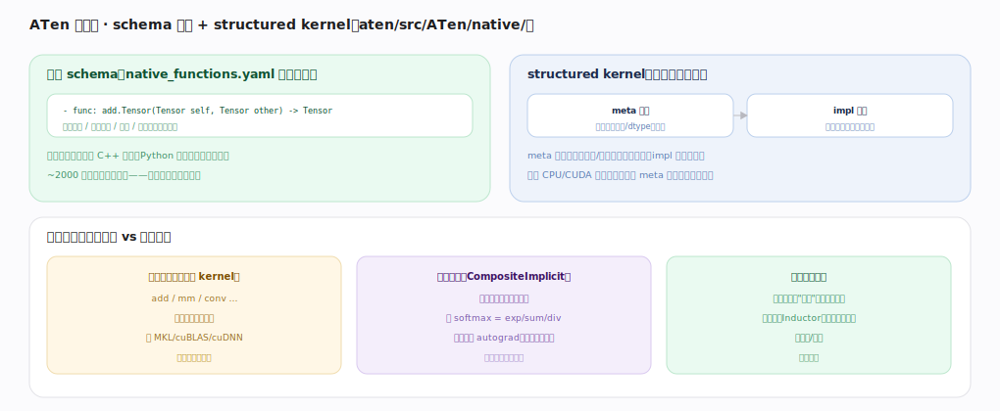

# PyTorch 核心原理 · 支撑能力域 · ATen 算子库

> **定位**：表示层。~2000 个张量算子的声明与实现，是 Dispatcher 分发的落点、后端 kernel 的组织框架。被**张量编程**、**自动微分**、**编译栈**依赖。核实基准：官方源码 `pytorch/pytorch` v2.13.0（`aten/src/ATen/native/`）。

## 一、schema 声明 + structured kernel

**算子 schema**（`aten/src/ATen/native/native_functions.yaml` 单一真源）：以 `add` 为例，用户面 `add.Tensor(Tensor self, Tensor other, *, Scalar alpha=1) -> Tensor`（`native_functions.yaml:536`）声明名/参数类型/返回/别名与可变性，并写 `structured_delegate: add.out`（`:538`）把计算委托给 out 版本；`variants: function, method`（`:539`）让代码生成同时产出 `torch.add(a,b)` 和 `a.add(b)` 两种入口。代码生成器 `torchgen/gen.py`（入口 `main()` 在 `torchgen/gen.py:2750`，解析 `native/native_functions.yaml`，见 `:2893`）据此产出 C++ 签名、Python 绑定、Dispatcher 注册样板——**一处声明多处生成**。

**structured kernel：形状与计算分离**。真正的实现挂在 `add.out(... , Tensor(a!) out) -> Tensor(a!)`（`native_functions.yaml:559`），标 `structured: True`、`structured_inherits: TensorIteratorBase`（`:561-562`）。分两半：① **meta 函数** `TORCH_META_FUNC2(add, Tensor)`（`aten/src/ATen/native/BinaryOps.cpp:151`）只做形状/dtype 推导与广播配置——调 `build_borrowing_binary_op`（`BinaryOps.cpp:153`）建一个 `TensorIteratorBase`（`aten/src/ATen/TensorIterator.h:246`）算出输出形状并分配；② **impl 函数** 在已分配的输出上真正算数值，逐元素循环由 TensorIterator 的 `for_each`（`TensorIterator.h:444`）驱动、最终落到 `add_stub`（`BinaryOps.cpp:437` 分发到 CPU/CUDA 的向量化内核）。meta 阶段不碰真实数据，可复用于 meta 设备（零显存形状推断）与编译期形状传播。

**算子分层**：基础算子（有专门 kernel，add/mm/conv，调 MKL/cuBLAS/cuDNN，性能热点）vs 复合算子（`CompositeImplicitAutograd`，用更基础算子拼出如 softmax=exp/sum/div，自动获得 autograd、不必每个写反向）；复合算子可降解成基础算子集，供编译器（Inductor）在小算子集上融合优化。`add.Tensor` 还带 `tags: [core, pointwise]`（`native_functions.yaml:546`），这些标签供 functionalization 与编译器识别逐点算子做融合。

---

## 拓展 · ATen 关键概念

| 概念 | 含义 | 锚点 |
|---|---|---|
| native_functions.yaml | 算子 schema 单一真源 | `aten/src/ATen/native/native_functions.yaml:536` |
| structured_delegate | 用户版把计算委托给 out 版 | `native_functions.yaml:538` |
| structured: True | 该 out 算子走 meta+impl 框架 | `native_functions.yaml:559` |
| TORCH_META_FUNC2 | 形状/dtype 推导（meta 阶段） | `aten/src/ATen/native/BinaryOps.cpp:151` |
| TensorIteratorBase | 广播/形状/逐元素循环引擎 | `aten/src/ATen/TensorIterator.h:246` |
| add_stub | 逐元素 kernel 分发桩 | `aten/src/ATen/native/BinaryOps.cpp:437` |
| 代码生成 | 从 schema 产签名/绑定/注册 | `torchgen/gen.py:2750` |
| dispatch: 后端表 | 稀疏/mkldnn/nested 等特化 | `native_functions.yaml:540` |

---

## 深化 · structured kernel 的两阶段

| 阶段 | 职责 | 是否碰真实数据 | 复用场景 | 锚点 |
|---|---|---|---|---|
| meta | 广播、推形状/dtype、分配输出 | 否（只算元信息） | meta 设备、编译期形状传播 | `BinaryOps.cpp:151` → `TensorIterator.h:246` |
| impl | 在已分配输出上逐元素算 | 是 | eager 真正执行 | `TensorIterator.h:444`（for_each）→ `add_stub` |

分离的红利：形状逻辑写一次被所有后端共享，各后端只写 impl；`meta` 设备只跑 meta 阶段就能校验整张网络的形状而不耗显存。

---

## 调优要点（关键开关）

- 热点用基础算子（背后是厂商高性能库 cuBLAS/cuDNN/MKL）；避免大量小复合算子零散调用。
- 复合算子（CompositeImplicitAutograd）在 torch.compile 下被降解成基础算子再融合，收益大。
- 自定义高性能算子写 structured kernel（`TORCH_META_FUNC`+`TORCH_IMPL_FUNC`）复用 TensorIterator 的形状推导与广播框架。
- meta 设备（`device='meta'`）跑一遍只走 meta 阶段，可验证形状而不耗显存。

---

## 常见误区与工程要点

- **以为每个算子都手写反向**：复合算子（CompositeImplicitAutograd）拆成基础算子后自动可微。
- **以为算子实现分散难维护**：schema 单一真源（`native_functions.yaml`）+ `torchgen/gen.py` 代码生成统一样板。
- **以为 add.Tensor 里就有计算**：它 `structured_delegate` 到 `add.out`（`:538`），真正计算在 out 版的 meta+impl。
- **忽视厂商库**：matmul/conv 的性能来自 cuBLAS/cuDNN，逐元素算子性能来自 TensorIterator 向量化 + `add_stub`，非纯朴素手写。
- **小算子链慢**：eager 下逐个派发 + 各自读写显存；编译融合是解药。

---

## 一句话总纲

**ATen 是 ~2000 算子的库：schema 在 native_functions.yaml 单一声明（add.Tensor structured_delegate 到 add.out）、torchgen/gen.py 代码生成产出签名/绑定/注册，structured kernel 把形状推导（TORCH_META_FUNC + TensorIteratorBase）与计算（impl + add_stub）分离以复用于编译与 meta 设备、减样板；基础算子（add/mm/conv）委托 MKL/cuBLAS/cuDNN 是性能热点，复合算子用基础算子拼成、自动可微且可被 Inductor 降解融合——这是 Dispatcher 分发的落点与后端 kernel 的组织框架。**
