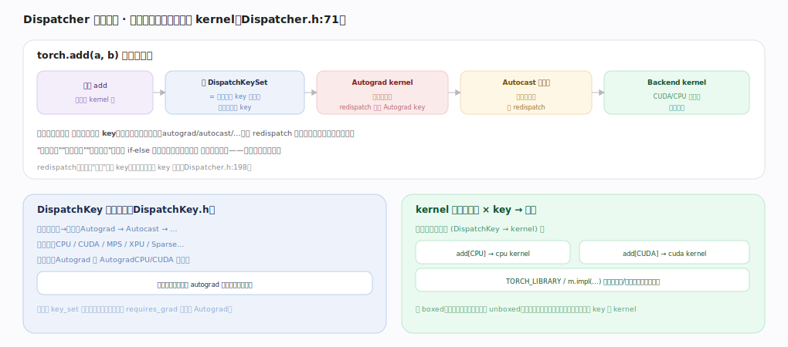

# PyTorch 核心原理 · 支撑能力域 · Dispatcher 分发

> **定位**：表示层、灵魂能力域之一。每次算子调用都经它按 DispatchKey 分层选 kernel——自动微分、混合精度、设备选择都做成可插拔的分发层。被所有算子调用依赖。核实基准：官方源码 `pytorch/src`（`aten/src/ATen/core/dispatch/Dispatcher.h:71`）。

## 一、分层分发机制

`torch.add(a,b)` 的分发之旅：查算子 add 的 kernel 表 → 算 **DispatchKeySet**（= 输入张量 key 的并集，取最高优先 key）→ **Autograd kernel**（记反向图节点，`redispatch` 去掉 Autograd key）→ **Autocast 等切面**（按需转精度再 redispatch）→ **Backend kernel**（CPU/CUDA 真正算）。关键：一次调用**逐层穿过多个 key**，每层做一件横切事再 redispatch 到下一层——"自动微分/混合精度/设备选择"不是 if-else 硬编码在算子里，而是**独立分发层**，可插拔可组合。**优先级**（`DispatchKey.h`）：功能键（Autograd→Autocast）高于后端键（CPU/CUDA），保证先做 autograd 记账再选后端算；张量 key_set 决定触发哪些层。**注册**：每算子有 `(DispatchKey→kernel)` 表，`TORCH_LIBRARY`/`m.impl(...)` 注册，扩展新后端只需注册对应 key 的 kernel；kernel 可 boxed（统一签名慢通用）或 unboxed（直调快）。

---

## 拓展 · 关键概念

| 概念 | 含义 |
|---|---|
| DispatchKey | CPU/CUDA/Autograd/Autocast/Sparse… |
| DispatchKeySet | 张量携带的 key 集合 |
| redispatch | 划掉当前 key 从下一优先级继续 |
| boxed / unboxed | 通用装箱调用 / 直调 |
| fallback | 某 key 无 kernel 时的兜底 |

---

## 调优要点（关键开关）

- 理解分发层帮助读懂 autocast/inference_mode 为何"自动"生效。
- 自定义算子经 `TORCH_LIBRARY` 注册到对应 key，融入分发体系。
- 新硬件后端 = 注册新 DispatchKey 的 kernel，无需改上层。
- 逐算子派发有开销（eager 慢的根源之一）→ torch.compile 绕过。

---

## 常见误区与工程要点

- **以为 autograd 是算子里写的**：它是独立分发层，靠 Autograd key 触发。
- **以为设备判断是 if 分支**：由 Backend key 分发到对应 kernel。
- **忽视 redispatch**：分层的核心机制，一次调用穿多层。
- **扩展算子不注册 key**：不注册就分发不到，算子"不存在"。

---

## 一句话总纲

**Dispatcher 是所有算子调用的总线：按输入张量的 DispatchKeySet 分层分发——先经 Autograd 层记反向图节点、再经 Autocast 等切面、最后落到 Backend（CPU/CUDA）kernel，每层做完 redispatch 到下一层；autograd/混合精度/设备选择都做成可插拔可组合的分发层而非硬编码，扩展新后端/新算子只需按 DispatchKey 注册 kernel。**
