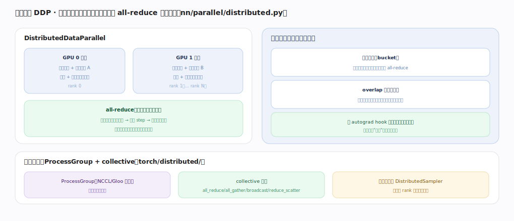
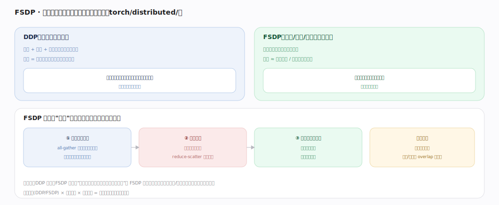

# PyTorch 核心原理 · 支撑能力域 · 分布式训练

> **定位**：扩展层。多卡/多机训练：DDP 数据并行（复制模型、同步梯度）、FSDP 分片（省显存）、底层 ProcessGroup + collective。被**建模与训练**在规模化时依赖。核实基准：官方源码 `pytorch/src`（`torch/distributed/`、`torch/nn/parallel/distributed.py`）。

## 一、DDP 数据并行

**DistributedDataParallel**：每卡一个进程、各持一份模型副本 + 不同数据分片，前向+反向算本地梯度，反向时 **all-reduce** 把各卡梯度求平均——同步后梯度一致、各自 step、参数保持一致（无中心参数服务器）。**关键优化：通信藏进反向**——梯度分桶（bucket，一桶算完立即 all-reduce）、overlap 计算与通信（反向还在算后面层时前面层梯度已在传，用 autograd hook 在梯度就绪时触发），通信几乎"免费"藏在计算背后。**通信底座**：ProcessGroup（NCCL/Gloo 后端）+ collective 原语（all_reduce/all_gather/broadcast/reduce_scatter），数据分片靠 DistributedSampler 保证各 rank 不重叠。

---

## 二、FSDP 分片

DDP 每卡存整份模型（显存不随卡数降，模型放不下就卡住）；**FSDP** 把参数/梯度/优化器状态分片、每卡只常驻自己那份（显存≈单卡模型/卡数）。机制"用时临时聚齐、用完扔"：① 前向到某层前 all-gather 聚齐该层完整参数、算完立即释放非本片 ② 反向同理临时聚齐算梯度、reduce-scatter 分回各片 ③ 优化器只更本片。核心权衡：**用通信换显存**（聚齐/散回可 overlap 藏延迟）。一句话：DDP 复制、FSDP 分片，"任意时刻只完整拥有正在算的那层"是 FSDP 省显存的关键。数据并行(DDP/FSDP) × 张量并行 × 流水并行 = 大模型训练的并行三维度。

---

## 拓展 · 分布式组件

| 组件 | 职责 |
|---|---|
| ProcessGroup | 进程间通信抽象（NCCL/Gloo） |
| collective | all_reduce/all_gather/reduce_scatter/broadcast |
| DDP | 数据并行 + 梯度 all-reduce |
| FSDP | 参数/梯度/优化器状态分片 |
| DistributedSampler | 各 rank 不重叠数据分片 |

---

## 调优要点（关键开关）

- 单卡放得下用 DDP（简单高效）；放不下用 FSDP（省显存）。
- GPU 间用 NCCL 后端；确保梯度桶大小与 overlap 生效。
- 配 DistributedSampler，否则各卡重复训同样数据。
- 超大模型叠加张量并行/流水并行（3D 并行）。

---

## 常见误区与工程要点

- **DDP 能省显存**：不能，每卡整份；省显存用 FSDP。
- **忘 DistributedSampler**：各 rank 训重叠数据、等价缩小数据集。
- **通信是纯开销**：DDP/FSDP 都尽量 overlap 藏进计算。
- **FSDP 无脑更省**：通信更多，小模型上可能不划算。

---

## 一句话总纲

**分布式训练把训练扩到多卡多机：DDP 每卡复制模型跑不同数据、反向时分桶 all-reduce 同步梯度并与计算 overlap（无参数服务器）；FSDP 把参数/梯度/优化器状态分片、用时 all-gather 聚齐算完即扔、用通信换显存以放下超大模型；二者都建在 ProcessGroup + collective（NCCL）之上、靠 DistributedSampler 分数据——数据并行是大模型三维并行（数据/张量/流水）之一。**
