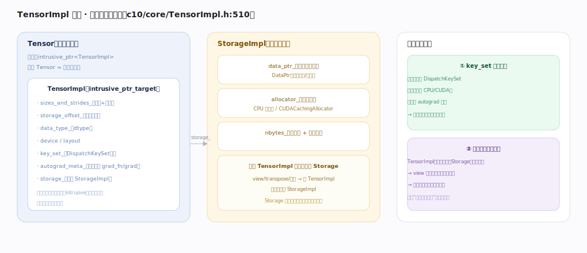

# PyTorch 核心原理 · 支撑能力域 · 张量与存储

> **定位**：表示层底座。定义张量的内核表示（TensorImpl）与底层内存（Storage），是一切算子与 autograd 的数据载体。被所有能力域依赖。核实基准：官方源码 `pytorch/src`。

## 一、TensorImpl 解剖

Tensor 是薄壳 `intrusive_ptr<TensorImpl>`（拷贝张量=加引用计数）。**TensorImpl**（`c10/core/TensorImpl.h:510`，intrusive_ptr_target）含：`sizes_and_strides_`（形状+步长）、`storage_offset_`、`data_type_`（dtype）、device/layout、**`key_set_`（DispatchKeySet！记录 CPU/CUDA/是否需 autograd）**、`autograd_meta_`（可选，含 grad_fn/grad）、`storage_`（指向 StorageImpl）——引用计数嵌在对象内（intrusive）省一次分配、元信息小拷贝廉价。**StorageImpl**（底层内存）含 `data_ptr_`（DataPtr，带删除器/设备）、`allocator_`（CPU 分配器/CUDACachingAllocator）、`nbytes_` + 引用计数；**多个 TensorImpl 可共享一个 Storage**（view/切片新建 TensorImpl 但共享 StorageImpl，引用计数归零才释放）。两个关键设计：① key_set 在张量上→算子据此分发；② 元信息与数据分离→view 零拷贝、拷贝廉价、内存自动引用计数管理。

---

## 拓展 · 张量内核字段

| 字段 | 含义 |
|---|---|
| sizes_and_strides_ | 多维视图如何映射一维内存 |
| storage_offset_ | 起始偏移（切片用） |
| key_set_ | 触发哪些分发层（device/autograd） |
| autograd_meta_ | grad_fn / grad（非叶可选） |
| storage_ | 共享的底层内存 |

---

## 调优要点（关键开关）

- 优先视图/切片（零拷贝）；需独立副本才 `.clone()`。
- 大量小张量有 TensorImpl 开销；批量化减少张量个数。
- `.storage()` 可查底层；`.data_ptr()` 看是否共享内存。
- meta 设备张量（只有元信息无数据）用于形状推断/编译，零显存。

---

## 常见误区与工程要点

- **以为 Tensor 很重**：Tensor/TensorImpl 是元信息壳，重的是 Storage 数据。
- **view 当独立副本**：共享内存，改一个动全部。
- **忽视 key_set**：它决定张量触发哪些分发层，是"自动 autograd/设备"的根源。
- **手动管显存**：Storage 引用计数自动释放，别手动 free。

---

## 一句话总纲

**张量与存储把 Tensor 表示为薄壳 intrusive_ptr<TensorImpl>：TensorImpl 装元信息（sizes/strides/dtype/device/key_set/autograd_meta）+ 指向可共享的 StorageImpl（底层内存 + 分配器 + 引用计数）；元信息与数据分离使 view 零拷贝、张量拷贝廉价、内存引用计数自动回收，而张量上的 DispatchKeySet 正是算子分发与"自动 autograd/设备"的起点。**
