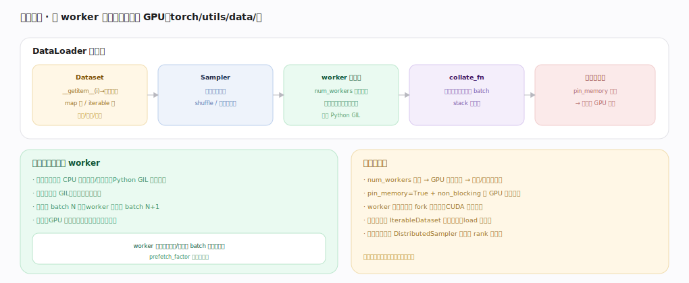

# PyTorch 核心原理 · 支撑能力域 · 数据加载

> **定位**：扩展层。用多 worker 进程后台预取、批处理，喂满 GPU 避免数据饥饿。被**建模与训练**依赖，是训练吞吐的隐形瓶颈。核实基准：官方源码 `pytorch/src`（`torch/utils/data/`）。

## 一、DataLoader 流水线

流水线：**Dataset**（`__getitem__(i)` 返回一条样本，读盘/解码/变换，map 式或 iterable 式）→ **Sampler**（决定取样顺序，shuffle/分布式分片）→ **worker 进程池**（`num_workers` 个子进程并行取样本、后台预取，绕开 Python GIL）→ **collate_fn**（多条样本拼成 batch、stack 成张量）→ 交训练循环（`pin_memory` 锁页 → 异步搬 GPU 更快）。**为什么多进程**：数据预处理是 CPU 活（解码/增广），Python GIL 限单线程；多进程绕开 GIL 并行准备——训练用 batch N 时 worker 已在备 N+1，目标是 GPU 永不等数据；worker 经共享内存/管道把 batch 传回主进程，`prefetch_factor` 控预取深度。

---

## 拓展 · 数据加载组件

| 组件 | 职责 |
|---|---|
| Dataset / IterableDataset | 单样本访问 / 流式 |
| Sampler / DistributedSampler | 取样顺序 / 分布式分片 |
| DataLoader | 批 + 多 worker + 预取 |
| collate_fn | 样本→batch 张量 |
| pin_memory | 锁页内存加速 H2D |

---

## 调优要点（关键开关）

- `num_workers`：太少 GPU 饿、太多内存/切换开销，按 CPU 核与 IO 实测。
- `pin_memory=True` + `non_blocking=True`：重叠 CPU→GPU 传输。
- `prefetch_factor`：预取深度，平滑抖动。
- 大数据集用 `IterableDataset` 流式，别全 load 进内存。
- 分布式配 `DistributedSampler`，各 rank 拿不重叠子集。

---

## 常见误区与工程要点

- **数据管道不是瓶颈**：GPU 快时它常是隐形瓶颈，先 profile。
- **worker 里用 CUDA 句柄**：fork 后不可用；预处理留在 CPU。
- **num_workers 越多越好**：过多引发内存与进程切换开销。
- **忘 pin_memory**：H2D 传输慢、无法充分异步。

---

## 一句话总纲

**数据加载用 DataLoader 组织流水线：Dataset 出单样本、Sampler 定顺序（含分布式分片）、num_workers 个子进程绕开 GIL 并行取样并后台预取、collate_fn 拼成 batch 张量、pin_memory 加速搬 GPU；目标是训练用当前 batch 时 worker 已备好下一批、让 GPU 永不等数据——数据管道常是训练吞吐的隐形瓶颈。**
