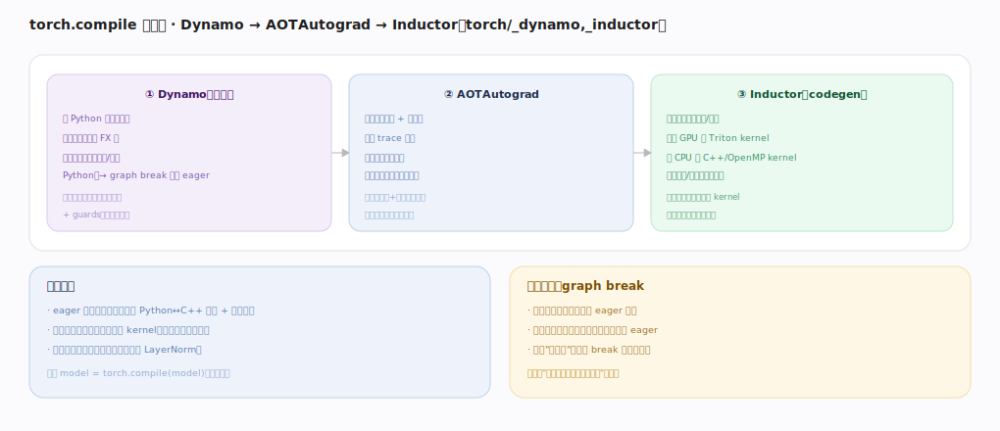

# PyTorch 核心原理 · 支撑能力域 · 编译栈

> **定位**：计算层。torch.compile 在 eager 之上就地编译加速——Dynamo 抓图 → AOTAutograd 联合前后向 → Inductor 生成融合 kernel。是"动态优先、编译加速可选"的落地。核实基准：官方源码 `pytorch/src`（`torch/_dynamo/`、`torch/_inductor/`）。

## 一、三段栈

**① Dynamo（抓图）**：拦 Python 字节码执行、把张量运算抽成 FX 图，遇不能抓的（打印/复杂 Python）→ graph break 回退 eager，产出可优化图 + guards（复用条件）。**② AOTAutograd**：提前把前向图 + 反向图一起 trace 出来、把复合算子降解成基础算子集（训练也能整图编译）。**③ Inductor（codegen）**：在算子图上融合/调度、生成 GPU 的 Triton kernel 与 CPU 的 C++/OpenMP kernel，减派发/访存、算子融合，缓存复用避免重编译。**为什么快**：eager 逐算子每个一次派发+读写显存；编译后多算子融合成一个 kernel（一次读写、省派发），访存密集链（如 LayerNorm）收益最大——一行 `torch.compile(model)` 写法不变。**优雅回退**：抓不了的片段自动切回 eager、图切成多段各自编译、保证总能跑。

---

## 二、Guards 与重编译

Dynamo 编译时记录一组 **guards（假设）**：输入的 dtype/device/形状（或符号形状）、Python 变量类型/常量/分支走向。每次调用先查 guards：全满足→直接用缓存编译产物（快路径，编译收益来源）；任一不满足→**重编译**（慢路径）。重编译代价：形状频繁变（变长序列）反复重编译很贵→`dynamic=True` 用符号形状少重编译；按值分支多→guards 多命中率低；有 recompile 上限保护。首次编译有开销，稳定形状下摊薄后净赚。

---

## 拓展 · 编译栈组件

| 组件 | 职责 | 锚点 |
|---|---|---|
| Dynamo | 字节码抓 FX 图 + guards | `torch/_dynamo/` |
| AOTAutograd | 前后向联合 trace + 降解 | `torch/_functorch/` |
| Inductor | 融合 codegen（Triton/C++） | `torch/_inductor/` |
| backends | 可换编译后端 | `torch/_dynamo/backends` |

---

## 调优要点（关键开关）

- `torch.compile(model)` 起步；`mode="max-autotune"` 更激进调优。
- 形状抖动大用 `dynamic=True` 减重编译。
- 减少 graph break（避免图中打印/不可抓 Python）提升覆盖。
- 首批慢是编译开销，稳定后看稳态吞吐。

---

## 常见误区与工程要点

- **首次慢=没用**：首次含编译，看摊薄后稳态。
- **形状乱变仍编译**：反复重编译可能比 eager 还慢；用动态形状。
- **以为要改写模型**：加一行装饰即可，写法不变。
- **graph break 无感**：break 多则编译覆盖低、收益小。

---

## 一句话总纲

**编译栈是 torch.compile 的三段：Dynamo 抓 Python 字节码成 FX 图（不可抓则 graph break 回退 eager）、AOTAutograd 联合 trace 前后向并降解成基础算子、Inductor 融合生成 Triton/C++ kernel；靠 guards 缓存复用编译产物（形状/dtype 变则重编译），把 eager 的逐算子派发+访存开销压成融合 kernel——不改写法地"动态优先、编译加速"。**
