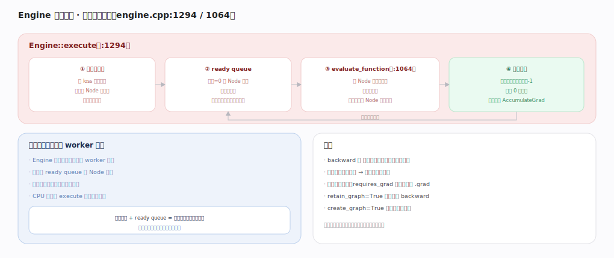

# PyTorch 核心原理 · 支撑能力域 · 自动微分引擎

> **定位**：计算层、灵魂能力域之一。前向时建反向图、backward 时按拓扑并行遍历求梯度——define-by-run 的内核实现。是**自动微分接口**与训练的引擎。核实基准：官方源码 `pytorch/src`（`torch/csrc/autograd/`）。

## 一、反向图结构

前向经 Dispatcher 的 Autograd 层时：为可微算子创建一个 **Node（grad_fn）**、记住输入张量的 grad_fn 作 **next_edges**、输出张量的 grad_fn 指向这个 Node、存反向要用的 saved tensors。于是 `z=relu(x@W); loss=z.sum` 建出 `SumBackward→ReluBackward→MmBackward` 的图，叶子（参数 W）挂 **AccumulateGrad** 把梯度写进 `.grad`（不需梯度的 x 不挂）。**图边算边连（define-by-run）**：控制流不同则每次图可不同、图默认反向后释放。saved tensors 是显存大头（checkpoint 用重算换显存），原地改被 saved 的张量会报错。

---

## 二、Engine 执行反向

`Engine::execute`（`engine.cpp:1294`）：① 从 loss 遍历图算每个 Node 的**依赖计数**（几个下游没算完）→ ② 依赖=0 的 Node 入 **ready queue**（保证拓扑序：先算完下游才算上游）→ ③ `evaluate_function`（`:1064`）调 Node 反向算子得输入梯度、累加到输入 Node → ④ 下游算完上游依赖-1、降到 0 入队，直到叶子 AccumulateGrad。**并行**：Engine 为每设备开 worker 线程各自从 ready queue 取 Node，无依赖分支并行反向；同一张量多路径梯度自动求和。要点：backward 是图上反向传播非重跑前向、默认只给叶子留 `.grad`、`retain_graph` 才能二次 backward、`create_graph` 建高阶导数图。

---

## 拓展 · autograd 引擎组件

| 组件 | 职责 | 锚点 |
|---|---|---|
| Node（Function） | 一个反向算子节点 | `torch/csrc/autograd/function.h` |
| next_edges | 指向输入 Node 的边 | 反向图连接 |
| AccumulateGrad | 叶子累积到 .grad | 叶子节点 |
| Engine::execute | 反向入口 | `engine.cpp:1294` |
| evaluate_function | 执行单 Node | `engine.cpp:1064` |
| saved tensors | 反向所需中间量 | 显存占用大头 |

---

## 调优要点（关键开关）

- 显存紧张用 `checkpoint`（重算换显存，少存 saved tensors）。
- 二阶导用 `create_graph=True`；一般训练不用。
- 避免对 saved 张量做原地操作（报错）。
- 多路径梯度自动求和——共享子模块时注意梯度叠加语义。

---

## 常见误区与工程要点

- **以为 backward 重跑前向**：它是沿已建图反向传播。
- **以为图能反复用**：默认反向后释放，需 `retain_graph`。
- **原地操作破坏图**：覆盖 saved 中间值 → backward 报错。
- **非叶子想要 grad**：默认不留，需 `retain_grad`。

---

## 一句话总纲

**自动微分引擎实现 define-by-run：前向每个可微算子在 Autograd 层建一个 Node（grad_fn）、用 next_edges 连成动态反向图、叶子挂 AccumulateGrad；backward 时 Engine::execute 按依赖计数 + ready queue 拓扑序、per-device worker 线程并行调各 Node 的反向算子、链式累积梯度到 .grad——图边算边连、用完即释、多路径梯度自动求和。**
