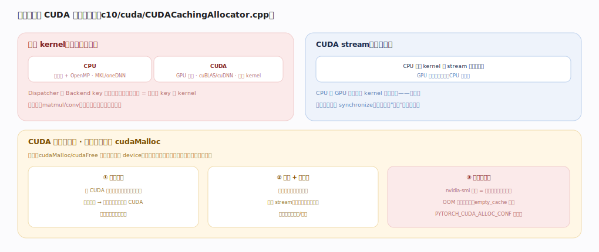

# PyTorch 核心原理 · 支撑能力域 · 设备后端与内存

> **定位**：表示层底座。真正的数值计算（CPU/CUDA kernel）+ 显存管理（CUDA 缓存分配器）+ 异步执行（stream）。被所有算子的落地执行依赖。核实基准：官方源码 `pytorch/pytorch` v2.13.0（`c10/cuda/CUDACachingAllocator.cpp`）。

## 一、后端 kernel、stream 与缓存分配器

**后端 kernel**：Dispatcher 按 Backend key 落到这里——CPU（向量化 + OpenMP，MKL/oneDNN）、CUDA（GPU 并行，cuBLAS/cuDNN，自写 kernel），大算子多委托厂商库，扩展新设备 = 注册新 key 的 kernel。

**CUDA stream 异步**：`CUDAStream`（`c10/cuda/CUDAStream.h:60`）封装 CUDA 流。CPU 通过 `getCurrentCUDAStream`（`CUDAStream.h:233`）拿到当前流、把 kernel 提交进流队列即返回、GPU 按序异步执行、CPU 不阻塞——CPU 与 GPU 重叠、多 kernel 流水，吞吐高；`getStreamFromPool`（`CUDAStream.h:203`）从流池取额外流做通信/计算重叠。后果是计时须 `synchronize`、报错可能延迟到下次同步。缓存分配器**流感知**：块记录它被哪条 stream 用过，跨流复用前必须插事件同步，避免"块还在被另一条流用就被复用"。

**CUDA 缓存分配器**（为什么不直接 cudaMalloc）：cudaMalloc/cudaFree 慢且会同步整个 device，训练每步海量临时张量若直调会卡死。核心是每设备一个 `DeviceCachingAllocator`（`CUDACachingAllocator.cpp:1426`）：

- **入口 `malloc`**（`CUDACachingAllocator.cpp:1722`）：先 `round_size`（`:3062`，向上取整到 512B 的倍数，`kMinBlockSize`）→ 优先 `get_free_block`（`:3710`，从对应大小桶里找现成空闲块）→ 找不到才 `alloc_block`（`:3843`，真正调 cudaMalloc 向 device 要一大段）→ 仍失败则 `release_cached_blocks`（`:4059`，把缓存的空闲块归还 CUDA）再重试。
- **释放 `free`**（`:2474`）：不还给 CUDA，而是把块标记空闲还进池；跨流的块要经 `synchronize_and_free_events`（`:4283`）等事件完成才可复用；相邻空闲块由 `free_block`（`:3505`）合并减碎片。
- **分桶**：小块（≤`kSmallSize`=1MB，`c10/core/AllocatorConfig.h:20`）走 `kSmallBuffer`=2MB（`AllocatorConfig.h:16`）的小块池，大块（≥`kMinLargeAlloc`=10MB，`:22`）按 `kRoundLarge`=2MB（`:24`）对齐——按大小分池减少大小块互相割裂造成的碎片。

后果：nvidia-smi 显存 = 池占用（含空闲块），OOM 可能是碎片（有足够总空闲但没连续大块），`empty_cache` 触发 `release_cached_blocks` 还池，`PYTORCH_CUDA_ALLOC_CONF=expandable_segments` 换用可扩展段策略缓解碎片。

---

## 拓展 · 设备内存组件

| 组件 | 职责 | 锚点 |
|---|---|---|
| CPU/CUDA kernel | 后端数值计算 | `aten/src/ATen/native/{cpu,cuda}` |
| DeviceCachingAllocator | 每设备显存池 | `c10/cuda/CUDACachingAllocator.cpp:1426` |
| malloc / free | 分配（先查池） / 释放（还池） | `CUDACachingAllocator.cpp:1722` / `:2474` |
| get_free_block / alloc_block | 池内找块 / 真 cudaMalloc | `:3710` / `:3843` |
| round_size | 对齐到 512B 倍数 | `:3062` |
| release_cached_blocks | 归还空闲块给 CUDA | `:4059` |
| CUDAStream | 异步执行队列 | `c10/cuda/CUDAStream.h:60` |
| 大小阈值常量 | kMinBlockSize/kSmallSize/kRoundLarge | `c10/core/AllocatorConfig.h:18/20/24` |

---

## 深化 · malloc 的分级兜底路径

| 层级 | 动作 | 命中即返回 | 锚点 |
|---|---|---|---|
| 1 | round_size 对齐、选大小池 | — | `:3062` |
| 2 | get_free_block 池内找现成空闲块 | 是（最快，无 CUDA 调用） | `:3710` |
| 3 | alloc_block 调 cudaMalloc 要新段 | 是 | `:3843` |
| 4 | release_cached_blocks 还池后重试 | 是 | `:4059` |
| 5 | 仍失败 → 报 CUDA OOM | 否 | `malloc` 内（`:1722`） |

流感知复用：块带 stream 归属，`synchronize_and_free_events`（`:4283`）确保被另一条流用过的块事件完成后才可复用——这是"看似有空闲却不给你"的常见根源。

---

## 调优要点（关键开关）

- 计时/基准务必 `torch.cuda.synchronize`（stream 异步，否则测的是 launch 时间）。
- OOM 先看碎片：`empty_cache`（触发 `release_cached_blocks`，`:4059`）、`PYTORCH_CUDA_ALLOC_CONF=expandable_segments`。
- 混合精度/更小 dtype 省显存；梯度检查点换显存。
- `non_blocking=True` + pin_memory 重叠 H2D 传输；用 `getStreamFromPool`（`CUDAStream.h:203`）另开流做通信/计算重叠。

---

## 常见误区与工程要点

- **nvidia-smi 显存高 = 泄漏**：多是缓存池占用（含空闲块，`free` 只还池不还 CUDA，`:2474`），非泄漏。
- **同步测时间才准**：不 synchronize 测的是 kernel launch 时间。
- **频繁 empty_cache**：会打断池化（强制 `release_cached_blocks`）、反而变慢；仅在必要时用。
- **cudaMalloc 心智**：PyTorch 不每次调 cudaMalloc，先 `get_free_block` 查池（`:3710`），池空才 `alloc_block`（`:3843`）。
- **以为空闲总量够就不 OOM**：碎片导致没有连续大块，`free_block`（`:3505`）合并有限时仍会 OOM。

---

## 一句话总纲

**设备后端与内存是算子的落地：Dispatcher 按 Backend key 分发到 CPU（MKL/oneDNN）或 CUDA（cuBLAS/cuDNN）kernel，CUDA 用 CUDAStream 异步执行（CPU 提交即返回、计时须 synchronize），显存由每设备 DeviceCachingAllocator 池化复用——malloc 先 round_size 再 get_free_block 查池、池空才 alloc_block 调 cudaMalloc、free 只还池不还 CUDA、按大小分桶 + 流感知复用，避免慢且同步的 cudaMalloc；nvidia-smi 显存=池占用、OOM 常因碎片而非总量不足。**
