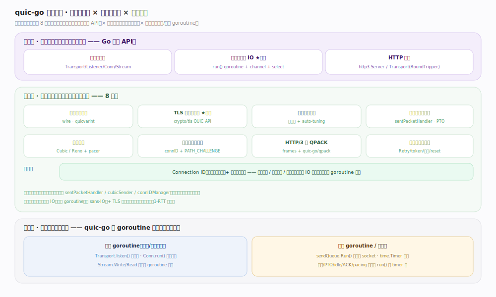
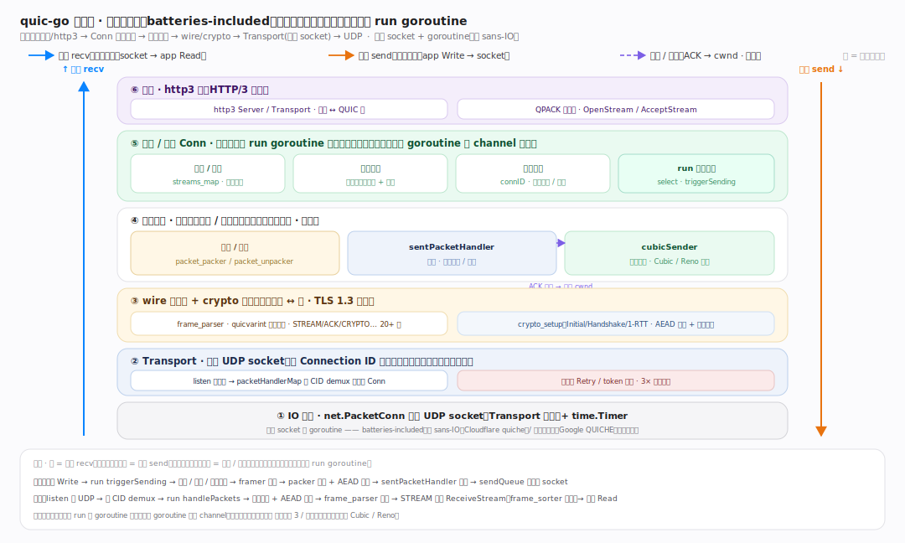
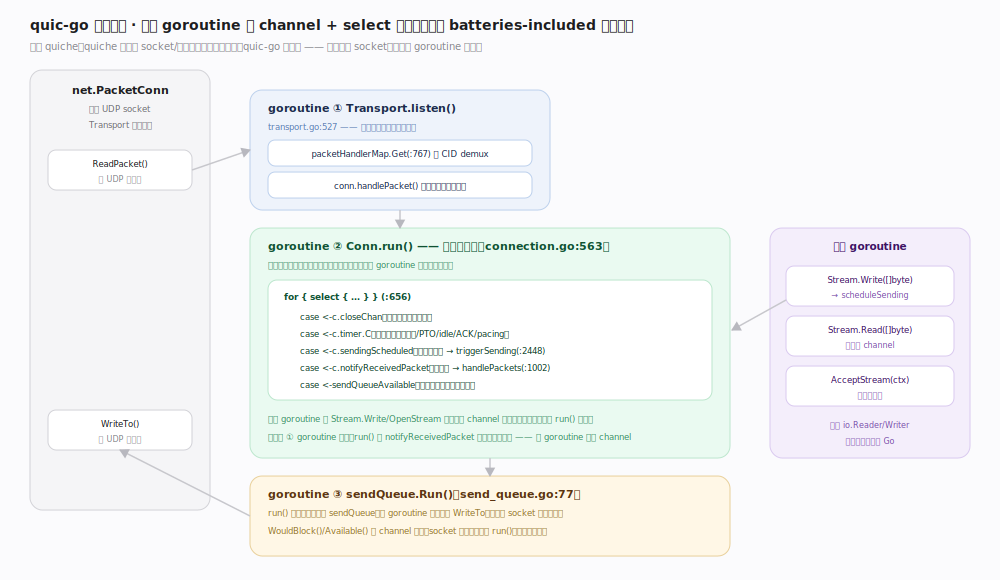
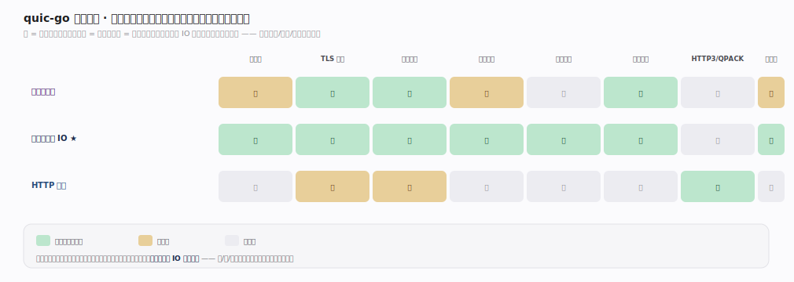

# quic-go 核心原理 · 全景主线框架

> **定位**：统领全部原理文档——quic-go 的 **3 条接口主线（会话与连接 / 事件循环与 IO / HTTP 与流）+ 8 条支撑能力域**，既无遗漏也无越界。核实基准：本地源码 `/tmp/quic-go-src`（quic-go，`commit 8bc5d4f`，Go）。灵魂两条：**自管 socket 与 goroutine 事件循环（`connection.go:563` run() select 循环）**、**TLS 1.3 内嵌复用 Go 标准库 crypto/tls（`internal/handshake/crypto_setup.go:28`）**。

quic-go 是 **QUIC(RFC 9000) + HTTP/3(RFC 9114) 的纯 Go 实现**，被 caddy、syncthing、Cloudflare 等大量使用。在原型库属**家族 8 传输协议库**。它与同家族的 C++ 实现 Google QUICHE、Rust 实现 Cloudflare quiche 协议线格式一致，但**编程范式截然不同**——这是判型第一步必须认清的。

## 〇、重要澄清：quic-go 是「batteries-included」而非 sans-IO

同为 QUIC 库，形态却分两派，本库属前者：

| 维度 | **quic-go（本库 · Go）** | Cloudflare quiche（Rust） | Google QUICHE（C++） |
|---|---|---|---|
| IO 归属 | **库拥有 `net.PacketConn`，自开 goroutine 读写** | sans-IO：`recv/send` 纯函数，应用喂字节 | IO 抽象：`QuicPacketWriter`/`QuicAlarm`，应用泵事件 |
| 并发模型 | **goroutine + channel + select**（`connection.go:563`） | 单线程状态机，无内建并发 | Visitor 回调 + 应用事件循环 |
| 时钟 | **自持 `time.Timer`，挂在 run() 循环** | 应用查 `timeout()` 自行计时 | `QuicAlarmFactory` 由应用实现 |
| 流 API | `Stream` 实现 `io.Reader`/`io.Writer`（`stream.go:52`） | 读写缓冲 + 事件轮询 | `QuicStream` + Visitor |
| 拥塞算法 | **仅内置 Cubic/Reno**（`internal/congestion/cubic_sender.go:23`） | BBRv1/v2 + CUBIC | BBRv1/v2 + CUBIC + PCC |

一句话：**quic-go 把 socket 与事件循环收进库内，用 goroutine 隐藏了「谁来泵事件」的问题**——这让它用起来像标准库 `net` 一样自然，代价是失去 sans-IO 的可移植性。

## 一、双维模型：接触面 × 支撑能力域 × 执行时机

用元模式判型（家族 8）：**接触面**是 Go 编程 API（`Transport`/`Listener`/`Conn`/`Stream`）；**支撑能力域**是协议内部 8 大公共机制；**执行时机**分前台 goroutine（`listen()`/`run()` 循环、用户 `Write/Read`）与后台（`sendQueue.Run()` 异步写、`time.Timer` 驱动重传/PTO/pacing）。贯穿层是 **Connection ID + 单调递增包号**，横切迁移、丢包恢复、多流；再叠一条「一切 IO 与定时都自管在 goroutine 里」。

## 二、总架构：Go 分层与数据流

自顶向下：**应用/http3** → **Transport**（`transport.go:56` 拥有 socket、`listen():527` 读 goroutine、`packetHandlerMap.Get():767` 按 CID 分流）→ **Conn**（`connection.go:124` 每连接一个 `run()` goroutine）→ **wire/crypto**（帧编解码 + AEAD）→ **sendQueue**（`send_queue.go:77` 异步写）→ **UDP socket**。服务端 `Listener`/`baseServer` 把入口防护（`validateToken():663`、`sendRetry():322`、3× 放大限制）合在 Transport 层。

## 三、事件循环：三类 goroutine 的协作

这是 quic-go 的心脏。① `Transport.listen()` 单读循环收 UDP、按 CID demux 入队；② 每个 `Conn.run()`（`connection.go:563`）是协议状态机的唯一持有者，`for { select {...} }`（`:656`）在 closeChan / timer.C / sendingScheduled / notifyReceivedPacket / sendQueueAvailable 之间等待——**所有连接状态只在此 goroutine 内修改，天然免锁**；③ `sendQueue.Run()` 异步执行 `WriteTo`，用 channel 背压避免写 socket 阻塞状态机。用户 goroutine 调 `Stream.Write` 只发信号，真正组包发包在 run() 内完成。

## 四、依赖矩阵：接口对能力域的依赖强度

竖看某能力域被哪些接口依赖，横看某接口用到哪些机制。**「事件循环与 IO」一行全强**——它是收/发/计时的总调度，改它牵一发而动全身；「TLS 握手与加密」是建连必经；「HTTP3 与 QPACK」只被「HTTP 与流」强依赖，与传输层解耦干净。

## 五、深化 · 8 支撑能力域与源码落点

| 归属 | 能力域 | 关键机制 | 源码锚点 |
|---|---|---|---|
| 编解码 | 包与帧编解码 | wire 逐帧解析 · quicvarint 变长整数 | `internal/wire/frame_parser.go`、`quicvarint/varint.go:113` |
| 加密 | TLS 握手与加密 | 三加密级 · 复用 crypto/tls QUIC API · 密钥轮换 | `internal/handshake/crypto_setup.go:28`、`updatable_aead.go:95` |
| 传输 | 流与流量控制 | 多流无队头阻塞 · 流级/连接级两级窗 | `flow_controller_stream.go:12`、`flow_controller_connection.go:14` |
| 传输 | 丢包检测与恢复 | 单调包号 · 包序阈值 3 / 时间阈值 9/8 · PTO | `internal/ackhandler/sent_packet_handler.go:67` |
| 传输 | 拥塞控制 | 可插拔接口 · 内置 Cubic/Reno · pacer | `internal/congestion/interface.go:9`、`cubic_sender.go:23` |
| 连接 | 连接管理与迁移 | CID 标识非四元组 · PATH_CHALLENGE 验证 | `conn_id_manager.go:19`、`path_manager.go:40` |
| 连接 | HTTP/3 与 QPACK | 请求映射到流 · 外部 qpack 库（静态表+Huffman） | `http3/frames.go`、`http3/headers.go:17` |
| 连接 | 可靠性与抗攻击 | 3× 放大限制 · Retry/token · stateless reset | `sent_packet_handler.go:25`、`server.go:663` |

## 六、三条贯穿全库的声明

1. **库拥有 socket 与 goroutine，协议状态机跑在单个 `run()` 里。** `Transport` 持有 `net.PacketConn`（`transport.go:56`），`listen()` 收包、`sendQueue` 发包、`run()` 决策——跨 goroutine 只经 channel，状态无锁。
2. **QUIC 是加密的、有状态的用户态传输。** TLS 1.3 握手内嵌走 CRYPTO 帧，复用 Go 标准库 crypto/tls 的 QUIC API（`crypto_setup.go:220` 把 CRYPTO 帧喂给 `conn.HandleData`），1-RTT 建连、可 0-RTT。
3. **Connection ID 是连接身份，四元组只是当前路径。** 身份与路径解耦（`conn_id_manager.go`），是连接迁移（换网不断）与抗关联追踪的根基；服务端靠 `packetHandlerMap` 按 DCID 把包路由到正确 `Conn`。

## 调优要点

- `Config.MaxIncomingStreams` / `MaxIncomingUniStreams` 默认各 100（`internal/protocol/params.go:40`、`:43`），高并发流场景需调大。
- 接收窗口默认流级 512 KB、连接级为其倍数（`params.go:25`、`:28`），上限分别 6 MB / 15 MB（`:31`、`:34`）；高 BDP 链路吞吐受限时提高上限。
- 把 `*net.UDPConn`（实现 `OOBCapablePacketConn`）交给 `Transport` 可启用 DF 位、ECN、`recvmmsg` 批量收包与 GSO 批量发包（`transport.go:56` 注释）。
- 生产环境务必配置 `Transport.StatelessResetKey`，否则崩溃重启后对端只能傻等超时。

## 常见误区

- **误以为 quic-go 是 sans-IO**：它不是——它拥有 socket、自开 goroutine，形态与 Cloudflare quiche（同名不同项目）相反。判型先认清语言与范式。
- **误以为内置 BBR**：quic-go 只自带 Cubic 与 Reno（`cubic_sender.go`），无 BBR；接口 `SendAlgorithm` 可插拔但仓库内无 BBR 实现。
- **误以为 `Connection` 是接口**：新版已把公开类型改为具体 struct `Conn`（`connection.go:124`）、`Stream`/`SendStream`/`ReceiveStream`。
- **把包号当序号复用**：QUIC 包号连接内单调递增，重传用**新包号**（重传单位是「帧」不是「包」），别按 TCP 序号思维理解。

## 一句话总纲

**quic-go = 拥有 socket 与 goroutine 的纯 Go QUIC/HTTP3 库：每连接一个 run() 事件循环持有全部状态、TLS 内嵌复用标准库、CID + 单调包号贯穿多流可靠传输——batteries-included 是它区别于 sans-IO 同类的分水岭。**
