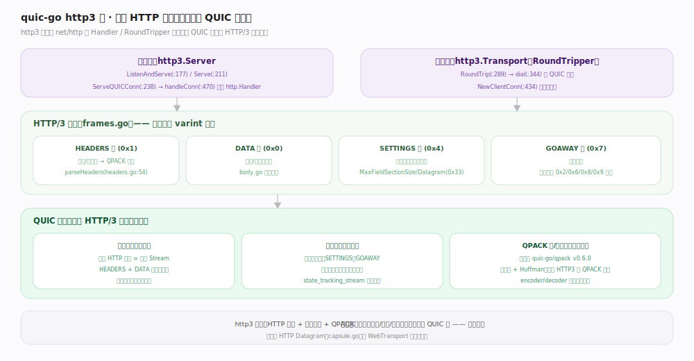

# quic-go 核心原理 · 接口主线 · HTTP 与流

> **定位**：`http3` 子包实现 `net/http` 的 `Handler`/`RoundTripper` 接口，把每个 HTTP 请求映射到一条 QUIC 双向流，HTTP/3 语义与可靠传输解耦。核实基准：`http3/server.go:238`、`http3/transport.go:289`、`http3/frames.go`。

## 一、http3 栈：请求即流

服务端 `http3.Server`：`ListenAndServe()`（`server.go:177`）/`Serve()`（`:211`）/`ServeQUICConn()`（`:238`）→ `handleConn()`（`:470`）复用标准 `http.Handler`。客户端 `http3.Transport` 是 `http.RoundTripper`：`RoundTrip()`（`transport.go:289`）→ `dial()`（`:344`）建 QUIC 连接，`NewClientConn()`（`:434`）管理请求流。

每个 HTTP 请求 = 一条 QUIC 双向流：先发 HEADERS 帧（`0x1`，头部经 QPACK 编码），再发若干 DATA 帧（`0x0`，请求/响应体）。连接级参数走单向控制流的 SETTINGS 帧（`0x4`，含 `MaxFieldSectionSize`、`ExtendedConnect 0x8`、`Datagram 0x33`），优雅关闭用 GOAWAY 帧（`0x7`）。帧类型用 varint 编码，保留类型 `0x2/0x6/0x8/0x9` 直接忽略（`frames.go:112`）。

**关键分层**：http3 只做「HTTP 语义 + 帧编解码 + QPACK」，可靠传输/加密/拥塞全交给下面的 QUIC 层——流间独立、无队头阻塞，一个慢请求不阻塞其它请求。还支持 HTTP Datagram（`capsule.go`）作为 WebTransport 等的基础。

## 二、深化 · http3 帧与接口锚点

| 帧/接口 | 编码/方法 | 源码锚点 | 说明 |
|---|---|---|---|
| HEADERS | 0x1 | `http3/frames.go:79` | 请求/响应头，QPACK 编码 |
| DATA | 0x0 | `http3/frames.go:67` | 请求/响应体，可多帧流式 |
| SETTINGS | 0x4 | `http3/frames.go:84` | 控制流首帧协商参数 |
| GOAWAY | 0x7 | `http3/frames.go:102` | 优雅关闭 |
| Server.ServeQUICConn | 方法 | `http3/server.go:238` | 在已有 QUIC 连接上跑 HTTP/3 |
| Transport.RoundTrip | 方法 | `http3/transport.go:289` | 客户端发请求，实现 RoundTripper |
| parseHeaders | 函数 | `http3/headers.go:54` | QPACK 解码头字段 |

## 调优要点

- `http3.Server` 可直接复用现有 `http.Handler`，从 HTTP/2 迁移成本低；同端口可与 h2 共存（Alt-Svc 协商）。
- 大量并发请求受 `Config.MaxIncomingStreams`（默认 100）限制，反代/网关场景需调大。
- HTTP Datagram（`capsule.go`）为 WebTransport/MASQUE 提供不可靠数据通道，避免占用流的可靠开销。

## 常见误区

- **以为 HTTP/3 的多路复用在 HTTP 层**：多路复用是 QUIC 流提供的，http3 只是把请求铺到流上；队头阻塞的消除来自 QUIC 而非 HTTP/3 帧。
- **把控制流当请求流**：控制流是单向流、每端一条、承载 SETTINGS/GOAWAY，不传业务数据。
- **忽略 QPACK 的表能力协商**：quic-go 的 qpack 库不用动态表（见「HTTP/3 与 QPACK」篇），SETTINGS 里协商的表容量对它意义有限。

## 一句话总纲

**http3 子包把每个 HTTP 请求映射成一条 QUIC 双向流（HEADERS+DATA 帧）、复用 net/http 的 Handler/RoundTripper 接口，HTTP 语义与 QPACK 压缩留在这层，可靠传输与加密全下沉给 QUIC——分层干净、无队头阻塞。**
