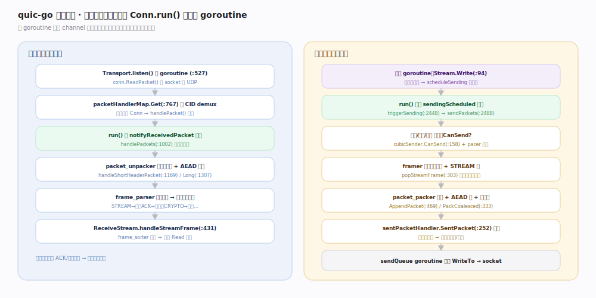

# quic-go 核心原理 · 接口主线 · 事件循环与 IO

> **定位**：★灵魂主线。quic-go 自管 socket 与 goroutine——收包、发包、计时都在库内的 goroutine 里跑，用 channel + select 协作。这是「batteries-included」区别于 sans-IO 库的分水岭。核实基准：`transport.go:527`（listen 读循环）、`connection.go:563`（run 事件循环）、`send_queue.go:77`（异步发送）。

## 一、收发路径：一切汇聚到 Conn.run()

**收包路径**：`Transport.listen()`（`transport.go:527`）单 goroutine 循环 `conn.ReadPacket()` 收 UDP → `packetHandlerMap.Get()`（`:767`）按目的 CID 找到目标 `Conn`、`handlePacket()`（`:562`）入队并发 `notifyReceivedPacket` 信号 → `run()` 被唤醒、`handlePackets()`（`connection.go:1002`）取出包 → `packet_unpacker` 去头保护 + AEAD 解密（`handleShortHeaderPacket:1169` / `handleLongHeaderPacket:1307`）→ `frame_parser` 逐帧分发 → STREAM 帧交 `ReceiveStream.handleStreamFrame()`（`receive_stream.go:431`），`frame_sorter` 重排乱序后用户 `Read` 可取。

**发包路径**：用户 goroutine `Stream.Write()`（`send_stream.go:94`）写发缓冲、`scheduleSending` 发信号 → `run()` 收到 `sendingScheduled`、`triggerSending()`（`connection.go:2448`）→ `sendPackets()`（`:2488`）→ 发送门禁（拥塞 `CanSend`、流控、放大限制、pacer 时机）→ framer 攒帧、`packet_packer.AppendPacket()`（`:469`）组包 + AEAD 封 + 头保护 → `sentPacketHandler.SentPacket()`（`internal/ackhandler/sent_packet_handler.go:252`）记账 → 交 `sendQueue` goroutine 异步 `WriteTo`。

## 二、三类 goroutine 的分工

`run()` 的 select（`connection.go:656`）在五路等待：`closeChan`（关闭）、`timer.C`（定时器：重传/PTO/idle/ACK/pacing）、`sendingScheduled`（有数据待发）、`notifyReceivedPacket`（有新包）、`sendQueueAvailable`（发送队列腾空）。**协议状态机只在这一个 goroutine 内改状态，天然免锁**——这是 quic-go 并发正确性的基石。`sendQueue`（`send_queue.go:24`）的 `Run()`（`:77`）在独立 goroutine 执行 socket 写，`WouldBlock()`（`:69`）/`Available()`（`:73`）用 channel 做背压，socket 写满时回压到 run()，不忙等不丢包。

## 三、深化 · 事件循环关键点

| 关注点 | 机制 | 源码锚点 |
|---|---|---|
| run 循环 | `for { select {...} }` 五路等待 | `connection.go:656` |
| 收包唤醒 | notifyReceivedPacket → handlePackets | `connection.go:1002` |
| 发包触发 | sendingScheduled → triggerSending → sendPackets | `connection.go:2448` / `:2488` |
| 读循环 | listen() 单 goroutine 服务多连接 | `transport.go:527` |
| CID 分流 | packetHandlerMap.Get 按 DCID 路由 | `transport.go:767` |
| 异步发送 | sendQueue.Run 独立 goroutine + channel 背压 | `send_queue.go:77` / `:69` |
| 计时 | time.Timer 挂 run()，到期驱动重传/PTO/pacing | `connection.go:659`（timer.C 分支） |

## 调优要点

- 单个 `Transport.listen()` goroutine 服务该 socket 上所有连接；超高连接数下 socket 读吞吐是瓶颈，用 `OOBCapablePacketConn` 启 `recvmmsg` 批量收包。
- `sendQueue` 的 GSO 批量发送（Linux）显著降低系统调用开销；确保底层是 `*net.UDPConn`。
- 每连接一个 `run()` goroutine：连接数极大时 goroutine 数与调度开销需评估，但单连接内无锁竞争。

## 常见误区

- **以为要自己泵事件循环**：不需要——quic-go 自己开 goroutine 跑循环，这点与 Cloudflare quiche（应用轮询）/Google QUICHE（应用实现 Alarm）相反。
- **跨 goroutine 直接读连接内部状态**：状态属于 run() goroutine，外部只能经导出方法（内部经 channel 同步），别绕过。
- **以为 Write 会立即发包**：`Write` 只写缓冲发信号，真正组包发包在 run() 内按拥塞/流控/pacing 决策进行。

## 一句话总纲

**listen() 读 goroutine 收包入队、run() 单 goroutine 用 select 决策收发与计时、sendQueue goroutine 异步写 socket——三类 goroutine 靠 channel 协作，让协议状态机无锁地跑在一处，是 quic-go 的心脏。**
