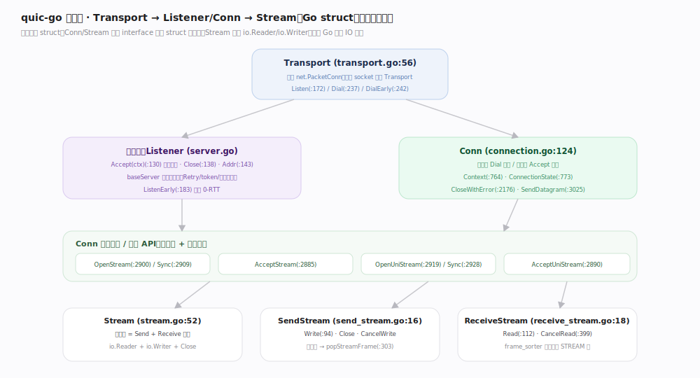

# quic-go 核心原理 · 接口主线 · 会话与连接

> **定位**：应用面对的对象树——`Transport → Listener/Conn → Stream`，全是导出的具体 struct（新版已由 interface 改为 struct），`Stream` 实现 `io.Reader`/`io.Writer`，天然融入 Go 标准 IO。核实基准：`transport.go:56`、`connection.go:124`、`stream.go:52`。

## 一、对象树：Transport 顶起一切

`Transport`（`transport.go:56`）是入口，持有唯一的 `net.PacketConn`——**一个 socket 一个 Transport**。它派生两条路：服务端 `Listen`（`:172`）/`ListenEarly`（`:183`，支持 0-RTT）返回 `Listener`；客户端 `Dial`（`:237`）/`DialEarly`（`:242`）返回 `Conn`。

`Listener` 上 `Accept(ctx)`（`server.go:130`）阻塞取新连接，`Close`（`:138`）、`Addr`（`:143`）。服务端的入口防护（Retry、token、放大限制）由 `baseServer` 承担。

`Conn`（`connection.go:124`）是连接句柄：`Context`（`:764`）、`ConnectionState`（`:773`）、`CloseWithError`（`:2176`）、`SendDatagram`（`:3025`，不可靠数据报）、`AddPath`（`:3082`，多路径）。

开流/取流 API 全挂在 `Conn` 上：`OpenStream`（`:2900`）与阻塞版 `OpenStreamSync`（`:2909`）、`AcceptStream`（`:2885`）、单向流 `OpenUniStream`（`:2919`）/`OpenUniStreamSync`（`:2928`）/`AcceptUniStream`（`:2890`）。

`Stream`（`stream.go:52`）是双向流 = `SendStream`（`send_stream.go:16`）+ `ReceiveStream`（`receive_stream.go:18`）的合体；发送侧 `Write`（`send_stream.go:94`）写入缓冲，接收侧 `Read`（`receive_stream.go:112`）从重排缓冲取字节。

## 二、深化 · 对象与源码锚点

| 对象 | 关键方法 | 源码锚点 | 说明 |
|---|---|---|---|
| Transport | Listen / Dial | `transport.go:172` / `:237` | 拥有 socket，跑 listen 读 goroutine |
| Listener | Accept / Close | `server.go:130` / `:138` | 服务端取连接；baseServer 做入口防护 |
| Conn | OpenStreamSync / AcceptStream | `connection.go:2909` / `:2885` | 开流阻塞等配额 / 取对端开的流 |
| Conn | CloseWithError / SendDatagram | `connection.go:2176` / `:3025` | 应用层错误码关连接 / 不可靠数据报 |
| Stream | Write / Read / Close | `send_stream.go:94` / `receive_stream.go:112` | 实现 io.Writer / io.Reader |
| SendStream | CancelWrite / popStreamFrame | `send_stream.go:399`(概念) / `:303` | 取消发送 / 组包时取 STREAM 帧 |
| ReceiveStream | CancelRead / handleStreamFrame | `receive_stream.go:399` / `:431` | 取消接收 / 处理入站 STREAM 帧 |

## 调优要点

- `OpenStreamSync` 在流配额用尽时阻塞直到 `MAX_STREAMS` 到来；对延迟敏感又不想阻塞用 `OpenStream` 并处理错误。
- `Conn.Context` 随连接关闭而 cancel，适合挂业务 goroutine 的生命周期。
- 单向流（Uni）省一半状态、适合只推不收的场景（如服务端推送、日志上报）。
- `SendDatagram`（`:3025`）走不可靠数据报，适合可丢的实时数据（音视频、游戏状态），不占流的可靠性开销。

## 常见误区

- **把 `Conn` 当接口**：新版是具体 struct（`connection.go:124`）；旧教程里的 `quic.Session`/`quic.Stream` 接口名已过时。
- **忘记双向 vs 单向流的 ID 语义**：流 ID 低 2 bit 编码方向与发起方，开错类型会协议错误。
- **在多 goroutine 里并发写同一 `SendStream`**：单条流的 `Write` 非并发安全，需自行串行化；不同流之间才天然独立。

## 一句话总纲

**Transport 拥有 socket 并派生 Listener/Conn，Conn 上开流取流、Stream 就是 io.Reader/io.Writer——一套贴合 Go 习惯的具体 struct API，把 QUIC 的连接与多流包装得像标准库 net 一样自然。**
