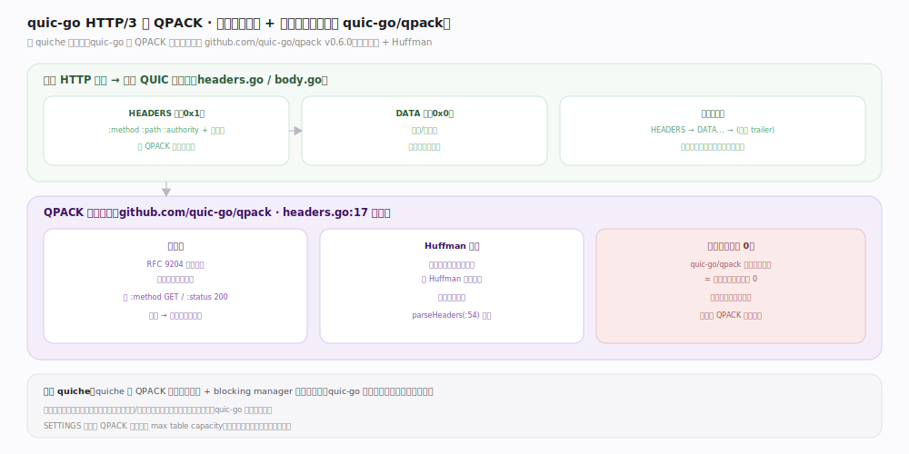

# quic-go 核心原理 · 支撑能力域 · HTTP/3 与 QPACK

> **定位**：请求映射到流 + 头部压缩。QPACK 由**外部独立库 `github.com/quic-go/qpack v0.6.0`** 承担，走「静态表 + Huffman、不用动态表」的简化路线。核实基准：`http3/frames.go`、`http3/headers.go:17`、`go.mod:7`。

## 一、请求映射到流 + QPACK 压缩

一个 HTTP 请求 = 一条 QUIC 双向流：先 HEADERS 帧（`0x1`，`:method`/`:path`/`:authority` 等经 QPACK 编码），再若干 DATA 帧（`0x0`，可多帧流式），流生命周期 `HEADERS → DATA... →（可选 trailer）`、写完关流；流间独立无队头阻塞。

**QPACK 头部压缩**（`http3/headers.go:17` 引用 `github.com/quic-go/qpack`）分三块：**静态表**（RFC 9204 预定义常见头字段索引表，如 `:method GET`/`:status 200`，命中只传索引号）、**Huffman 编码**（未命中静态表的字面值用 Huffman 压缩字符，`parseHeaders:54` 解码）、**动态表（容量 0）**——**quic-go/qpack 未实现动态表**，等价声明动态表容量为 0；好处是无跨流依赖、天然免 QPACK 队头阻塞。

**对比 quiche**：quiche 的 QPACK 含完整动态表 + blocking manager 抗队头阻塞；quic-go 选「不用动态表」的简单鲁棒路线。权衡：动态表能进一步压缩重复头，但引入编/解码流的跨流依赖与阻塞管理复杂度。SETTINGS 帧协商 QPACK 参数（max table capacity 等）。

## 二、深化 · HTTP/3 帧与 QPACK 锚点

| 项 | 值/机制 | 源码锚点 |
|---|---|---|
| HEADERS 帧 | 0x1，QPACK 编码头 | `http3/frames.go:79` |
| DATA 帧 | 0x0，请求/响应体 | `http3/frames.go:67` |
| SETTINGS 帧 | 0x4，协商参数（含 Datagram 0x33） | `http3/frames.go:84` |
| QPACK 库 | github.com/quic-go/qpack v0.6.0 | `go.mod:7` |
| 头解码 | parseHeaders（qpack.DecodeFunc） | `http3/headers.go:54` |
| 头字段校验 | validateHeaderFieldNameAndValue | `http3/headers.go:151` |
| 动态表 | 未实现（容量 0） | `github.com/quic-go/qpack`（外部库） |

## 调优要点

- 不用动态表 → 无 QPACK 队头阻塞、实现简单鲁棒，代价是重复头压缩率略低；多数场景可接受。
- 头部大小受 SETTINGS 的 `MaxFieldSectionSize`（`frames.go:162`）约束，超大头会被拒。
- HTTP Datagram（`settingDatagram 0x33`）为 WebTransport/MASQUE 提供不可靠通道。

## 常见误区

- **以为 QPACK 在 quic-go 主仓库**：它在独立库 `github.com/quic-go/qpack`，主仓库只调用。
- **以为一定用动态表**：quic-go/qpack 不用动态表，SETTINGS 里协商的表容量对它意义有限。
- **把 HTTP/3 帧与 QUIC 帧混淆**：HTTP/3 帧（DATA/HEADERS…）在 QUIC 流内的字节流上，与 QUIC 传输帧（STREAM/ACK…）是不同层。

## 一句话总纲

**每个 HTTP 请求映射到一条 QUIC 双向流（HEADERS+DATA），头部经外部 quic-go/qpack 库用静态表 + Huffman 压缩、刻意不用动态表——以略低压缩率换取无 QPACK 队头阻塞的简单与鲁棒，是与 quiche 的一处显著取舍差异。**
