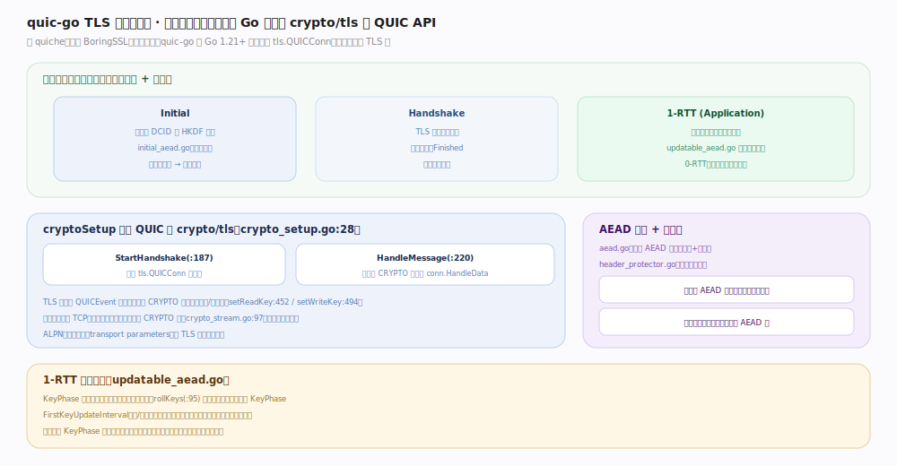

# quic-go 核心原理 · 支撑能力域 · TLS 握手与加密

> **定位**：★灵魂主线。传输与加密合一——TLS 1.3 内嵌走 CRYPTO 帧，**复用 Go 标准库 crypto/tls 的 QUIC API**（非 BoringSSL），三加密级各自独立密钥，1-RTT 建连、可 0-RTT。核实基准：`internal/handshake/crypto_setup.go:28`、`internal/handshake/updatable_aead.go`。

## 一、三加密级 + crypto/tls 桥接

QUIC 有三个独立加密级、各有独立包号空间与密钥：**Initial**（密钥由 DCID 经 HKDF 派生、`initial_aead.go` 固定盐，任何人可解，只防篡改）、**Handshake**（TLS 握手密钥，交换证书/Finished，真正建立信任）、**1-RTT/Application**（握手后所有应用数据）。

关键在 `cryptoSetup`（`crypto_setup.go:28`）桥接 QUIC 与 Go 标准库 crypto/tls：`StartHandshake()`（`:187`）启动 `tls.QUICConn` 状态机，`HandleMessage()`（`:220`）把收到的 CRYPTO 帧喂给 `conn.HandleData(encLevel.ToTLSEncryptionLevel(), data)`（`:228`）；TLS 层通过 QUICEvent 反向要求写 CRYPTO 数据、设置读/写密钥（`setReadKey:452` / `setWriteKey:494`）。握手消息不走独立流，而封进 CRYPTO 帧（`crypto_stream.go:97`）在各加密级传输。ALPN 与传输参数随 TLS 扩展一起协商。

**与 quiche 的分水岭**：Google QUICHE 内嵌 BoringSSL，quic-go 复用 Go 1.21+ 标准库的 QUIC-TLS 集成——不引第三方 TLS 库，随 Go 版本演进。

## 二、AEAD 封装与密钥轮换

`aead.go` 做包体 AEAD 加解密（机密+完整性），`header_protector.go` 加密包号字节；发包先 AEAD 封体再头保护、收包先去头保护取包号再 AEAD 解。1-RTT 支持密钥轮换（`updatable_aead.go`）：短头首字节的 KeyPhase 位标记密钥代，`rollKeys()`（`:95`）派生下一代并翻转 KeyPhase；`FirstKeyUpdateInterval`（`:30`）限制单密钥暴露的数据量；收到对端 KeyPhase 翻转即知对端已轮换、本端跟进，旧密钥短暂保留解迟到包。

## 三、深化 · 加密机制锚点

| 机制 | 说明 | 源码锚点 |
|---|---|---|
| cryptoSetup | 桥接 QUIC 与 crypto/tls | `crypto_setup.go:28` |
| StartHandshake | 启动 tls.QUICConn | `crypto_setup.go:187` |
| HandleMessage | CRYPTO 帧 → conn.HandleData | `crypto_setup.go:220` |
| setReadKey/setWriteKey | TLS 事件设置各级密钥 | `crypto_setup.go:452` / `:494` |
| Initial 密钥 | 由 DCID + HKDF 派生（固定盐） | `internal/handshake/initial_aead.go` |
| 密钥轮换 | KeyPhase 翻转 + rollKeys | `internal/handshake/updatable_aead.go:95` |
| 首次轮换阈值 | FirstKeyUpdateInterval | `internal/handshake/updatable_aead.go:30` |

## 调优要点

- 复用标准库 crypto/tls 意味着密码套件、证书验证行为随 Go 版本；升级 Go 可能改变可用套件。
- 0-RTT 需会话票据缓存（`TokenStore`，`interface.go:42`）；0-RTT 数据有重放风险，仅用于幂等请求。
- Initial 包人人可解密，只提供完整性；别以为握手前的包是机密的。

## 常见误区

- **以为 quic-go 用 OpenSSL/BoringSSL**：它用 Go 标准库 crypto/tls 的 QUIC API，纯 Go。
- **把三加密级混为一谈**：各级独立密钥与包号空间，Initial/Handshake/1-RTT 的丢包检测互不干扰。
- **忽视密钥轮换**：长连接会周期轮换 1-RTT 密钥，KeyPhase 位不是摆设。

## 一句话总纲

**TLS 1.3 内嵌在传输里、握手消息走 CRYPTO 帧、三加密级各自独立密钥——quic-go 复用 Go 标准库 crypto/tls 的 QUIC 集成完成握手，AEAD 封包 + 头保护 + KeyPhase 密钥轮换保障机密与完整，1-RTT 即可建连。**
