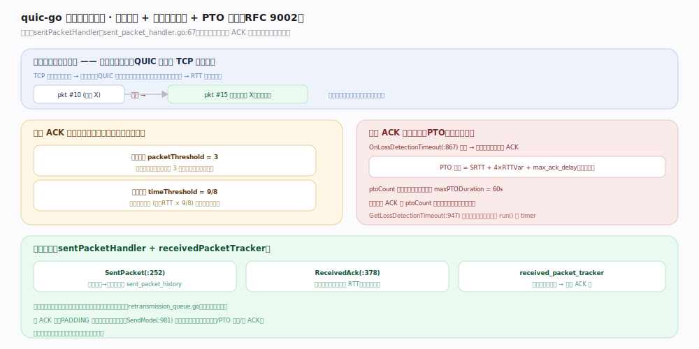

# quic-go 核心原理 · 支撑能力域 · 丢包检测与恢复

> **定位**：可靠传输的核心。包号连接内单调递增、重传用新包号；收 ACK 后按「包序阈值 3」与「时间阈值 9/8」判丢，无 ACK 时靠 PTO 兜底催 ACK（RFC 9002）。核实基准：`internal/ackhandler/sent_packet_handler.go`。

## 一、单调包号 + 两种判丢 + PTO

**单调包号是 QUIC 区别于 TCP 的关键**：TCP 重传用相同序号 → 重传歧义；QUIC 每次发送（含重传）都用全新更大的包号 → RTT 采样无歧义。「帧」是重传单位、「包」用后即弃——某包丢失，其携带的仍需可靠送达的帧被放回重传队列（`retransmission_queue.go`），装进新包号的新包重发。

`sentPacketHandler`（`sent_packet_handler.go:67`）管发送侧：`SentPacket()`（`:252`）登记包号→所含帧进 `sent_packet_history`；`ReceivedAck()`（`:378`）收 ACK 后移除已确认包、更新 RTT、喂拥塞控制。**判丢两条阈值任一命中即丢**：包序阈值 `packetThreshold = 3`（`:23`，被确认包之后落后达 3 个包号的未确认包判丢）、时间阈值 `timeThreshold = 9/8`（`:21`，发送时间早于最新 RTT × 9/8 的未确认包判丢）。

**PTO（探测超时）兜底**：无 ACK 时 `OnLossDetectionTimeout()`（`:867`）到期发探测包催对端回 ACK；PTO 时长 = SRTT + 4×RTTVar + max_ack_delay，指数退避，`ptoCount`（`:97`）每超时翻倍、上限 `maxPTODuration = 60s`（`:29`）；收到任意 ACK 即 `ptoCount` 归零。`GetLossDetectionTimeout()`（`:947`）算出下次告警时刻挂到 run() 的 timer。`SendMode()`（`:981`）决定当前可发何种包（正常/PTO 探测/仅 ACK）。

## 二、深化 · 丢包检测常量与锚点

| 项 | 值/机制 | 源码锚点 |
|---|---|---|
| 包序阈值 | packetThreshold = 3 | `sent_packet_handler.go:23` |
| 时间阈值 | timeThreshold = 9/8 | `sent_packet_handler.go:21` |
| PTO 上限 | maxPTODuration = 60s | `sent_packet_handler.go:29` |
| 发包记账 | SentPacket | `sent_packet_handler.go:252` |
| 收 ACK 处理 | ReceivedAck（更新 RTT、喂 CC） | `sent_packet_handler.go:378` |
| 丢包告警到期 | OnLossDetectionTimeout | `sent_packet_handler.go:867` |
| 可发模式 | SendMode（正常/PTO/仅 ACK） | `sent_packet_handler.go:981` |
| 接收侧记账 | received_packet_tracker 生成 ACK | `internal/ackhandler/received_packet_tracker.go` |

## 调优要点

- 每个加密级有独立包号空间与丢包检测状态；握手期与稳态互不干扰。
- 高丢包链路 PTO 退避会拉高尾延迟，但避免了误判风暴；对延迟敏感场景可关注 `ptoCount` 观测。
- 纯 ACK/PADDING 等不可靠帧不进重传，只有需可靠送达的帧才重传。

## 常见误区

- **按 TCP 序号理解重传**：QUIC 重传是「把帧装进新包号的新包」，不是重发同序号包。
- **以为丢包只看超时**：优先靠 ACK 触发的包序/时间阈值快速判丢，PTO 只是没 ACK 时的兜底。
- **忽略 RTT 采样无歧义的价值**：单调包号让 RTT 测量精确，是拥塞控制准确的前提。

## 一句话总纲

**包号连接内单调递增、重传的是「帧」而非「包」；收 ACK 走包序阈值 3 / 时间阈值 9/8 快速判丢，无 ACK 时 PTO 指数退避（上限 60s）催 ACK——单调包号带来无歧义 RTT，是可靠传输与拥塞控制的共同地基。**
