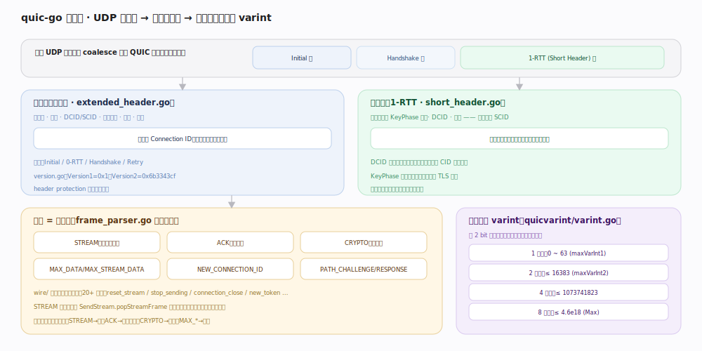

# quic-go 核心原理 · 支撑能力域 · 包与帧编解码

> **定位**：字节 ↔ 帧的转换层。一个 UDP 数据报可 coalesce 多个不同加密级的 QUIC 包，包体由若干帧组成，一切长度用 varint 编码。核实基准：`internal/wire/frame_parser.go`、`internal/wire/extended_header.go`、`quicvarint/varint.go`。

## 一、线格式：数据报 → 包 → 帧

**长头包**（`extended_header.go`）用于握手期：含首字节、版本、DCID/SCID、包号——`version.go` 里 `Version1 = 0x1`（`:26`）、`Version2 = 0x6b3343cf`（`:27`），`SupportedVersions`（`:32`）；类型有 Initial / 0-RTT / Handshake / Retry。**短头包**（`short_header.go`）用于握手完成后的 1-RTT 数据：只有首字节（含 KeyPhase 位）、DCID、包号——无版本无 SCID，开销最小；收方按本地已知 CID 长度解析（DCID 长度不在包里）。

包体是若干**帧**，`frame_parser.go` 逐帧解析后按类型分发：STREAM → 流、ACK → 丢包检测、CRYPTO → 握手、`MAX_DATA`/`MAX_STREAM_DATA` → 流控、`NEW_CONNECTION_ID` → 连接迁移、`PATH_CHALLENGE`/`RESPONSE` → 路径验证。`wire/` 下每种帧一个文件（20+ 种）。

**varint**（`quicvarint/varint.go`）：前 2 bit 定字节数，`Append()`（`:113`）编码——1 字节 ≤ 63（`maxVarInt1:17`）、2 字节 ≤ 16383（`maxVarInt2:18`）、4 字节 ≤ 1073741823（`maxVarInt4:19`）、8 字节 ≤ 4.6e18（`Max:15`）；越小的数越省字节。

## 二、深化 · 帧与编码锚点

| 项 | 值/机制 | 源码锚点 |
|---|---|---|
| Version1 / Version2 | 0x1 / 0x6b3343cf | `internal/protocol/version.go:26` / `:27` |
| varint 4 档 | 1/2/4/8 字节按值大小 | `quicvarint/varint.go:17`~`:20` |
| 长头解析 | 版本/CID/包号 | `internal/wire/extended_header.go` |
| 短头解析 | 首字节含 KeyPhase | `internal/wire/short_header.go` |
| 逐帧解析 | 按帧类型分发 | `internal/wire/frame_parser.go` |
| STREAM 帧 | 偏移+长度+FIN | `internal/wire/stream_frame.go` |
| ACK 帧 | ACK range + delay | `internal/wire/ack_frame.go` |

## 调优要点

- coalesce（合并包）让握手期一个 UDP 报同时带 Initial+Handshake，减少往返；quic-go 由 `packet_packer.PackCoalescedPacket`（`:333`）组装。
- 短头包无版本/SCID，稳态数据开销最小；这是握手完成后所有数据走短头的原因。
- STREAM 帧发送侧按包内剩余空间切分（`send_stream.go:303`），大 `Write` 会自动拆成多帧填包。

## 常见误区

- **以为一个 UDP 报只装一个 QUIC 包**：握手期常 coalesce 多包（不同加密级各一）。
- **裸用 int 编码长度**：QUIC 所有长度字段都是 varint，不是定长整数。
- **把「包」当重传单位**：可靠传输的重传单位是「帧」，包号用后即弃，重传的帧装进新包号的新包。

## 一句话总纲

**UDP 数据报可合并多个不同加密级的包、包体由 20+ 种帧组成、一切长度用 4 档 varint 编码——wire 包逐帧解析后按类型分发到各能力域，是协议线格式与内部逻辑之间的翻译层。**
