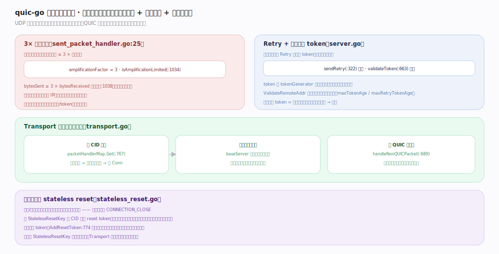

# quic-go 核心原理 · 支撑能力域 · 可靠性与抗攻击

> **定位**：服务端入口是关卡。UDP 无连接易被伪造源地址做反射放大，QUIC 建连前用 3× 放大限制、Retry/token 地址验证、入口分流限流、stateless reset 多重防护。核实基准：`internal/ackhandler/sent_packet_handler.go:25`、`server.go:663`、`stateless_reset.go`。

## 一、入口防护：放大限制 + 地址验证 + 无状态重置

**3× 放大限制**（`sent_packet_handler.go:25` `amplificationFactor = 3`）：地址验证前，服务端发出字节 ≤ 3 × 已收字节——`isAmplificationLimited`（`:1034`）判 `bytesSent ≥ 3 × bytesReceived`（`:1038`）即停发，等对端再发包。防攻击者伪造受害者 IP 让服务端向其猛发；地址一旦验证通过限制解除。

**Retry + 地址验证 token**（`server.go`）：服务端可先回 Retry 包携带 token（`sendRetry:322`），要求客户端带回；`validateToken`（`:663`）校验——token 由 `tokenGenerator` 加密签名、含客户端地址与时间戳，`ValidateRemoteAddr` 校验地址匹配、过期即拒（`maxTokenAge`/`maxRetryTokenAge`）。带回有效 token = 证明客户端能收到该地址的包 → 真实。

**Transport 入口分流限流**（`transport.go`）：`packetHandlerMap.Get`（`:767`）按 CID 路由（已有连接直投、新连接建 Conn）；`baseServer` 限制待握手连接数防握手洪泛；`handleNonQUICPacket`（`:689`）处理不认识的包（交回调或丢弃）。

**stateless reset**（`stateless_reset.go`）：崩溃/重启后丢失连接状态但对端仍发包，用 `StatelessResetKey` 对 CID 算 reset token（无需连接状态）回一个「看似普通短头包」的重置包；对端识别 token（`AddResetToken:774` 登记过）即知连接已死、快速放弃而非傻等超时。未配置 key 则关闭此功能。

## 二、深化 · 抗攻击机制锚点

| 机制 | 说明 | 源码锚点 |
|---|---|---|
| 放大因子 | amplificationFactor = 3 | `sent_packet_handler.go:25` |
| 放大判定 | bytesSent ≥ 3 × bytesReceived | `sent_packet_handler.go:1038` |
| Retry 下发 | sendRetry | `server.go:322` |
| token 校验 | validateToken（地址+过期） | `server.go:663` |
| CID 路由 | packetHandlerMap.Get | `transport.go:767` |
| 非 QUIC 包 | handleNonQUICPacket | `transport.go:689` |
| reset token 登记 | AddResetToken | `transport.go:774` |

## 调优要点

- 生产环境务必配置 `Transport.StatelessResetKey`，否则崩溃重启后对端只能傻等超时（`transport.go:56` 注释强烈建议）。
- 高连接建立速率场景，Retry 强制地址验证能有效抵御 SYN-flood 式握手洪泛（代价一个额外 RTT）。
- `handleNonQUICPacket` 回调可用于同端口复用（如 STUN/其它协议共存）。

## 常见误区

- **忽视放大限制导致握手卡住**：服务端发得过多会被 3× 限制卡住等对端包，握手期表现为「间歇停顿」，属正常防护。
- **不配 StatelessResetKey**：默认不发 stateless reset，故障恢复变慢。
- **以为 token 只防重放**：token 主要证明地址可达性（反射放大防护），与 0-RTT 抗重放是不同机制。

## 一句话总纲

**服务端入口是安全关卡：地址验证前 3× 放大限制封顶发送、Retry+token 证明客户端地址真实、Transport 按 CID 分流并限流待握手连接、stateless reset 让崩溃后对端快速放弃——多重手段抵御 UDP 反射放大与握手洪泛。**
