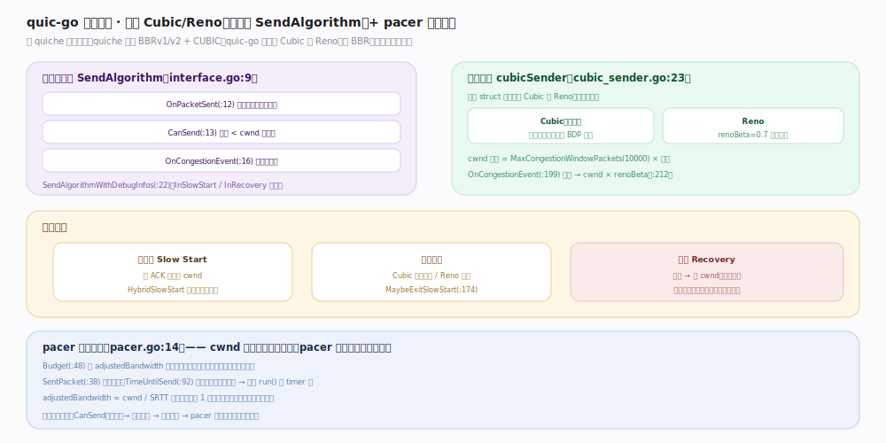

# quic-go 核心原理 · 支撑能力域 · 拥塞控制

> **定位**：带宽治理。可插拔接口 `SendAlgorithm`，但**仓库内只自带 Cubic 与 Reno**（无 BBR），配 pacer 平滑发送。核实基准：`internal/congestion/interface.go:9`、`internal/congestion/cubic_sender.go:23`、`internal/congestion/pacer.go`。

## 一、可插拔接口 + 内置 Cubic/Reno + pacer

拥塞控制经接口 `SendAlgorithm`（`interface.go:9`）解耦：`OnPacketSent`（`:12`）登记在途字节、`CanSend`（`:13`，在途 < cwnd 才准发）、`OnCongestionEvent`（`:16`，丢包降窗）；`SendAlgorithmWithDebugInfos`（`:22`）暴露 `InSlowStart`（`:24`）/`InRecovery`（`:25`）供观测。

内置实现 `cubicSender`（`cubic_sender.go:23`）——**一个 struct 同时实现 Cubic（默认，三次函数增窗、高 BDP 友好）与 Reno**（`renoBeta = 0.7` 回退因子、`:18`），靠标志切换。cwnd 上限 = `MaxCongestionWindowPackets`（10000、`internal/protocol/params.go:15`）× 包长；`OnCongestionEvent`（`:199`）丢包时 `cwnd × renoBeta`（`:212`）。增窗阶段：慢启动（每 ACK 指数增，HybridSlowStart 提前探测退出点）→ 拥塞避免（Cubic 三次曲线/Reno 线性，`MaybeExitSlowStart:174`）→ 恢复（丢包降窗进恢复期，期内不对同轮丢包重复降窗）。

**pacer**（`pacer.go:14`）平滑节流——cwnd 决定「能发多少」、pacer 决定「什么时候发」：`Budget`（`:48`）按 `adjustedBandwidth`（`:18`，≈ cwnd/SRTT × 略大于 1 系数）累积预算避免瞬间突发，`SentPacket`（`:38`）扣减，`TimeUntilSend`（`:92`）算下一个可发时刻挂到 run timer。

**与 quiche 分水岭**：Google QUICHE 内置 BBRv1/v2 + CUBIC + PCC，quic-go 只自带 Cubic/Reno；接口虽可插拔，但仓库内无 BBR。

## 二、深化 · 拥塞控制锚点

| 项 | 值/机制 | 源码锚点 |
|---|---|---|
| 抽象接口 | SendAlgorithm（CanSend/OnCongestionEvent） | `internal/congestion/interface.go:9` |
| 内置实现 | cubicSender（Cubic + Reno 一体） | `internal/congestion/cubic_sender.go:23` |
| Reno 回退因子 | renoBeta = 0.7 | `internal/congestion/cubic_sender.go:18` |
| 丢包降窗 | cwnd × renoBeta | `internal/congestion/cubic_sender.go:212` |
| cwnd 上限 | 10000 包 × 包长 | `internal/protocol/params.go:15` |
| 退出慢启动 | MaybeExitSlowStart | `internal/congestion/cubic_sender.go:174` |
| pacing 预算 | Budget / TimeUntilSend | `internal/congestion/pacer.go:48` / `:92` |

## 调优要点

- 默认 Cubic 适合多数场景；需要 BBR 得自行实现 `SendAlgorithm` 接口（仓库不提供）。
- pacer 的突发系数（略大于 1）在允许小突发打满链路与避免中间队列膨胀之间折中。
- `MaxCongestionWindowPackets`（10000）是硬上限，超高 BDP 下 cwnd 可能撞顶。

## 常见误区

- **以为 quic-go 有 BBR**：没有内置 BBR，只有 Cubic 与 Reno；这是与 quiche 的显著差异。
- **把 cwnd 与 pacing 混淆**：cwnd 管「总量」、pacer 管「时机」，两者串联做门禁。
- **忽略 CanSend 的门禁地位**：发包必须过 CanSend（拥塞）+ 流控 + 放大限制 + pacer 时机，全绿才发。

## 一句话总纲

**拥塞控制经 SendAlgorithm 接口可插拔，但 quic-go 只自带 Cubic（默认）与 Reno（renoBeta=0.7）、无 BBR；cwnd 管发送总量、pacer 管发送时机——两者串成发送门禁的一环，与流控/放大限制共同决定「此刻能发多少、何时发」。**
