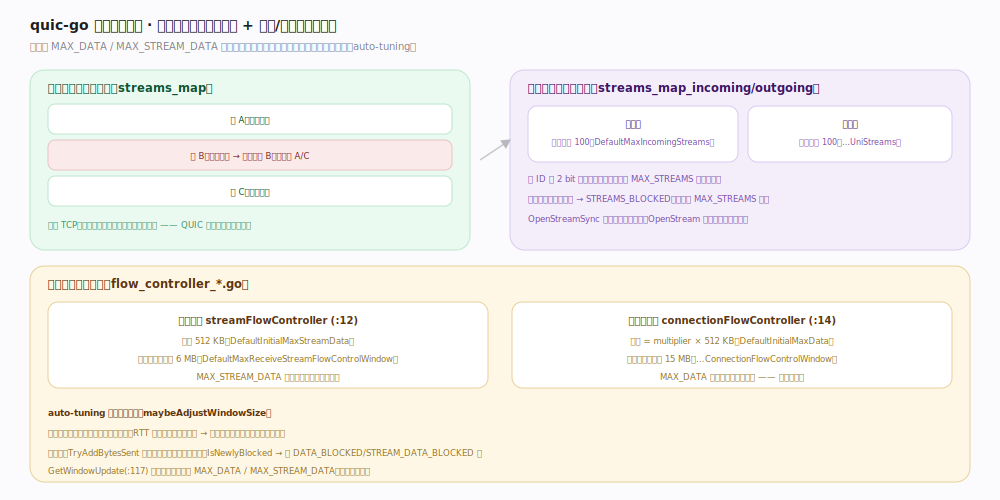

# quic-go 核心原理 · 支撑能力域 · 流与流量控制

> **定位**：一连接多流、流间独立无队头阻塞；背压靠流级 + 连接级两级窗口，用 `MAX_STREAM_DATA`/`MAX_DATA` 帧告知对端可发多少，窗口随消费速度自动放大。核实基准：`flow_controller_stream.go:12`、`flow_controller_connection.go:14`、`internal/protocol/params.go`。

## 一、多流无队头阻塞 + 两级窗口

一连接内多条独立流（`streams_map.go`），某条流丢包只阻塞该流，不影响其它流——**对比 TCP 单一字节流任一段丢失阻塞全部，这是 QUIC 的根本改进**。流分双向/单向，默认各上限 100（`params.go:40` `DefaultMaxIncomingStreams`、`:43` `DefaultMaxIncomingUniStreams`），用 `MAX_STREAMS` 帧提升；超上限想开流 → `STREAMS_BLOCKED`，`OpenStreamSync` 阻塞等配额、`OpenStream` 无配额立即报错。

**流量控制两级窗口**：流级 `streamFlowController`（`flow_controller_stream.go:12`）初始 512 KB（`params.go:25` `DefaultInitialMaxStreamData`）、上限 6 MB（`:31`）；连接级 `connectionFlowController`（`flow_controller_connection.go:14`）初始 = multiplier × 512 KB（`:28` `DefaultInitialMaxData`）、上限 15 MB（`:34`），所有流共享。发送侧 `TryAddBytesSent`（`:73`）检查两级窗口都有余量才发，`IsNewlyBlocked`（`:106`）触发 `DATA_BLOCKED`/`STREAM_DATA_BLOCKED` 帧。

**auto-tuning**：`maybeAdjustWindowSize`（`flow_controller_base.go:55`）发现窗口更新过频（消费快、RTT 长）就成倍放大接收窗口，减少往返等待；`GetWindowUpdate`（`flow_controller_connection.go:117`）计算何时发新的 `MAX_DATA`/`MAX_STREAM_DATA` 避免对端饿死。

## 二、深化 · 流控参数与锚点

| 项 | 默认/上限 | 源码锚点 |
|---|---|---|
| 流级初始窗口 | 512 KB | `internal/protocol/params.go:25` |
| 流级窗口上限 | 6 MB | `internal/protocol/params.go:31` |
| 连接级初始窗口 | multiplier × 512 KB | `internal/protocol/params.go:28` |
| 连接级窗口上限 | 15 MB | `internal/protocol/params.go:34` |
| 双向流上限 | 100 | `internal/protocol/params.go:40` |
| 单向流上限 | 100 | `internal/protocol/params.go:43` |
| 自动窗口调整 | maybeAdjustWindowSize | `flow_controller_base.go:55` |
| 发送侧配额检查 | TryAddBytesSent | `flow_controller_connection.go:73` |

## 调优要点

- 高 BDP（高带宽×高延迟）链路吞吐受限时，调大 `Config` 的接收窗口上限（默认 6 MB/15 MB 偏保守）。
- 大量并发流场景把 `MaxIncomingStreams`/`MaxIncomingUniStreams` 调大，避免 `STREAMS_BLOCKED` 卡顿。
- auto-tuning 已能自适应，但初始窗口偏小会让首个 RTT 内吞吐受限；短连接可适当提高初始值。

## 常见误区

- **以为 QUIC 没有队头阻塞**：传输层流间无队头阻塞，但单条流内仍有序（丢包会阻塞该流的后续字节）。
- **只设流级窗口忘了连接级**：连接级窗口是所有流的总闸门，单流窗口再大也受连接级封顶。
- **把流数上限当无限**：默认各 100，超了要等 `MAX_STREAMS`。

## 一句话总纲

**一连接多流、流间独立无队头阻塞；流级窗口（512KB→6MB）与连接级窗口（→15MB）两级背压、用 MAX_(STREAM_)DATA 帧告知配额、随消费速度 auto-tuning 放大——既隔离慢流又防对端撑爆内存。**
