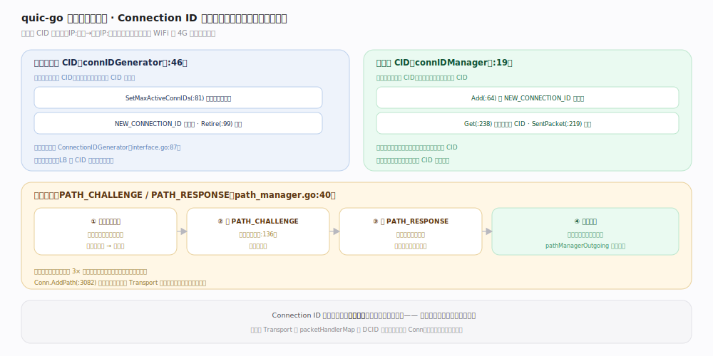

# quic-go 核心原理 · 支撑能力域 · 连接管理与迁移

> **定位**：连接由 Connection ID 标识（非四元组），换网不断。本端签发一批 CID、对端用它们找到我；迁移前用 PATH_CHALLENGE 验证新路径。核实基准：`conn_id_manager.go:19`、`conn_id_generator.go:46`、`path_manager.go:40`。

## 一、两套 CID + 路径验证

**两套 Connection ID**：本端签发的由 `connIDGenerator`（`conn_id_generator.go:46`）管理——`SetMaxActiveConnIDs()`（`:81`）按对端上限签发、`NEW_CONNECTION_ID` 帧下发、`Retire()`（`:99`）回收；应用可自定义 `ConnectionIDGenerator`（`interface.go:87`）用于负载均衡（LB 按 CID 路由到同一后端）。对端的 CID 由 `connIDManager`（`conn_id_manager.go:19`）管理——`Add()`（`:64`）收 `NEW_CONNECTION_ID` 帧入池、`Get()`（`:238`）取当前活跃 CID 作发包的目的 CID、`SentPacket()`（`:219`）计数；迁移或探测新路径时换用未用过的 CID，避免链路观察者靠固定 CID 关联用户。

**路径验证**（`path_manager.go:40`）：① 检测到来自新四元组的包（尚不可信）→ ② 发 `PATH_CHALLENGE`（含随机数据、`:136`）到新地址 → ③ 收 `PATH_RESPONSE` 原样回传随机数据（证明对端确在该地址）→ ④ 迁移完成、切换新路径。验证前对新路径同样受 3× 放大限制，防被用作反射放大攻击。`Conn.AddPath()`（`connection.go:3082`）支持应用主动在新 Transport 上加路径（多路径基础），主动迁移由 `path_manager_outgoing.go` 的 `pathManagerOutgoing` 驱动。

**贯穿层**：Connection ID 是「连接身份」、四元组只是「当前路径」——身份与路径解耦是迁移的根本。服务端 `Transport` 靠 `packetHandlerMap` 按 DCID 把包路由到正确 `Conn`。

## 二、深化 · CID 与迁移锚点

| 项 | 机制 | 源码锚点 |
|---|---|---|
| 对端 CID 池 | connIDManager.Add/Get | `conn_id_manager.go:64` / `:238` |
| 本端 CID 签发 | connIDGenerator.SetMaxActiveConnIDs | `conn_id_generator.go:81` |
| CID 回收 | Retire（RETIRE_CONNECTION_ID） | `conn_id_generator.go:99` |
| 自定义 CID | ConnectionIDGenerator 接口 | `interface.go:87` |
| 路径验证 | PATH_CHALLENGE 含随机数据 | `path_manager.go:136` |
| 主动迁移 | pathManagerOutgoing | `path_manager_outgoing.go` |
| 应用加路径 | Conn.AddPath | `connection.go:3082` |

## 调优要点

- 用自定义 `ConnectionIDGenerator` 把路由信息编码进 CID，可实现 QUIC-aware 负载均衡（LB 无需解密即路由）。
- CID 长度 1~20 字节（`Transport.ConnectionIDLength`），过短增加碰撞风险，默认 4 字节。
- 频繁迁移会触发多次路径验证与放大限制，移动网络下需权衡。

## 常见误区

- **以为连接绑定 IP:端口**：连接绑定的是 CID，四元组变了（换网）连接照旧。
- **混淆两套 CID**：签发给对端的（generator）与对端给我的（manager）是两套，方向别搞反。
- **忽略迁移的放大限制**：新路径验证前受 3× 限制，不是无条件立即全速。

## 一句话总纲

**连接由 Connection ID 而非四元组标识：本端 generator 签发、对端 manager 使用，迁移前用 PATH_CHALLENGE 验证新路径——身份与路径解耦让换网不断连，也支撑 CID 路由的负载均衡与抗关联追踪。**
