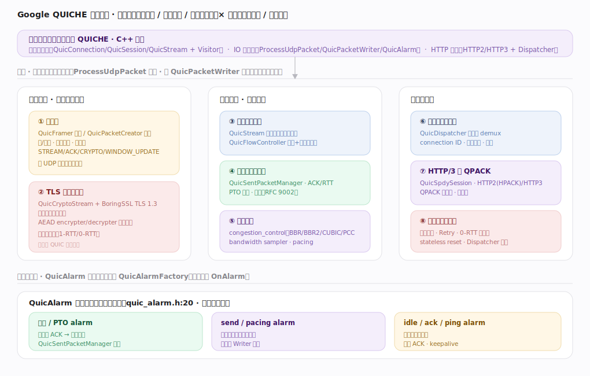
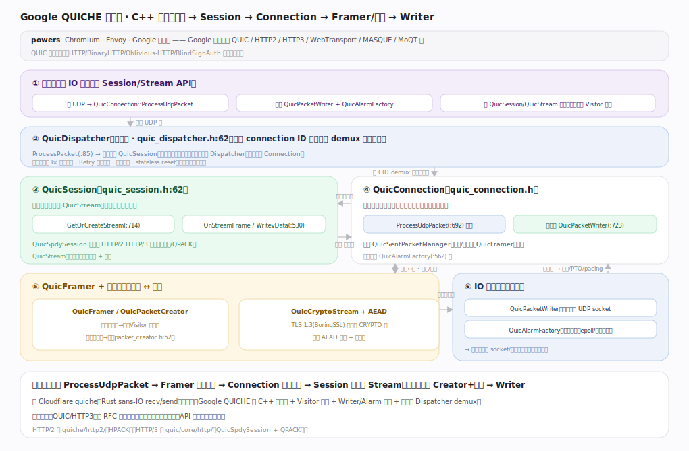
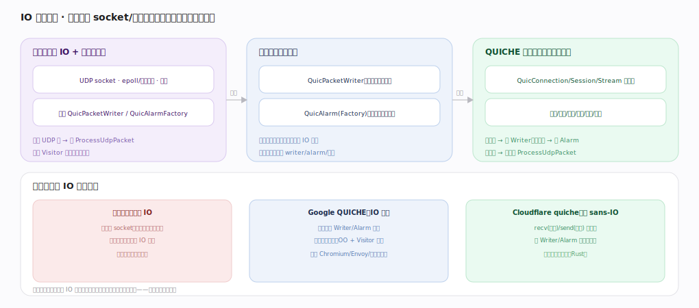
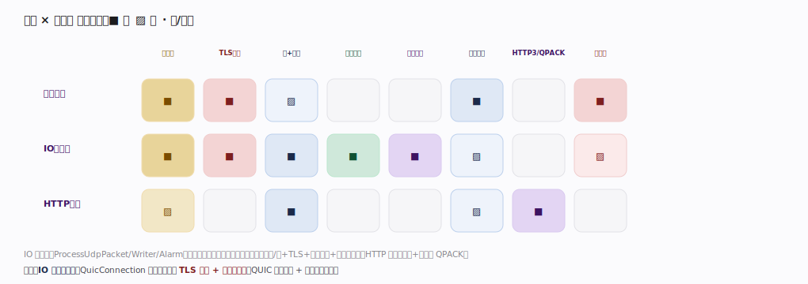

# Google QUICHE 核心原理 · 全景主线框架

> 统领全部原理文档：Google QUICHE 的 **3 条接口主线（会话与连接 / IO 与事件驱动 / HTTP 与流）+ 8 条支撑能力域**，既无遗漏也无越界。核实基准 = 本地源码 `/Users/zhangdongdong92/workdir/quiche`（Google QUICHE，`commit 72810bce`，C++）。QUICHE = **QUIC, Http, Etc**——Google 的生产级 QUIC/HTTP2/HTTP3/WebTransport/MASQUE/MoQT 实现，powers Chromium/Envoy/Google 服务器。在原型库属**新家族（传输协议库，family 8）**，走元模式判型。灵魂三条：**QuicConnection 收发引擎（IO 抽象驱动）**、**QUIC 连接状态机 + TLS 强制加密**、**多流可靠传输（丢包恢复 + 拥塞控制）**。

## 〇、重要澄清：两个"quiche"（读前必看）

"quiche/QUICHE" 有两个同名不同项目，本库指前者：

| | **Google QUICHE**（本库） | Cloudflare quiche |
|---|---|---|
| 语言 | **C++** | Rust |
| 全称 | QUIC, Http, Etc | quiche |
| 用于 | **Chromium / Envoy / Google 服务器** | Cloudflare 边缘、curl 等 |
| API 形态 | **OO：QuicConnection/Session/Stream + Visitor + Writer/Alarm 抽象** | sans-IO：recv/send 纯函数 |
| 范围 | QUIC + HTTP2 + HTTP3 + WebTransport/MASQUE/MoQT… | QUIC + HTTP3 |

协议本身（QUIC RFC 9000、HTTP/3 RFC 9114）两者一致；差异在语言、API 形态与工程结构。**本库讲 Google QUICHE。**

---

## 一、双维模型：能力域 × 执行时机

- **能力域**：接口（会话连接/IO事件/HTTP流）面向应用；支撑侧按线上表示/可靠传输/连接与应用分 8 条——包与帧（QuicFramer/Creator）、TLS 握手与加密（QuicCryptoStream/AEAD）；流与流量控制、丢包检测与恢复（QuicSentPacketManager）、拥塞控制（congestion_control）；连接管理与迁移（QuicDispatcher）、HTTP3 与 QPACK、可靠性与抗攻击。
- **执行时机**：前台是 `ProcessUdpPacket` 入站处理 / 经 `QuicPacketWriter` 出站，均由应用驱动；定时器工作由 **QuicAlarm**（`quic_alarm.h:20`，应用提供 QuicAlarmFactory）驱动——重传/PTO、pacing、idle/ack/ping，无自跑线程。

---

## 二、总架构：C++ 分层 + IO 抽象

应用提供 IO 原语、用 Session/Stream API：收 UDP → `QuicConnection::ProcessUdpPacket`（`quic_connection.h:692`），提供 `QuicPacketWriter`（`:723`）+ `QuicAlarmFactory`（`:562`），经 `QuicSession`/`QuicStream` 读写。服务端 **QuicDispatcher**（`quic_dispatcher.h:62`，`ProcessPacket:85`）按 connection ID 把入站包 demux 到对应会话。`QuicSession`（`quic_session.h:62`）管所有流、分发帧事件（`GetOrCreateStream:714`、`WritevData:530`），`QuicSpdySession` 子类加 HTTP/2·HTTP/3 语义。`QuicConnection` 是连接状态机核心（收包解密解帧、发包组包加密，内含 QuicSentPacketManager/QuicFramer/加密），`QuicFramer`+`QuicPacketCreator` 做字节↔帧、`QuicCryptoStream`+AEAD 做 TLS 与包保护，出站经 `QuicPacketWriter`、计时经 `QuicAlarm`——库不直接碰 socket/时钟。

---

## 三、形态：IO 抽象（应用提供原语，库经接口驱动）

应用拥有 UDP socket / 事件循环 / 时钟并实现 `QuicPacketWriter`（库要发包时调它）、`QuicAlarmFactory`（库要计时时建它），收到 UDP 报喂 `ProcessUdpPacket`、实现 Visitor 接收流数据事件；库只依赖接口不依赖具体 IO 实现（测试可注入模拟 writer/alarm/时钟）。谱系：传统库拥有 IO（难测难嵌）→ **Google QUICHE 是 IO 抽象**（应用提供 Writer/Alarm 原语、库经接口驱动、OO+Visitor 回调，可跑 Chromium/Envoy/测试各环境）→ Cloudflare quiche 是纯 sans-IO（recv/send 纯函数、连 Writer/Alarm 抽象都没有）。共性：应用掌控真实 IO 与并发模型，库专注协议逻辑、可测可嵌，只是抽象粒度不同。

---

## 四、接口 × 能力域 依赖矩阵

IO 与事件（ProcessUdpPacket/Writer/Alarm）几乎踩满全部传输能力域；会话连接以包/帧+TLS+连接迁移+抗攻击为轴；HTTP 与流主用流+流控与 QPACK。灵魂两域是 **IO 与事件驱动**（QuicConnection 收发引擎）与 **TLS 加密 + 连接状态机**（QUIC 强制加密 + 有状态传输）。

---

## 五、8 条支撑能力域的分层归位

| 层 | 支撑能力域 | 一句话职责 | 源码锚点 |
|---|---|---|---|
| 表示 | **包与帧编解码** | QuicFramer 解析 / QuicPacketCreator 组包、头保护 | `quic/core/quic_framer.h`、`quic_packet_creator.h:52` |
| 表示 | **TLS 握手与加密** | QuicCryptoStream + BoringSSL、AEAD 每包加密 | `quic/core/quic_crypto_stream.h:54`、`crypto/` |
| 传输 | **流与流量控制** | QuicStream 多流无队头阻塞、QuicFlowController 两级窗口 | `quic_stream.h`、`quic_flow_controller.h:24` |
| 传输 | **丢包检测与恢复** | QuicSentPacketManager、ACK/RTT/PTO（RFC 9002） | `quic_sent_packet_manager.h:55` |
| 传输 | **拥塞控制** | BBR/BBR2/CUBIC/PCC、bandwidth sampler、pacing | `quic/core/congestion_control/` |
| 连接 | **连接管理与迁移** | QuicDispatcher demux、connection ID、路径验证 | `quic_dispatcher.h:62`、`quic_connection_id_manager.h` |
| 连接 | **HTTP/3 与 QPACK** | QuicSpdySession、HTTP2(HPACK)/HTTP3、QPACK | `quic/core/http/`、`quic/core/qpack/` |
| 连接 | **可靠性与抗攻击** | 放大限制、Retry、0-RTT 抗重放、stateless reset | `quic_connection.h`、`quic_dispatcher.h` |

---

## 六、三条贯穿全库的声明

1. **应用提供 IO 原语（Writer/Alarm），库拥有协议状态机。** QuicConnection/Session/Stream 是状态机；发包调 QuicPacketWriter、计时建 QuicAlarm、收包由应用喂 ProcessUdpPacket——协议逻辑与真实 IO 经抽象解耦。
2. **QUIC 是加密的、有状态的用户态传输。** 建在 UDP 上，TLS 1.3（BoringSSL）握手内嵌走 CRYPTO 帧、每包 AEAD 加密 + 头保护；连接有状态机、用 connection ID 而非四元组（支持迁移），服务端 QuicDispatcher 按 CID demux。
3. **多流可靠传输：无队头阻塞 + 丢包恢复 + 拥塞控制。** QuicStream 多流并行、丢一流的包不阻塞其他流；QuicSentPacketManager 按 ACK/PTO 检测丢失并重传，congestion_control（BBR/CUBIC）+ pacing 决定发送速率。

---

## 常见误区与工程要点

- **把 Google QUICHE 当 Cloudflare quiche**：同名不同项目——C++ OO（Writer/Alarm/Dispatcher/Visitor）vs Rust sans-IO（recv/send）。
- **以为库自己收发/计时**：库经 QuicPacketWriter/QuicAlarm 抽象，真实 IO 归应用。
- **只有 HTTP/3**：QUICHE 同时含 HTTP/2（quiche/http2/，HPACK）与 HTTP/3（quic/core/http/，QPACK），还有 WebTransport/MASQUE/MoQT。
- **把 QUIC 当 TCP+TLS**：用户态实现、连接迁移、0-RTT、多流无队头阻塞，心智不同。

---

## 一句话总纲

**Google QUICHE 是 C++ 的 QUIC/HTTP2/HTTP3 协议栈（powers Chromium/Envoy）：应用提供 QuicPacketWriter（出）+ QuicAlarmFactory（定时器）并把收到的 UDP 报喂 QuicConnection::ProcessUdpPacket，服务端 QuicDispatcher 按 connection ID demux 到 QuicSession，Connection 解密解帧更新状态、Session 分发到 QuicStream、出站经 Framer/Creator+AEAD 加密后由 Writer 发出；QUIC 是加密有状态的用户态传输（TLS 1.3 内嵌、CID、多流无队头阻塞、QuicSentPacketManager 丢包恢复 + congestion_control 拥塞控制），HTTP/2(HPACK)/HTTP/3(QPACK) 架在其上——协议逻辑与真实 IO 经 Writer/Alarm 抽象解耦。**
