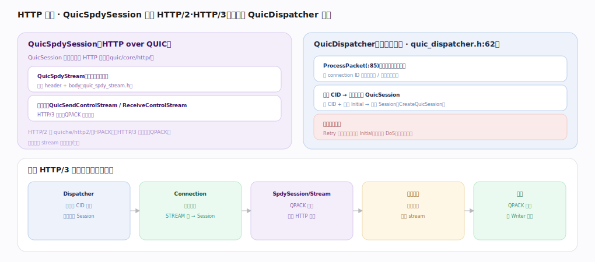

# Google QUICHE 核心原理 · 接口主线 · HTTP 与流

> **定位**：应用层接触面——`QuicSpdySession` 承载 HTTP/2·HTTP/3 语义，服务端 `QuicDispatcher` 按 connection ID 接客分流。是 QUICHE 作 Web 服务器/客户端的入口。核实基准：`quic/core/http/`、`quic_dispatcher.h`、`qpack/`。

## 一、HTTP 语义 + Dispatcher 接客

**QuicSpdySession**（`http/quic_spdy_session.h:162`，QuicSession 子类，加 HTTP 语义）：每个 HTTP 请求一条双向 **QuicSpdyStream**（`http/quic_spdy_stream.h:57`，承载 header 帧 + data 帧），HTTP/3 另有单向控制流 `QuicSendControlStream`（`http/quic_send_control_stream.h:22`，发 SETTINGS）与 `QuicReceiveControlStream`（`http/quic_receive_control_stream.h:19`，收对端设置），帧结构由 `HttpDecoder`（`http/http_decoder.h:29`）解析；HTTP/2 走 `quiche/http2/`（HPACK），HTTP/3 走这里（QPACK）。

**QuicDispatcher**（服务端接客，`quic_dispatcher.h:62`）：所有入站包先到 `ProcessPacket`（`:85`）→`MaybeDispatchPacket`（`:220`）按 connection ID 查已有会话→路由到对应 QuicSession；新 CID + 合法 Initial→`CreateQuicSession`（`:209`）建新 Session；无法建连时 `OnNewConnectionRejected`（`:321`）拒绝，不认识的短头包 `MaybeResetPacketsWithNoVersion`（`:339`）回 stateless reset；乱序早到的 Initial 经 `TryExtractChloOrBufferEarlyPacket`（`:379`）缓冲等 CHLO 齐（兼做入口防护，见抗攻击主线）。

**一个 HTTP/3 请求的旅程**：Dispatcher 按 CID 路由（`:85`）→Connection 解密解帧→STREAM 帧到 SpdySession/SpdyStream→QPACK 解头组装请求→应用生成响应写回 stream→回程 QPACK 编头经 QuicPacketWriter 发出。

## 二、流号语义与并发

QUIC 流号编码方向与发起方：最低两位区分 客户端/服务端发起 × 双向/单向。请求-响应用双向流（客户端发起）；SETTINGS/QPACK 指令用单向流。一个 `QuicSpdyStream` 内部仍是有序字节流（header 段 + body 段有序），但**流间独立**——A 流丢包不阻塞 B 流交付，这是 HTTP/3 相比 HTTP/2（受 TCP 单流队头阻塞拖累）的核心优势。并发流上限由传输参数协商（见流与流量控制主线的 QuicConfig）。

## 深化 · HTTP 与流关键类

| 类 | 职责 | 锚点 |
|---|---|---|
| QuicSpdySession | HTTP over QUIC 语义 | `http/quic_spdy_session.h:162` |
| QuicSpdyStream | 一请求一双向流 | `http/quic_spdy_stream.h:57` |
| QuicSendControlStream | 发 HTTP/3 SETTINGS | `http/quic_send_control_stream.h:22` |
| QuicReceiveControlStream | 收对端控制流 | `http/quic_receive_control_stream.h:19` |
| HttpDecoder | 解析 HTTP/3 帧 | `http/http_decoder.h:29` |
| QuicDispatcher | 服务端按 CID 接客 | `quic_dispatcher.h:62` |

## 深化 · Dispatcher 分流路径

| 环节 | 方法 | 锚点 |
|---|---|---|
| 入站包总入口 | ProcessPacket | `quic_dispatcher.h:85` |
| 查会话/判分流 | MaybeDispatchPacket | `quic_dispatcher.h:220` |
| 新连接建会话 | CreateQuicSession | `quic_dispatcher.h:209` |
| 缓冲早到 Initial | TryExtractChloOrBufferEarlyPacket | `quic_dispatcher.h:379` |
| 拒绝新连接 | OnNewConnectionRejected | `quic_dispatcher.h:321` |
| 无版本包重置 | MaybeResetPacketsWithNoVersion | `quic_dispatcher.h:339` |

## 深化 · 请求体重组

`QuicSpdyStream` 的字节重组沿用底层 `QuicStreamSequencer`（`quic_stream_sequencer.h:25`）：乱序到达的 STREAM 帧经 `OnStreamFrame`（`:69`）按偏移插入缓冲，连续可读时才交给 HTTP/3 帧解析（`HttpDecoder` `http/http_decoder.h:29`）拆出 HEADERS/DATA；应用读走 body 后 `MarkConsumed`（`:108`）推进。故"HTTP 请求体"在库内始终是一条有序字节流的视图，跨包乱序对上层透明——这正是流间独立、流内有序在应用层的体现。

## 调优要点（关键开关）

- 应用继承 `QuicSpdyStream` 处理请求/响应，别裸拼 header。
- Dispatcher 层做限流/Retry，抗放大与 DoS（见抗攻击）。
- QPACK 动态表大小权衡压缩率 vs 队头阻塞。
- 长连接复用多请求，控制并发流上限。

## 常见误区与工程要点

- **一请求一连接**：QUIC 是一连接多流，一请求一双向 QuicSpdyStream。
- **绕过 Dispatcher 建连**：服务端新连接必经 `MaybeDispatchPacket`（`:220`）+`CreateQuicSession`（`:209`）。
- **混淆 HPACK/QPACK**：HTTP/2 用 HPACK，HTTP/3 用 QPACK（抗队头阻塞）。
- **不做入口防护**：Initial 不缓冲/限流会被放大攻击/DoS 打爆。

## 一句话总纲

**HTTP 与流是 QUICHE 的应用层接触面：`QuicSpdySession`（`http/quic_spdy_session.h:162`）在 QuicSession 上加 HTTP/2·HTTP/3 语义，每请求一条双向 `QuicSpdyStream`（`:57`）承载 header+data，控制流 `QuicSendControlStream`/`QuicReceiveControlStream` 跑 HTTP/3 SETTINGS 与 QPACK；服务端 `QuicDispatcher`（`quic_dispatcher.h:62`）`ProcessPacket`（`:85`）按 connection ID 接客——`MaybeDispatchPacket`（`:220`）查会话/`CreateQuicSession`（`:209`）建新连接、`TryExtractChloOrBufferEarlyPacket`（`:379`）缓冲早到 Initial；一个请求经 Dispatcher 路由→Connection 解帧→SpdyStream QPACK 解头→应用处理→回程编头经 Writer 发出。**
