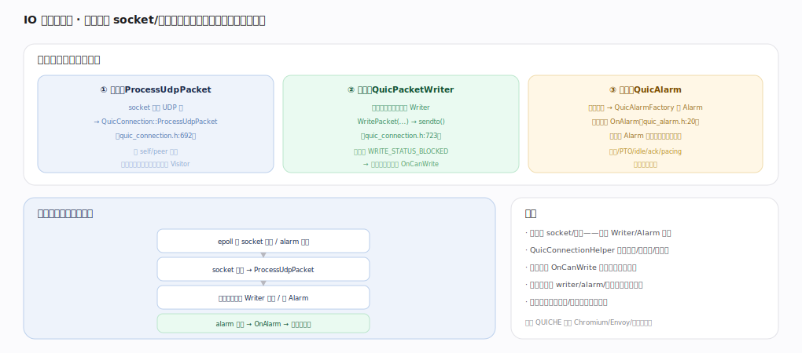

# Google QUICHE 核心原理 · 接口主线 · IO 与事件驱动

> **定位**：灵魂接触面——库不碰真实 socket/时钟，经 `ProcessUdpPacket`（入）/`QuicPacketWriter`（出）/`QuicAlarm`（时钟）三个抽象由应用驱动。是 QUICHE 可嵌 Chromium/Envoy/测试的根源。核实基准：本地源码 `quic/core/`。

## 一、三个契约点 + 事件循环

应用与库的三个契约点：**① 入站 ProcessUdpPacket**（socket 收到 UDP 报→`QuicConnection::ProcessUdpPacket`，`quic_connection.h:692`，带 self/peer 地址，解密解帧、更新状态、触发 Visitor）；**② 出站 QuicPacketWriter**（库要发包时调应用的 Writer→`WritePacket`→`sendto`，`:723`；可返回 `WRITE_STATUS_BLOCKED`→库暂停、可写时 `OnCanWrite` 恢复）；**③ 时钟 QuicAlarm**（库要计时→`QuicAlarmFactory` 建 Alarm，到点触发 `OnAlarm`，`quic_alarm.h:20`；应用把 Alarm 挂自己的事件循环；重传/PTO/idle/ack/pacing，无库自跑线程）。典型事件循环：epoll 等 socket 可读/alarm 到期→可读则 ProcessUdpPacket→库内部按需调 Writer 发包/设 Alarm→alarm 到期 OnAlarm 处理超时。`QuicConnectionHelper` 提供时钟/随机数/分配器。库全经抽象、可注入模拟做确定性测试、并发模型由应用定。

---

## 拓展 · IO 抽象接口

| 抽象 | 方向 | 职责 |
|---|---|---|
| ProcessUdpPacket | 入站 | 喂一个 UDP 报字节 |
| QuicPacketWriter | 出站 | 库调它把包写 socket |
| QuicAlarm / Factory | 时钟 | 库建定时器、到点 OnAlarm |
| QuicConnectionHelper | 辅助 | 时钟/随机/内存分配 |
| OnCanWrite | 反压 | 写阻塞解除后恢复发送 |

---

## 调优要点（关键开关）

- Writer 支持 GSO/批量发降 syscall；实现好 BLOCKED/OnCanWrite 别丢包。
- Alarm 对接 epoll timerfd/事件循环定时器，精度影响重传/pacing。
- 高吞吐用 recvmmsg/GRO 批量收再逐包 ProcessUdpPacket。
- 单线程事件循环最常见；多线程需自管连接归属。

---

## 常见误区与工程要点

- **以为库自己收发**：库经 Writer/ProcessUdpPacket 抽象，socket 归应用。
- **不处理写阻塞**：Writer 返回 BLOCKED 却不实现 OnCanWrite 会卡死发送。
- **Alarm 不接事件循环**：定时器不触发→重传/keepalive 失效。
- **多线程乱用**：一个连接的调用需串行化到其所属线程。

---

## 一句话总纲

**IO 与事件驱动是 QUICHE 的灵魂接触面：库不碰真实 socket/时钟，而经三个抽象由应用驱动——入站 ProcessUdpPacket 喂 UDP 报、出站 QuicPacketWriter 让库发包（支持 BLOCKED/OnCanWrite 反压）、时钟 QuicAlarm 让库计时（重传/PTO/pacing/idle）；应用在自己的事件循环里编排收包→库处理→按需发包/设闹钟，可注入模拟做确定性测试——这是它可嵌 Chromium/Envoy 的根源。**
