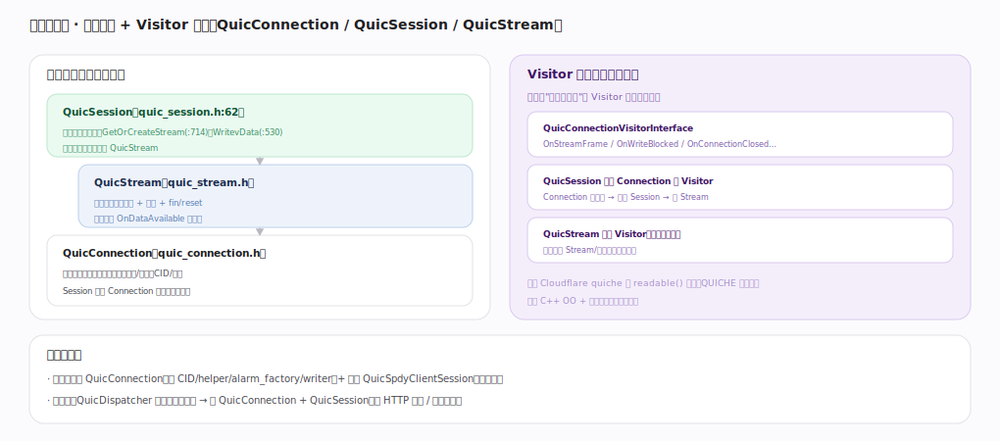

# Google QUICHE 核心原理 · 接口主线 · 会话与连接

> **定位**：核心编程接触面——三层对象 QuicConnection/QuicSession/QuicStream + Visitor 回调。是应用操作 QUIC 的主 API，依赖**连接管理**、**流与流量控制**能力域。核实基准：本地源码 `quic/core/`。

## 一、三层对象 + Visitor 回调

**三层**（自上而下）：**QuicSession**（`quic_session.h:62`，管连接内所有流，`GetOrCreateStream:714`/`WritevData:530`，收帧事件分发到流）→ **QuicStream**（`quic_stream.h`，单条流的收发缓冲 + 流控 + fin/reset，应用重写 `OnDataAvailable` 收数据）；QuicSession 建在 **QuicConnection**（`quic_connection.h`，连接状态机：收发包、握手、丢包/拥塞、CID/迁移）之上（拥有它）。**Visitor 回调（控制反转）**：连接把"发生了什么"经 `QuicConnectionVisitorInterface`（OnStreamFrame/OnWriteBlocked/OnConnectionClosed…）回调上层——QuicSession 就是 Connection 的 Visitor（收到帧→回调 Session→找 Stream），QuicStream 也有 Visitor。对比 Cloudflare quiche 的 `readable` 轮询，QUICHE 用回调推（C++ OO + 观察者模式）。建连：客户端建 Connection + QuicSpdyClientSession 发起握手；服务端由 QuicDispatcher 建（见 HTTP 与流）。

---

## 拓展 · 会话连接关键类

| 类 | 职责 | 锚点 |
|---|---|---|
| QuicConnection | 连接状态机、收发包 | `quic_connection.h` |
| QuicSession | 管流、分发帧事件 | `quic_session.h:62` |
| QuicStream | 单流收发 + 流控 | `quic_stream.h` |
| QuicSpdySession | 加 HTTP 语义 | `quic/core/http/` |
| Visitor 接口 | 事件回调上层 | `QuicConnectionVisitorInterface` |

---

## 调优要点（关键开关）

- 用 Session/Stream API，别直接操作 Connection 底层。
- 应用继承 QuicStream/QuicSpdyStream 实现回调消费数据。
- 流的创建受流数上限约束（见流与流量控制）。
- 连接关闭走 CloseConnection/OnConnectionClosed 回调，勿裸释放。

---

## 常见误区与工程要点

- **轮询读数据**：QUICHE 是回调推（OnDataAvailable），不是 Cloudflare 的 readable 轮询。
- **绕过 Session 操作 Stream**：帧分发由 Session 编排，应经其 API。
- **以为 Connection = Session**：Connection 是传输状态机，Session 管流 + HTTP 语义。
- **忽视 Visitor 生命周期**：回调对象销毁早于连接会崩。

---

## 一句话总纲

**会话与连接是 QUICHE 的核心 API：QuicConnection（传输状态机）之上建 QuicSession（管连接内所有流、分发帧事件），再管理多个 QuicStream（单流收发+流控）；连接经 Visitor 接口把事件回调上层（Session 即 Connection 的 Visitor、收帧后路由到 Stream），应用继承 Stream 实现 OnDataAvailable 消费数据——C++ OO + 观察者回调，区别于 sans-IO 的轮询风格。**
