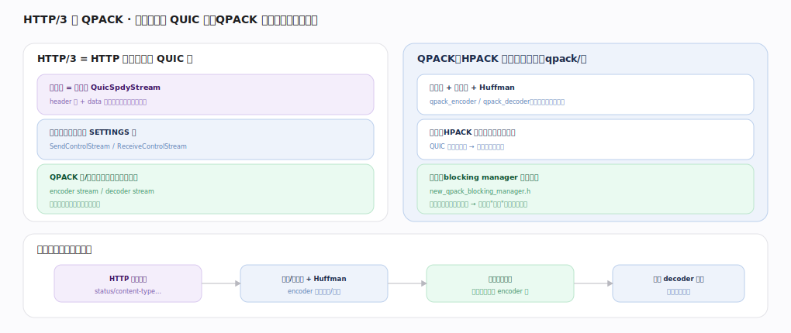

# Google QUICHE 核心原理 · 支撑能力域 · HTTP/3 与 QPACK

> **定位**：应用层适配——HTTP 请求映射到 QUIC 双向流，QPACK 压缩头字段且用 blocking manager 抗队头阻塞（HPACK 的 QUIC 版改造）。核实基准：`quic/core/http/`、`quic/core/qpack/`（`qpack_encoder.h`、`qpack_decoder.h`、`new_qpack_blocking_manager.h`）。

## 一、请求映射 + QPACK 压缩

**HTTP/3 = HTTP 语义映射到 QUIC 流**：一请求 = 一双向 `QuicSpdyStream`（`http/quic_spdy_stream.h:57`，HEADERS 帧 + DATA 帧，帧结构由 `HttpDecoder` `http/http_decoder.h:29` 解析，流间独立无队头阻塞）；控制流（单向）`QuicSendControlStream`（`http/quic_send_control_stream.h:22`）/`QuicReceiveControlStream`（`http/quic_receive_control_stream.h:19`）传 SETTINGS；QPACK 另有编码流/解码流（单向各一对，动态表指令与确认走这两条流）。

**QPACK（qpack/）**：静态表（`qpack_static_table.h`，预定义常见头，固定索引）+ 动态表 + Huffman——`QpackEncoder`（`qpack/qpack_encoder.h:36`）`EncodeHeaderList`（`:57`）把头字段集查表编成索引/字面，`QpackDecoder`（`qpack/qpack_decoder.h:30`）还原。**核心问题**：HPACK 动态表要求编解码严格同序，而 QUIC 流可乱序到达——若某头引用的动态表项所在包还没到，直接阻塞会拖累其它流。**解法** `NewQpackBlockingManager`（`qpack/new_qpack_blocking_manager.h:26`）：`OnHeaderBlockSent`（`:66`）登记某头块对动态表项的依赖（Required Insert Count），`stream_is_blocked`（`:70`）判断该流是否因依赖未到而阻塞——某流阻塞不拖累别流，把队头阻塞隔离到单流。

**响应头编码旅程**：HTTP 头字段集→`EncodeHeaderList`（`:57`）查静/动态表 + Huffman 编成索引/字面→经请求流发出（动态表插入指令走 encoder 流）→对端 `QpackDecoder`（`:30`）依赖到齐（`stream_is_blocked:70` 解除）才还原成头。

## 二、动态表的取舍

静态表零协商、零依赖，但只覆盖固定常见头；动态表把本连接高频头（如自定义 header、cookie）也压成索引，压缩率高，代价是引入跨包依赖 → 潜在队头阻塞 + 双端内存。QPACK 用两条独立单向流（encoder/decoder 流）把"动态表变更"与"请求流"解耦，再用 `NewQpackBlockingManager`（`:26`）限制"最大阻塞流数"——在压缩率与时延间取平衡。这是 QPACK 相对 HPACK 的全部复杂度来源：它要在乱序传输上重建 HPACK 的有序表语义，同时不牺牲 QUIC 无队头阻塞的优势。

## 深化 · HTTP/3 流与帧

| 组件 | 职责 | 锚点 |
|---|---|---|
| QuicSpdyStream | 一请求一双向流（HEADERS+DATA） | `http/quic_spdy_stream.h:57` |
| HttpDecoder | 解析 HTTP/3 帧 | `http/http_decoder.h:29` |
| QuicSendControlStream | 发 SETTINGS | `http/quic_send_control_stream.h:22` |
| QuicReceiveControlStream | 收对端控制流 | `http/quic_receive_control_stream.h:19` |

## 深化 · QPACK 组件

| 组件 | 职责 | 锚点 |
|---|---|---|
| QpackEncoder / EncodeHeaderList | 查表 + Huffman 编头 | `qpack/qpack_encoder.h:36` / `:57` |
| QpackDecoder | 还原头字段 | `qpack/qpack_decoder.h:30` |
| 静态表 | 预定义常见头 | `qpack/qpack_static_table.h` |
| NewQpackBlockingManager | 追踪依赖、隔离阻塞 | `qpack/new_qpack_blocking_manager.h:26` |
| OnHeaderBlockSent | 登记头块依赖 | `qpack/new_qpack_blocking_manager.h:66` |
| stream_is_blocked | 判该流是否阻塞 | `qpack/new_qpack_blocking_manager.h:70` |

## 深化 · QPACK 动态表与指令流

动态表的插入/淘汰由 `QpackEncoderHeaderTable`（`qpack/qpack_header_table.h:245`，基类 `QpackHeaderTableBase` `:37`）维护，编码器把"插入新表项"作为指令经 `QpackEncoderStreamSender`（`qpack/qpack_encoder_stream_sender.h:20`）写到单向 encoder 流；解码器在 decoder 流回确认（Section Acknowledgment / Insert Count Increment）。`QpackEncoder`（`qpack/qpack_encoder.h:36`）在 `EncodeHeaderList`（`:57`）时权衡：引用动态表项能省字节，但会让该头块依赖"表项已送达"，故 `NewQpackBlockingManager`（`new_qpack_blocking_manager.h:26`）据"允许的最大阻塞流数"决定是否冒险引用——这是压缩率与队头阻塞风险之间的运行期取舍。

| 组件 | 职责 | 锚点 |
|---|---|---|
| QpackEncoderHeaderTable | 动态表插入/淘汰 | `qpack/qpack_header_table.h:245` |
| QpackEncoderStreamSender | 发动态表指令到 encoder 流 | `qpack/qpack_encoder_stream_sender.h:20` |

## 调优要点（关键开关）

- 动态表越大压缩率越高，但阻塞风险与内存上升。
- 允许的最大阻塞流数（`NewQpackBlockingManager:26`）权衡压缩 vs 时延。
- 高频头进动态表收益大。
- SETTINGS（`QuicSendControlStream:22`）提前协商参数降首包开销。

## 常见误区与工程要点

- **HTTP/3 用 HPACK**：HTTP/3 用 QPACK（`qpack/`），HPACK 是 HTTP/2。
- **QPACK 无队头阻塞**：动态表依赖仍可能阻塞该流，但被 `stream_is_blocked`（`:70`）隔离不扩散。
- **头压缩走请求流**：动态表指令走独立 encoder/decoder 流。
- **静态表够用**：动态表（`EncodeHeaderList:57`）才是高频头压缩率的来源。

## 一句话总纲

**HTTP/3 与 QPACK 是 QUICHE 的应用层适配：HTTP 请求映射到双向 `QuicSpdyStream`（`http/quic_spdy_stream.h:57`，HEADERS+DATA、`HttpDecoder:29` 解帧、流间独立），`QpackEncoder`（`qpack/qpack_encoder.h:36`）`EncodeHeaderList`（`:57`）用静态表+动态表+Huffman 压缩头、`QpackDecoder`（`:30`）还原；针对 HPACK 严格有序在乱序 QUIC 流上会引入队头阻塞的问题，QPACK 用独立 encoder/decoder 流传动态表指令、`NewQpackBlockingManager`（`new_qpack_blocking_manager.h:26`）`OnHeaderBlockSent`（`:66`）/`stream_is_blocked`（`:70`）追踪依赖把阻塞隔离到单流——既保压缩率又不牺牲 QUIC 的无队头阻塞优势。**
