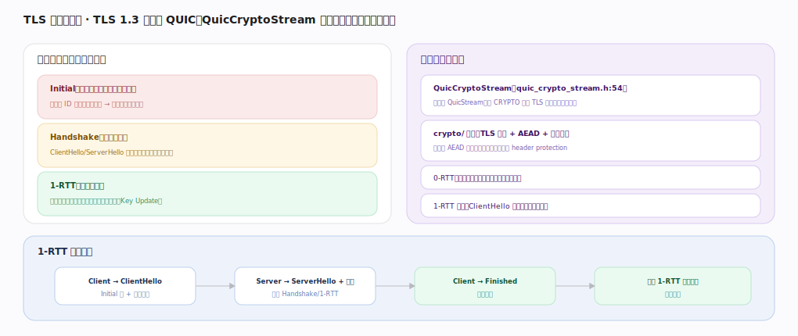

# Google QUICHE 核心原理 · 支撑能力域 · TLS 握手与加密

> **定位**：安全地基——TLS 1.3 内嵌于 QUIC 传输，`QuicCryptoStream` 经 CRYPTO 帧跑握手，按 Initial/Handshake/1-RTT 三级密钥分层保护。核实基准：`quic/core/quic_crypto_stream.h`、`quic_types.h`（EncryptionLevel）、`quic/core/crypto/`。

## 一、加密级与握手承载

**三个加密级逐步升级**（`quic_types.h:490` `enum EncryptionLevel`）：**ENCRYPTION_INITIAL**（`:491`，用连接 ID 派生的公开密钥，人人可算，仅防篡改不防窃听）→ **ENCRYPTION_HANDSHAKE**（`:492`，ClientHello/ServerHello 交换后派生，保护握手消息）→ **ENCRYPTION_ZERO_RTT**（`:493`，0-RTT 早期数据）→ **ENCRYPTION_FORWARD_SECURE**（`:494`，即 1-RTT，握手完成后保护应用数据，密钥可轮换 Key Update）。

**承载**：`QuicCryptoStream`（`quic_crypto_stream.h:54`）是特殊 QuicStream，走 CRYPTO 帧传 TLS 消息（不占流号）：入向 `OnCryptoFrame`（`:72`）收握手字节喂 TLS 状态机，出向 `WriteCryptoData`（`:91`）/`WriteCryptoFrame`（`:238`）按加密级发；密钥就绪时 `OnPacketDecrypted`（`:114`）通知连接可升级读密钥；每级有独立缓冲上限 `BufferSizeLimitForLevel`（`:165`）防握手数据撑爆内存。`crypto/` 目录做 TLS（BoringSSL）适配 + AEAD 载荷加密认证，包号与首字节另有 header protection。

**Key Update**：连接可 `InitiateKeyUpdate`（`quic_connection.h:1039`）主动轮换 1-RTT 密钥、对端经 `OnKeyUpdate`（`:807`，visitor `:260`）感知——前向保密的运行期加固。**0-RTT**：复用会话票据的首包即带应用数据（有重放风险，需应用侧幂等保护）。

## 二、握手时序与密钥升级

**1-RTT 首连**：Client→ClientHello（Initial 级 CRYPTO 帧 + 密钥参数）→Server→ServerHello+证书+Finished（派生 Handshake/1-RTT 密钥）→Client→Finished→双向进入 ENCRYPTION_FORWARD_SECURE。每收到更高级密钥，`QuicCryptoStream` 经 `OnPacketDecrypted`（`:114`）通知连接切读密钥，出向 `WriteCryptoData`（`:91`）按当前可用最高级发。**握手内嵌**是 QUIC 与 "TCP+TLS 两段式" 的根本区别：传输握手与加密握手合一、CRYPTO 帧与其他帧同包乱序推进、0-RTT 让复访首包即带数据——省整整 1 个 RTT。

## 深化 · 加密级（EncryptionLevel）

| 级别 | 保护对象 | 锚点 |
|---|---|---|
| ENCRYPTION_INITIAL | 握手首包（公开密钥，防篡改） | `quic_types.h:491` |
| ENCRYPTION_HANDSHAKE | 握手消息 | `quic_types.h:492` |
| ENCRYPTION_ZERO_RTT | 0-RTT 早期数据（有重放风险） | `quic_types.h:493` |
| ENCRYPTION_FORWARD_SECURE | 1-RTT 应用数据（可 Key Update） | `quic_types.h:494` |

## 深化 · QuicCryptoStream 关键方法

| 环节 | 方法 | 锚点 |
|---|---|---|
| 类定义（特殊 QuicStream） | QuicCryptoStream | `quic_crypto_stream.h:54` |
| 收握手字节 | OnCryptoFrame | `quic_crypto_stream.h:72` |
| 发握手数据 | WriteCryptoData | `quic_crypto_stream.h:91` |
| 按级发 CRYPTO 帧 | WriteCryptoFrame | `quic_crypto_stream.h:238` |
| 密钥就绪通知 | OnPacketDecrypted | `quic_crypto_stream.h:114` |
| 每级缓冲上限 | BufferSizeLimitForLevel | `quic_crypto_stream.h:165` |
| 主动轮换 1-RTT 密钥 | InitiateKeyUpdate | `quic_connection.h:1039` |

## 深化 · TLS 握手器（TlsHandshaker）

`QuicCryptoStream` 之下真正推进 TLS 1.3 状态机的是 `TlsHandshaker`（`tls_handshaker.h:29`，`TlsConnection::Delegate` 的实现，桥接 BoringSSL）：`AdvanceHandshake`（`:64`）把 CRYPTO 帧带来的握手字节喂 BoringSSL、取出要发的握手数据回填。客户端/服务端各有子类——`TlsClientHandshaker`（`tls_client_handshaker.h`）、`TlsServerHandshaker`（`tls_server_handshaker.h:50`，服务端异步取证书/密钥时 `AdvanceHandshakeFromCallback` `:165` 回调续跑）。分层是：`QuicCryptoStream`（`quic_crypto_stream.h:54`，QUIC 侧 CRYPTO 帧收发）↔ `TlsHandshaker`（TLS 状态机）↔ BoringSSL（密码学）。

| 组件 | 职责 | 锚点 |
|---|---|---|
| TlsHandshaker | 推进 TLS 状态机（桥接 BoringSSL） | `tls_handshaker.h:29` |
| AdvanceHandshake | 喂握手字节、取待发数据 | `tls_handshaker.h:64` |
| TlsServerHandshaker | 服务端握手器 | `tls_server_handshaker.h:50` |
| TlsClientHandshaker | 客户端握手器 | `tls_client_handshaker.h` |

## 调优要点（关键开关）

- 开 0-RTT 省 1 RTT，但需应用侧幂等/抗重放保护。
- Session ticket 复用与证书链大小影响首包与握手体积。
- Key Update（`quic_connection.h:1039`）周期轮换提升前向保密。
- 每级握手缓冲上限（`:165`）防握手数据泛滥耗内存。

## 常见误区与工程要点

- **QUIC 握手 = TLS over TCP**：QUIC 把 TLS 1.3 内嵌传输、握手加密合一、走 CRYPTO 帧，不是两段式。
- **CRYPTO 帧占流号**：CRYPTO 帧是独立空间，不占用户流号。
- **1-RTT 密钥永不变**：可经 `InitiateKeyUpdate`（`:1039`）轮换。
- **0-RTT 无风险**：0-RTT 数据可被重放，需业务层幂等保障。

## 一句话总纲

**TLS 握手与加密是 QUICHE 的安全地基：TLS 1.3（BoringSSL）内嵌 QUIC 传输，`QuicCryptoStream`（`quic_crypto_stream.h:54`）经 CRYPTO 帧收发握手（`OnCryptoFrame:72`/`WriteCryptoData:91`），按 `EncryptionLevel`（`quic_types.h:490`）四级——INITIAL/HANDSHAKE/ZERO_RTT/FORWARD_SECURE——分层用 AEAD 保护载荷、header protection 保护包号；`OnPacketDecrypted`（`:114`）驱动密钥升级、`InitiateKeyUpdate`（`quic_connection.h:1039`）轮换 1-RTT 密钥；握手内嵌 + 0-RTT 是 QUIC 相比 TCP+TLS 省 RTT 的关键。**
