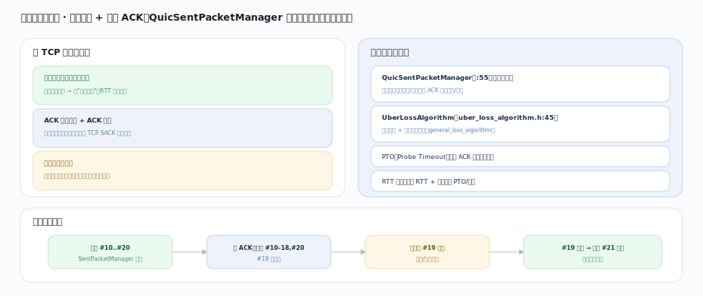

# Google QUICHE 核心原理 · 支撑能力域 · 丢包检测与恢复

> **定位**：可靠性引擎——单调包号 + 显式 ACK，`QuicSentPacketManager` 追踪在途包、`UberLossAlgorithm` 判丢、按需用新包号重传。核实基准：`quic/core/quic_sent_packet_manager.h`、`congestion_control/uber_loss_algorithm.h`、`general_loss_algorithm.h`。

## 一、包号与判丢机制

**与 TCP 的关键区别**：QUIC 包号单调递增、永不复用——重传用新包号，故无 TCP 的"重传歧义"（Karn 问题），RTT 采样精确；ACK 帧带已收包号区间 + ACK 延迟，比 TCP SACK 表达力更强；数据与包号解耦——丢的帧内容重新封进新包重发，不重发原包。**判丢与重传**：`QuicSentPacketManager`（`:55`）记录每包发送时间/内容，收 ACK 后判交付/丢失；`UberLossAlgorithm`（`:45`，内含 `general_loss_algorithm`）用乱序阈值 + 时间阈值判丢；PTO（Probe Timeout）在无 ACK 时超时探测重传；RTT 估计（平滑 RTT + 方差）喂 PTO 与拥塞控制。**闭环**：发 #10-#20→收 ACK 确认 #10-18/#20（#19 疑似丢）→阈值判 #19 丢失→#19 内容封进新包 #21 重发 + 通知拥塞控制。

---

## 拓展 · 判丢信号

| 机制 | 触发 |
|---|---|
| 乱序阈值 | 后续包号已被 ACK 超过 kPacketThreshold |
| 时间阈值 | 超过 RTT × 系数仍未 ACK |
| PTO | 长时间无任何 ACK，探测性重传 |
| RTT 估计 | smoothed RTT + rttvar，无重传歧义 |

---

## 调优要点（关键开关）

- PTO 初值/退避策略影响尾延迟。
- 乱序阈值权衡误判 vs 恢复速度。
- ACK 频率（延迟 ACK）省带宽 vs RTT 精度。
- 丢包信号及时喂拥塞控制避免过发。

---

## 常见误区与工程要点

- **重传用原包号**：QUIC 重传用新包号，原包号永不复用。
- **RTT 有歧义**：无重传歧义，故 RTT 采样精确（QUIC 优于 TCP）。
- **只靠超时判丢**：主要靠乱序/时间阈值快速判丢，PTO 是兜底。
- **重发整包**：重发的是帧内容重新封的新包，不是原包。

---

## 一句话总纲

**丢包检测与恢复是 QUICHE 的可靠性引擎：包号单调递增永不复用、重传封进新包，消除 TCP 的重传歧义使 RTT 采样精确；QuicSentPacketManager 追踪在途包，UberLossAlgorithm 用乱序阈值 + 时间阈值判丢、PTO 兜底探测，丢失帧内容重新封新包重发并通知拥塞控制——数据与包号解耦是 QUIC 精准恢复的基础。**
