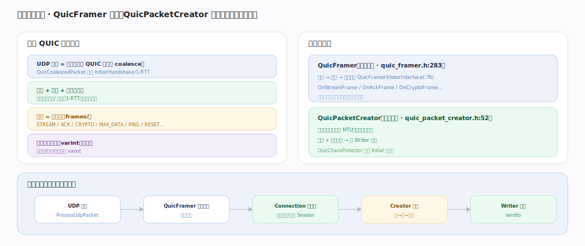

# Google QUICHE 核心原理 · 支撑能力域 · 包与帧编解码

> **定位**：线格式的门面——`QuicFramer` 解析入向、`QuicPacketCreator` 组装出向，把字节流 ↔ 结构化帧。是所有 QUIC 语义的字节层地基。核实基准：`quic/core/quic_framer.h`、`quic_packet_creator.h`、`quic/core/frames/`。

## 一、层次与两个门面

**层次**：一个 UDP 载荷 = 一或多个 QUIC 包（`QuicCoalescedPacket` 可把 Initial/Handshake/1-RTT 合并进一个 UDP 报）；每包 = 包头（长头握手/短头 1-RTT）+ 加密包号 + 受保护载荷；载荷 = 帧序列（`frames/`：STREAM/ACK/CRYPTO/MAX_DATA/PING/RESET…）；帧内类型/长度/偏移用变长整数（varint）省字节。**两个门面**：`QuicFramer`（`:283`，入向：解密→拆帧→逐帧回调 `QuicFramerVisitorInterface`（`:76`，OnStreamFrame/OnAckFrame/OnCryptoFrame…），负责版本协商、包号恢复、认证失败即丢）；`QuicPacketCreator`（`:52`，出向：把帧塞进包、控制 MTU、决定封包时机、加密+分配包号→交 Writer；`QuicChaosProtector` 打乱 Initial 抗指纹）。链路位置：UDP 入→Framer 解→Connection 处理→Creator 组包→Writer 发。

---

## 拓展 · 帧与编码

| 帧类型 | 用途 |
|---|---|
| STREAM | 承载流数据（含 offset/fin） |
| ACK | 确认已收包号范围 |
| CRYPTO | 握手数据（不占流号） |
| MAX_DATA / MAX_STREAM_DATA | 流量控制窗口更新 |
| RESET_STREAM / STOP_SENDING | 流中止 |
| NEW_CONNECTION_ID / PATH_CHALLENGE | 迁移相关 |

---

## 调优要点（关键开关）

- coalesce 合并握手包降 RTT/syscall。
- MTU 探测（PMTUD）提升单包载荷。
- varint 编码对小值友好，帧顺序影响解析成本。
- 认证失败包静默丢弃，不泄露状态。

---

## 常见误区与工程要点

- **包 = 帧**：一个包内可含多个不同类型帧。
- **包号明文**：包号是加密保护的，需先解密恢复。
- **STREAM 帧才是数据**：握手数据走 CRYPTO 帧，不占流号。
- **忽略 coalesce**：不合并握手包会多花 RTT。

---

## 一句话总纲

**包与帧编解码是 QUICHE 的字节层地基：QuicFramer 把入向 UDP 载荷解密、拆成帧并逐帧回调，QuicPacketCreator 把出向帧组装成包、加密、分配包号交 Writer；一个 UDP 报可 coalesce 多个包，载荷是 STREAM/ACK/CRYPTO 等帧序列、字段用 varint 编码——这层门面之上才谈得上流、握手、拥塞等一切 QUIC 语义。**
