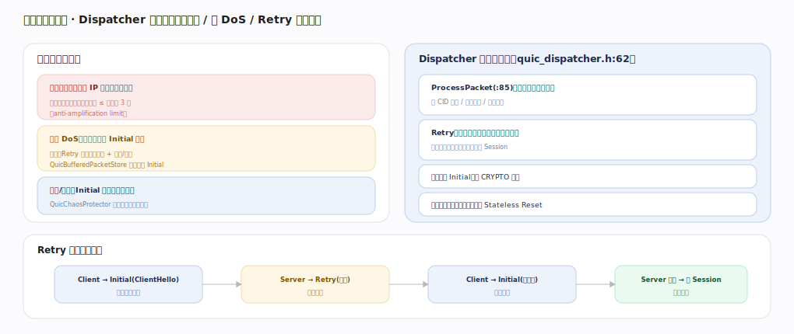

# Google QUICHE 核心原理 · 支撑能力域 · 可靠性与抗攻击

> **定位**：入口防线——`QuicDispatcher` 作服务端关卡，抗放大（3 倍限额）、抗 DoS（Retry 地址验证 + 缓冲限流）、抗指纹（ChaosProtector）。核实基准：`quic/core/quic_dispatcher.h`、`quic_buffered_packet_store.h`、`quic_chaos_protector.h`。

## 一、三类威胁与 Dispatcher 防护

**三类威胁与防护**：**放大攻击**（伪造源 IP 让服务端猛回包做反射放大）→ 未验证地址前回包 ≤ 收到的 3 倍（anti-amplification limit）；**洪泛 DoS**（海量新连接 Initial 打爆）→ Retry 强制地址验证 + 缓冲/限流，`QuicBufferedPacketStore`（`:57`）暂存乱序 Initial；**指纹/审查**（Initial 可被中间盒识别）→ `QuicChaosProtector` 打乱首包结构抗指纹。**Dispatcher 关卡**（`quic_dispatcher.h:62`）：`ProcessPacket`（`:85`）所有入站包先过它，按 CID 分流/判新连接/丢无效包；Retry 回令牌要求客户端带回证明源地址真实才建 Session；缓冲乱序 Initial 等 CRYPTO 齐；对不认识的包回 Stateless Reset。**Retry 时序**：Client→Initial（源未验证）→Server→Retry(令牌，不建状态)→Client→Initial(带令牌)→Server 校验→建 Session。

---

## 拓展 · 防护机制

| 威胁 | 防护 | 锚点 |
|---|---|---|
| 反射放大 | 3× anti-amplification limit | RFC 9000 §8 |
| 洪泛 DoS | Retry + 缓冲 + 限流 | QuicDispatcher / BufferedPacketStore |
| 指纹识别 | Initial 结构打乱 | QuicChaosProtector |
| 迟到/无效包 | Stateless Reset | QuicDispatcher |

---

## 调优要点（关键开关）

- 高负载下开 Retry 强制地址验证防洪泛。
- 缓冲区大小权衡容忍乱序 vs 内存耗尽风险。
- 放大限额与握手包体积权衡建连速度。
- 限流阈值按部署规模调，防单源打爆。

---

## 常见误区与工程要点

- **服务端可随便回包**：未验证地址前受 3 倍放大限额约束。
- **Retry 总是必需**：Retry 是可选防护，负载高/疑似攻击时启用。
- **Dispatcher 只做路由**：它还是抗 DoS/放大的核心入口关卡。
- **首包结构固定**：ChaosProtector 会打乱 Initial 抗指纹与审查。

---

## 一句话总纲

**可靠性与抗攻击是 QUICHE 的入口防线：QuicDispatcher 作服务端关卡先过所有入站包，用 3 倍 anti-amplification limit 抗反射放大、Retry 地址验证 + BufferedPacketStore 缓冲限流抗洪泛 DoS、ChaosProtector 打乱 Initial 抗指纹审查、Stateless Reset 处理迟到包；Retry 令牌往返证明源可达才建 Session——把攻击挡在建立连接状态之前，是 QUIC 面向公网部署的安全基石。**
