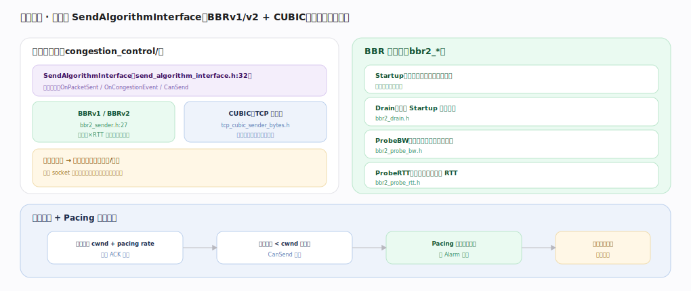

# Google QUICHE 核心原理 · 支撑能力域 · 拥塞控制

> **定位**：带宽治理——可插拔 `SendAlgorithmInterface`，内置 BBRv2 与 CUBIC，全用户态实现故可热切换/快速实验，`PacingSender` 平滑注入。核实基准：`congestion_control/send_algorithm_interface.h`、`bbr2_sender.h`、`bbr2_misc.h`、`tcp_cubic_sender_bytes.h`、`pacing_sender.h`。

## 一、可插拔算法 + BBR 阶段

**可插拔**：`SendAlgorithmInterface`（`congestion_control/send_algorithm_interface.h:32`）统一接口——`OnPacketSent`（`:123`）记发送、`OnCongestionEvent`（`:111`）收 ACK/丢包信号更新模型、`CanSend`（`:139`）门禁（在途字节 < cwnd 才可发）、`PacingRate`（`:142`）给发送速率、`GetCongestionWindow`（`:154`）给拥塞窗口；实现有 **BBRv2**（`bbr2_sender.h:27`，测带宽×RTT 建模、不靠丢包信号）与 **CUBIC**（`tcp_cubic_sender_bytes.h:34`，丢包驱动、三次函数增窗、TCP 兼容）。全用户态实现，无需内核改动，同一进程不同连接可用不同算法、便于灰度（Google 借此在真实流量上快速试新算法）。

**BBR 四阶段**（`bbr2_misc.h:649` `enum class Bbr2Mode`）：Startup（指数探带宽，带宽不再增即退）→ Drain（排空 Startup 造的队列）→ ProbeBW（周期探带宽、稳态巡航）→ ProbeRTT（周期降窗测最小 RTT）。

**cwnd + Pacing 协作**：算法经 `GetCongestionWindow`（`:154`）给 cwnd + `PacingRate`（`:142`）给速率→`CanSend`（`:139`）门禁在途 < cwnd 才放行→`PacingSender`（`pacing_sender.h:31`）经 QuicAlarm 定时按速率均匀发→避免突发丢包。

## 二、为什么拥塞控制在用户态是优势

TCP 拥塞控制在内核，升级需全网换内核、迭代以年计；QUIC 把它放用户态，随应用版本发布即可上线新算法、甚至同一部署对不同连接做 A/B。`SendAlgorithmInterface`（`:32`）的窄接口（发送/事件/门禁/速率四组方法）让 BBR、CUBIC、乃至实验算法即插即换。BBR 用带宽×RTT 建模而非把丢包当唯一拥塞信号，在有随机丢包的无线/长肥管道上比 CUBIC 更抗误判——这正是 Google 能在生产快速演进拥塞控制的工程根源。

## 深化 · SendAlgorithmInterface 契约

| 方法 | 职责 | 锚点 |
|---|---|---|
| 接口定义 | SendAlgorithmInterface | `send_algorithm_interface.h:32` |
| OnPacketSent | 记录发包 | `send_algorithm_interface.h:123` |
| OnCongestionEvent | 收 ACK/丢包更新模型 | `send_algorithm_interface.h:111` |
| CanSend | 在途 < cwnd 门禁 | `send_algorithm_interface.h:139` |
| PacingRate | 给发送速率 | `send_algorithm_interface.h:142` |
| GetCongestionWindow | 给拥塞窗口 | `send_algorithm_interface.h:154` |

## 深化 · 算法实现与对比

| 算法 | 信号 | 特点 | 锚点 |
|---|---|---|---|
| BBRv2 | 带宽 + RTT 建模 | 高吞吐、抗随机丢包、低排队 | `bbr2_sender.h:27` |
| BBR 四阶段 | Startup/Drain/ProbeBW/ProbeRTT | 状态机巡航 | `bbr2_misc.h:649` |
| CUBIC | 丢包 | TCP 友好、成熟稳定 | `tcp_cubic_sender_bytes.h:34` |
| Pacing | — | 平滑注入，配合任意算法 | `pacing_sender.h:31` |

## 深化 · BBR 状态机实现

BBR 的四阶段各由独立类实现，`Bbr2Sender`（`bbr2_sender.h:27`）持有一个 `Bbr2Mode`（`bbr2_misc.h:649`）当前态并在其间迁移：

| 阶段 | 实现类 | 职责 |
|---|---|---|
| Startup | Bbr2StartupMode（`congestion_control/bbr2_startup.h:17`） | 指数探带宽，带宽增益不足即退出 |
| ProbeBW | Bbr2ProbeBwMode（`congestion_control/bbr2_probe_bw.h:19`） | 稳态巡航，周期性上探带宽 |
| 带宽采样 | BandwidthSampler（`congestion_control/bandwidth_sampler.h`） | 从 ACK 推算交付速率，喂 BBR 建模 |

`OnCongestionEvent`（`send_algorithm_interface.h:111`）每次收 ACK 都把交付率/RTT 样本喂给当前 mode，由它决定是否切换阶段、调整 cwnd 与 pacing gain。

## 调优要点（关键开关）

- BBR（`bbr2_sender.h:27`）适合高带宽长肥管道 + 有随机丢包链路。
- CUBIC（`tcp_cubic_sender_bytes.h:34`）在与 TCP 竞争的环境更公平。
- Pacing（`pacing_sender.h:31`）精度依赖 QuicAlarm 精度。
- 初始 cwnd（IW10 等）影响短连接性能。

## 常见误区与工程要点

- **拥塞控制在内核**：QUIC 拥塞控制在用户态，可随版本升级、热切换。
- **只有丢包一种信号**：BBR 用带宽/RTT 建模（`OnCongestionEvent:111`），不依赖丢包。
- **cwnd 就够了**：还需 `PacingRate`（`:142`）+`PacingSender` 平滑注入，否则突发致丢。
- **一个算法通吃**：按链路特性选 BBR/CUBIC，QUICHE 经 `SendAlgorithmInterface`（`:32`）支持并存。

## 一句话总纲

**拥塞控制是 QUICHE 的带宽治理层：`SendAlgorithmInterface`（`send_algorithm_interface.h:32`）统一可插拔接口（`OnPacketSent:123`/`OnCongestionEvent:111`/`CanSend:139`/`PacingRate:142`/`GetCongestionWindow:154`），内置 BBRv2（`bbr2_sender.h:27`，带宽×RTT 建模、四阶段 `bbr2_misc.h:649`、不靠丢包）与 CUBIC（`tcp_cubic_sender_bytes.h:34`，丢包驱动、TCP 友好），全用户态故能热切换、在真实流量上实验；算法给出 cwnd + pacing rate，`CanSend` 门禁在途 < cwnd 才发、`PacingSender`（`pacing_sender.h:31`）经 QuicAlarm 均匀注入避免突发丢包——用户态可迭代是 QUIC 拥塞控制演进快的根源。**
