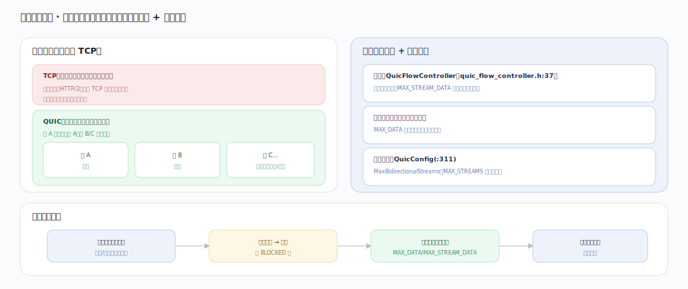

# Google QUICHE 核心原理 · 支撑能力域 · 流与流量控制

> **定位**：多路复用的核心——一连接多条独立流、消除队头阻塞，`QuicFlowController` 做流级+连接级两级窗口，`QuicConfig` 管流数与初始窗口。核实基准：`quic/core/quic_flow_controller.h`、`quic_stream.h`、`quic_config.h`。

## 一、多流 + 两级流控

**一连接多流（对比 TCP）**：TCP 是单有序字节流，一处丢包全队阻塞，HTTP/2 的多路复用仍受 TCP 层队头阻塞拖累；QUIC 一连接多条独立流（`QuicStream` `quic_stream.h:158`），流 A 丢包只阻塞 A、流 B/C 照常交付；流号最低两位区分主/被动发起、双向/单向。

**两级流量控制**（`QuicFlowController` `quic_flow_controller.h:37`）：**流级**（每流一个 `QuicFlowController`，收方消费数据后 `AddBytesConsumed`（`:61`）推进、`MaybeSendWindowUpdate`（`:116`）经 MAX_STREAM_DATA 拨额度）+ **连接级**（所有流字节总和一个窗口，MAX_DATA 更新，防单连接吃爆内存）；发方窗口耗尽时 `IsBlocked`（`:84`）返 true→发 STREAM_DATA_BLOCKED/DATA_BLOCKED 帧暂停；收到超过窗口的偏移则 `FlowControlViolation`（`:87`）判违规、关连接。收窗可 `UpdateReceiveWindowSize`（`:108`）自动调大（auto-tuning 按 BDP）。

**流数上限**：`QuicConfig` `SetMaxBidirectionalStreamsToSend`（`quic_config.h:311`）/`SetMaxUnidirectionalStreamsToSend`（`:319`）设初值，初始窗口 `SetInitialStreamFlowControlWindowToSend`（`:379`）/`SetInitialSessionFlowControlWindowToSend`（`:414`）；运行期 MAX_STREAMS 帧动态放开并发流。

**反压闭环**：发方按流级∧连接级双窗口发→窗口耗尽发 BLOCKED 帧→收方消费后 `AddBytesConsumed`（`:61`）+`MaybeSendWindowUpdate`（`:116`）拨额度→发方窗口滑动恢复。

## 二、为什么两级都要

只有流级流控则单连接可开海量流、每流各占满窗口→总内存无上限；只有连接级则一条慢消费流可饿死其他流（发方连接窗口被它占死）。两级叠加：连接级封顶总内存、流级隔离单流反压，才能既防 OOM 又保流间公平。这与 TCP 单一接收窗口的心智不同——QUIC 把"传输层背压"细化到了每条应用流。

## 深化 · QuicFlowController 关键方法

| 环节 | 方法 | 锚点 |
|---|---|---|
| 类定义 | QuicFlowController | `quic_flow_controller.h:37` |
| 消费后推进 | AddBytesConsumed | `quic_flow_controller.h:61` |
| 是否被窗口阻塞 | IsBlocked | `quic_flow_controller.h:84` |
| 违规检查（超窗关连接） | FlowControlViolation | `quic_flow_controller.h:87` |
| 主动发窗口更新 | SendWindowUpdate | `quic_flow_controller.h:90` |
| 按需发窗口更新 | MaybeSendWindowUpdate | `quic_flow_controller.h:116` |
| 收窗自动调大 | UpdateReceiveWindowSize | `quic_flow_controller.h:108` |

## 深化 · QuicConfig 流/窗口参数

| 参数 | 作用 | 锚点 |
|---|---|---|
| SetMaxBidirectionalStreamsToSend | 双向流并发上限 | `quic_config.h:311` |
| SetMaxUnidirectionalStreamsToSend | 单向流并发上限 | `quic_config.h:319` |
| SetInitialStreamFlowControlWindowToSend | 流级初始窗口 | `quic_config.h:379` |
| SetInitialSessionFlowControlWindowToSend | 连接级初始窗口 | `quic_config.h:414` |

## 深化 · 流内重组（QuicStreamSequencer）

流级流控之外，每条流的乱序字节重组由 `QuicStreamSequencer`（`quic_stream_sequencer.h:25`）负责：`OnStreamFrame`（`:69`）把收到的 STREAM 帧按偏移插入缓冲，连续可读时才回调应用；应用读走后 `MarkConsumed`（`:108`）推进、`HasBytesToRead`（`:115`）判断是否还有连续数据。它与流级 `QuicFlowController` 协同——sequencer 缓冲的是"已收但未消费"的字节，消费后触发 `AddBytesConsumed`（`quic_flow_controller.h:61`）拨额度。流内有序、流间独立，正是在这一层落地。

| 环节 | 方法 | 锚点 |
|---|---|---|
| 重组器 | QuicStreamSequencer | `quic_stream_sequencer.h:25` |
| 按偏移插入帧 | OnStreamFrame | `quic_stream_sequencer.h:69` |
| 消费推进 | MarkConsumed | `quic_stream_sequencer.h:108` |
| 是否有可读连续字节 | HasBytesToRead | `quic_stream_sequencer.h:115` |

## 调优要点（关键开关）

- 初始窗口（`quic_config.h:379`/`:414`）越大越省 RTT，但吃内存。
- 自动调窗（`UpdateReceiveWindowSize` `:108`）按 BDP 放大窗口。
- 流数上限（`:311`/`:319`）权衡并发 vs 资源。
- 及时 `MaybeSendWindowUpdate`（`:116`）避免发方饿死。

## 常见误区与工程要点

- **QUIC 无队头阻塞是绝对的**：流内仍有序，只是流间独立；同一流丢包仍阻塞该流。
- **只有一级流控**：QUIC 是流级 + 连接级两级（`QuicFlowController` 两处实例）。
- **流可无限开**：受 `SetMaxBidirectionalStreamsToSend`（`:311`）约束，需 MAX_STREAMS 放开。
- **窗口不更新**：不 `MaybeSendWindowUpdate`（`:116`）会把发方卡死。

## 一句话总纲

**流与流量控制是 QUICHE 多路复用的核心：一条连接承载多条独立 `QuicStream`（`quic_stream.h:158`）、流间无队头阻塞（区别于 TCP 单字节流），`QuicFlowController`（`quic_flow_controller.h:37`）做流级+连接级两级窗口反压——`IsBlocked`（`:84`）耗尽发 BLOCKED、收方 `AddBytesConsumed`（`:61`）+`MaybeSendWindowUpdate`（`:116`）拨额度、超窗 `FlowControlViolation`（`:87`）关连接；`QuicConfig`（`quic_config.h:311`/`:414`）管流数与初始窗口——两级流控既封顶总内存又隔离单流反压，是 QUIC 相比 TCP+HTTP/2 消除队头阻塞的关键。**
