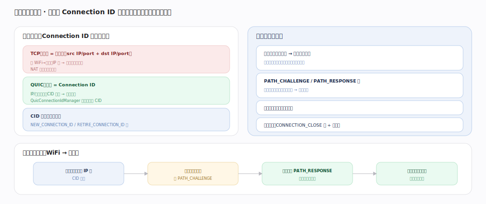

# Google QUICHE 核心原理 · 支撑能力域 · 连接管理与迁移

> **定位**：连接身份与移动性——连接由 Connection ID 标识（非四元组），换网/IP 变而连接不断，路径迁移经 PATH_CHALLENGE 验证防伪造。核实基准：`quic/core/quic_connection_id_manager.h`、`quic_connection.h`、`quic/core/frames/`。

## 一、Connection ID + 路径验证

**连接标识**：TCP 连接 = 四元组（src/dst IP+port），换 WiFi→蜂窝 IP 变即断连、NAT 重绑也可能断；QUIC 连接 = **Connection ID**，IP/端口变了 CID 不变→连接存活，`QuicConnectionIdManager` 管多个可用 CID，NEW_CONNECTION_ID/RETIRE_CONNECTION_ID 帧轮换 CID 防关联跟踪。**路径迁移与验证**：检测到新对端地址→触发路径验证（不盲信，防地址伪造放大攻击）；PATH_CHALLENGE 发随机数挑战、对端 PATH_RESPONSE 原样回→证明可达；验证前限速新路径防放大；连接关闭走 CONNECTION_CLOSE 帧 + 排空期。**换网时序**：手机切蜂窝源 IP 变（CID 不变）→服务端见新地址发 PATH_CHALLENGE→客户端回 PATH_RESPONSE 证明可达→连接继续不重建（重置拥塞状态防新路径过发）。

---

## 拓展 · 迁移相关帧

| 帧 | 用途 |
|---|---|
| NEW_CONNECTION_ID | 下发备用 CID |
| RETIRE_CONNECTION_ID | 弃用旧 CID |
| PATH_CHALLENGE / RESPONSE | 路径可达性验证 |
| CONNECTION_CLOSE | 主动关连接 |

---

## 调优要点（关键开关）

- 预下发多个 CID 支持无缝迁移。
- 迁移后重置拥塞窗口，重新探测新路径带宽。
- CID 长度权衡负载均衡路由 vs 隐私。
- 排空期长度权衡资源 vs 迟到包处理。

---

## 常见误区与工程要点

- **连接绑 IP**：QUIC 连接绑 CID，不绑四元组，换网不断。
- **迁移即无验证**：新路径必经 PATH_CHALLENGE 验证防伪造放大。
- **迁移后照旧发**：应重置拥塞状态，新路径带宽未知。
- **CID 固定**：CID 应轮换以防被动关联跟踪。

---

## 一句话总纲

**连接管理与迁移是 QUICHE 的移动性基石：连接由 Connection ID 标识而非四元组，换 WiFi/蜂窝、IP 变而 CID 不变故连接不断；QuicConnectionIdManager 管多 CID 并轮换防跟踪，路径迁移必经 PATH_CHALLENGE/RESPONSE 验证可达性（防地址伪造放大）、验证前限速、迁移后重置拥塞——这是移动端 QUIC 体验远胜 TCP 的关键。**
