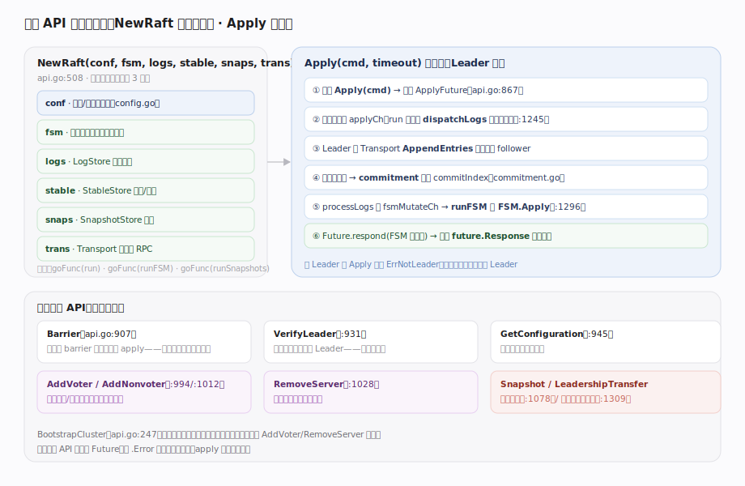

# HashiCorp raft 核心原理 · 接口主线 · 编程 API 与接口注入

> **定位**：raft 唯一的对外接触面——**编程 API**（宿主调用）+ **接口注入**（宿主实现 5 个接口把业务/存储/网络注入进来）。它是库形态的门面：宿主 `import` 本库、用 `NewRaft` 注入六件套启动，再用 `Apply`/`AddVoter`/`Snapshot`/`LeadershipTransfer` 驱动共识。核实基准：`api.go`、`fsm.go`、`log.go`、`stable.go`、`snapshot.go`、`transport.go`。

## 一、NewRaft 注入六件套 + Apply 写路径

**接口注入是灵魂**：`NewRaft(conf, fsm, logs, stable, snaps, trans)`（`api.go:508`）接收六个参数——`conf`（`config.go` 参数）与 5 个由宿主实现的接口，随后启动 3 个后台协程 `run` / `runFSM` / `runSnapshots`（`api.go:636-638`）。5 个接口把库“外包”出去的能力精确划界：

- **FSM**（`fsm.go:16`）：业务状态机。`Apply(*Log)` 在日志被多数派提交后调用、`Snapshot()(FSMSnapshot,error)` 生成快照、`Restore(io.ReadCloser)` 从快照恢复。可选实现 `BatchingFSM`（`fsm.go:54`，`ApplyBatch` 批量应用，最多 `MaxAppendEntries` 条）。
- **LogStore**（`log.go:112`）：日志条目存取——`FirstIndex/LastIndex/GetLog/StoreLog/StoreLogs/DeleteRange`。生产常用 `raft-boltdb`。
- **StableStore**（`stable.go:8`）：单调元数据——`Set/Get`（`[]byte`）与 `SetUint64/GetUint64`，持久化 CurrentTerm / LastVote。
- **SnapshotStore**：快照的 `Create/Open/List`（`snaps` 参数，如 `FileSnapshotStore`）。
- **Transport**（`transport.go:31`）：节点间 RPC——`AppendEntries/RequestVote/InstallSnapshot/TimeoutNow` + `Consumer()` 消费入站 + `AppendEntriesPipeline` 流水线。

**Apply 写路径**（Leader 上，图右）：`Apply(cmd, timeout)`（`api.go:867`）返回 `ApplyFuture` → 命令投递 applyCh、`run` 主线程 `dispatchLogs`（`raft.go:1245`）写本地日志 → Transport 复制到 follower → 多数派确认后 `commitment` 推进 commitIndex → `processLogs`（`raft.go:1296`）送 `fsmMutateCh` → `runFSM` 调 `FSM.Apply` → `future.respond(FSM 返回值)`，宿主 `future.Response()` 取结果。**非 Leader 调 `Apply` 返回 `ErrNotLeader`**，宿主须自行重定向。

---

## 拓展 · 五个注入接口的职责边界

| 接口 | 谁实现 | 关键方法 | 源码 |
|---|---|---|---|
| FSM | 宿主业务 | Apply / Snapshot / Restore | `fsm.go:16` |
| LogStore | raft-boltdb 等 | FirstIndex / GetLog / StoreLogs / DeleteRange | `log.go:112` |
| StableStore | raft-boltdb 等 | Set / Get / SetUint64 / GetUint64 | `stable.go:8` |
| SnapshotStore | FileSnapshotStore 等 | Create / Open / List | `snapshot.go` |
| Transport | TCP / Inmem | AppendEntries / RequestVote / InstallSnapshot / TimeoutNow | `transport.go:31` |

---

## 拓展 · 关键编程 API

| API | 作用 | 返回 | 源码 |
|---|---|---|---|
| NewRaft | 注入六件套、启动节点 | *Raft | `api.go:508` |
| BootstrapCluster | 首次写入初始配置 | error | `api.go:247` |
| Apply / ApplyLog | 提交命令到状态机 | ApplyFuture | `api.go:867/874` |
| Barrier | 等待此前写全部 apply | Future | `api.go:907` |
| VerifyLeader | 向多数派确认仍是 Leader | Future | `api.go:931` |
| AddVoter / AddNonvoter | 增加成员（单步） | IndexFuture | `api.go:994/1012` |
| RemoveServer | 移除成员（单步） | IndexFuture | `api.go:1028` |
| Snapshot | 手动触发快照 | SnapshotFuture | `api.go:1078` |
| LeadershipTransfer | 主动转移领导权 | Future | `api.go:1309` |

---

## 调优要点

- **Future 必须等待**：`Apply` 等返回 Future，务必 `.Error()`/`.Response()`，否则拿不到“已提交并 apply”的真实结果。
- **选对 LogStore/StableStore 实现**：生产用 `raft-boltdb`（可选开 `MonotonicLogStore` 优化）；测试用 `InmemStore`。
- **BatchingFSM**：写吞吐高时实现 `ApplyBatch`，一次拿一批已提交日志，减少 apply 开销。
- **VerifyLeader 做线性读**：读之前调它确认领导权，避免读到旧 Leader 的过期数据。
- **AddVoter 的 prevIndex**：传上一次配置 index 做 CAS，防并发成员变更覆盖。

---

## 常见误区与工程要点

- **在非 Leader 上 Apply**：返回 `ErrNotLeader`；宿主须把写重定向到当前 Leader（用 `LeaderWithID` 查）。
- **以为库自带存储/网络**：全靠注入——LogStore/StableStore/SnapshotStore/Transport 由宿主提供。
- **忘了 BootstrapCluster**：全新集群第一次必须 bootstrap 写初始配置，否则没有成员、选不出 Leader。
- **把 FSM.Apply 写成非确定性**：Apply 必须确定性、在所有节点产生相同结果，否则状态机分叉。
- **在 FSM.Apply 里做阻塞 IO**：会拖慢整个 apply 流水线；重 IO 应放到 `FSMSnapshot.Persist`。

---

## 一句话总纲

**raft 的唯一接触面是编程 API + 接口注入：宿主 import 本库、用 NewRaft 注入 conf 与 FSM/LogStore/StableStore/SnapshotStore/Transport 五个接口（把业务、日志、元数据、快照、网络全部外包给宿主），库启动 run/runFSM/runSnapshots 三协程；宿主用 Apply 提交命令（返回 Future，经 Leader 写日志→多数派复制→commit→FSM.Apply→respond 才有结果）、用 AddVoter/RemoveServer 单步变更成员、用 Snapshot/LeadershipTransfer 运维——库只持共识状态机，一切 IO 与业务经接口注入。**
