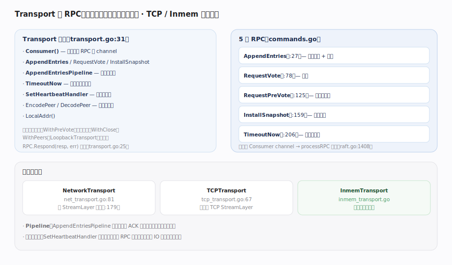

# HashiCorp raft 核心原理 · 支撑能力域 · Transport 与 RPC

> **定位**：节点间通信的抽象层——库不碰真实网络，`Transport` 接口由宿主实现（生产用 TCP、测试用 Inmem）。它定义 5 类 RPC、pipeline 流水线与心跳快路径。核实基准：`transport.go:31`、`commands.go`、`net_transport.go`（NetworkTransport:81、StreamLayer:179）、`tcp_transport.go:67`、`raft.go`（processRPC:1408）。

## 一、Transport 接口、5 类 RPC 与实现

**Transport 接口**（`transport.go:31`）：`Consumer()` 返回消费入站 RPC 的 channel；`AppendEntries`/`RequestVote`/`InstallSnapshot`/`TimeoutNow` 发出站 RPC；`AppendEntriesPipeline` 建流水线；`SetHeartbeatHandler` 装心跳快路径；`EncodePeer`/`DecodePeer` 编解码地址；`LocalAddr` 报本地址。另有可选扩展接口 `WithPreVote`（`:74`，声明支持预投票）、`WithClose`、`WithPeers`、`LoopbackTransport`（测试）。入站 RPC 用 `RPC.Respond(resp, err)`（`transport.go:25`）应答。

**5 类 RPC**（`commands.go`）：`AppendEntriesRequest`（`:27`，复制日志 + 心跳）、`RequestVoteRequest`（`:78`，拉票）、`RequestPreVoteRequest`（`:125`，预投票探路）、`InstallSnapshotRequest`（`:159`，推整快照）、`TimeoutNowRequest`（`:206`，触发领导权转移）。入站经 `Consumer()` channel → `processRPC`（`raft.go:1408`）分派到对应处理函数。

**实现与优化**：`NetworkTransport`（`net_transport.go:81`）是通用实现，走 `StreamLayer`（`:179`）抽象；`TCPTransport`（`tcp_transport.go:67`）用 TCP StreamLayer 供生产；`InmemTransport` 是内存回环供测试。两项优化：① **Pipeline**——`AppendEntriesPipeline` 不等上一批 ACK 就连发，吃满高延迟链路带宽；② **心跳快路径**——`SetHeartbeatHandler` 让心跳绕过普通 RPC 队列，避免磁盘 IO 造成的队头阻塞（心跳延迟直接决定 lease 与选举稳定性）。

---

## 拓展 · RPC 与传输

| RPC | 方向 | 用途 | 源码 |
|---|---|---|---|
| AppendEntries | Leader→Follower | 复制日志 / 心跳 | `commands.go:27` |
| RequestVote | Candidate→Voter | 拉票 | `commands.go:78` |
| RequestPreVote | Candidate→Voter | 预投票探路 | `commands.go:125` |
| InstallSnapshot | Leader→Follower | 推整快照 | `commands.go:159` |
| TimeoutNow | Leader→目标 | 领导权转移 | `commands.go:206` |
| Pipeline | — | 连发不等 ACK | `transport.go` AppendEntriesPipeline |
| 心跳快路径 | — | 绕过 IO 队列 | `transport.go` SetHeartbeatHandler |

---

## 调优要点

- **NetworkTransport 连接池**：复用到 peer 的连接，减少握手开销；落后 follower 的 InstallSnapshot 走独立流。
- **TLS**：TCPTransport 可包 TLS StreamLayer 加密节点间流量。
- **心跳快路径必开**：否则心跳排在磁盘 IO 后面，抖动会误触发选举/lease 超时。
- **超时配置**：Transport 的 RPC 超时应与 HeartbeatTimeout/ElectionTimeout 协调，避免误判失联。

---

## 常见误区与工程要点

- **以为库自带网络**：Transport 由宿主注入；库只面向接口，不 new socket。
- **心跳走普通队列**：会被磁盘 IO 阻塞——务必用 SetHeartbeatHandler 快路径。
- **Pipeline 保证顺序**：AppendEntries 有序，pipeline 只是不等 ACK 连发，仍按序处理。
- **InstallSnapshot 频繁**：说明 follower 落后严重或 TrailingLogs 太小，应排查而非无视。
- **自定义 Transport 漏实现方法**：接口方法要全实现，可选扩展（WithPreVote 等）按需实现。

---

## 一句话总纲

**Transport 是节点间通信的抽象——库不碰真实网络，由宿主注入实现（NetworkTransport 走 StreamLayer，生产 TCPTransport、测试 InmemTransport）：接口定义 Consumer 消费入站 + AppendEntries/RequestVote/RequestPreVote/InstallSnapshot/TimeoutNow 五类 RPC（入站经 processRPC 分派），并提供 AppendEntriesPipeline 流水线（不等 ACK 连发吃满带宽）与 SetHeartbeatHandler 心跳快路径（绕过磁盘 IO 队列避免队头阻塞）——传输可插拔、可加 TLS，心跳延迟直接决定 lease 与选举稳定性。**
