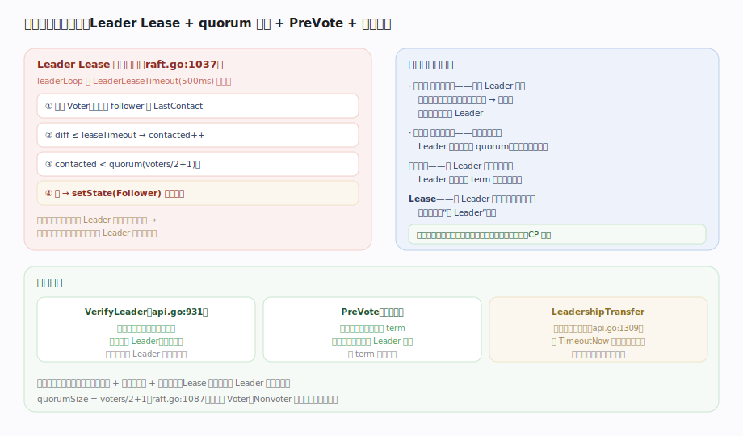

# HashiCorp raft 核心原理 · 支撑能力域 · 可靠性与脑裂防护

> **定位**：保证 CP 语义——分区/故障下绝不出现两个能写数据的 Leader。三重保险是**多数派选举 + 多数派提交 + 单调任期**；`Leader Lease` 让少数派侧的旧 Leader 主动退位、`VerifyLeader` 做线性读前哨、`PreVote` 防 term 膨胀、`LeadershipTransfer` 优雅交班。核实基准：`raft.go`（checkLeaderLease:1037、quorumSize:1087、leaderLoop:668）、`api.go`（VerifyLeader:931、LeadershipTransfer:1309）。

## 一、Leader Lease 退位、脑裂防护原理与配套机制

**Leader Lease 自检退位**（`checkLeaderLease`, `raft.go:1037`）：`leaderLoop`（`:668`）每 `LeaderLeaseTimeout`（默认 500ms）遍历所有 Voter，看每个 follower 的 `LastContact` 距今 `diff`——`diff <= leaseTimeout` 则 `contacted++`；若 `contacted < quorum`（`quorumSize = voters/2+1`, `raft.go:1087`）就 `setState(Follower)` **主动退位**。这样被分区到少数派的旧 Leader 联系不到多数派时会自己下台，缩短“假 Leader”窗口，不会傻乎乎地继续应答。

**为什么不会脑裂**（三重保险）：① **选举需多数派授权**——两个 Leader 各需一个多数派，而任两个多数派必有交集，同任期不可能有两个 Leader；② **提交需多数派复制**——少数派侧的旧 Leader 永远凑不齐 quorum，写不进任何数据；③ **单调任期**——新 Leader 任期更高，旧 Leader 一收到高 term 消息立即退位（见 `appendEntries`/`requestVote`）。Lease 只是让旧 Leader **主动**退位而非等被发现，加速收敛。结论：分区时最多含多数派的一侧能工作——这就是 CP。

**配套机制**：`VerifyLeader`（`api.go:931`）线性读前哨，向多数派确认自己仍是 Leader 再返回读，避免读到旧 Leader 的过期数据；`PreVote`（默认开）让隔离节点不真正自增 term、恢复时不强迫现任 Leader 退位，防 term 膨胀扰动；`LeadershipTransfer`（`api.go:1309`）主动转移领导权——发 `TimeoutNow` 让目标节点立即发起选举，用于优雅维护、避免选举超时空窗。

---

## 拓展 · 可靠性机制

| 机制 | 作用 | 源码 |
|---|---|---|
| Leader Lease | 联系不到 quorum 则主动退位 | `raft.go:1037` |
| quorumSize | voters/2+1，只数 Voter | `raft.go:1087` |
| 多数派选举 | 两多数派必交集 → 至多一 Leader | `electSelf` |
| 单调任期 | 见更高 term 立即退位 | `appendEntries`/`requestVote` |
| VerifyLeader | 线性读前哨 | `api.go:931` |
| PreVote | 防隔离节点 term 膨胀 | `config.go:236` |
| LeadershipTransfer | 优雅交班（TimeoutNow） | `api.go:1309` |

---

## 调优要点

- **LeaderLeaseTimeout ≤ HeartbeatTimeout**：lease 应短于选举超时，让旧 Leader 在新 Leader 选出前就退位。
- **线性读用 VerifyLeader**：或 ReadIndex 类前哨；直接读本地状态可能读到过期数据。
- **维护先 LeadershipTransfer**：滚动重启前主动交班，避免每次都等选举超时的空窗。
- **奇数节点**：3/5 节点容忍 1/2 故障；偶数不增容错还增 quorum 开销。

---

## 常见误区与工程要点

- **以为 Lease 是防脑裂的根本**：根本是多数派 + 单调任期；Lease 只加速旧 Leader 主动退位。
- **分区两侧都能写**：不可能——只有含多数派的一侧能提交，少数派侧只读且很快退位。
- **直接读 Leader 本地就线性一致**：不一定，可能是刚被取代的旧 Leader；要 VerifyLeader。
- **Nonvoter 影响可用性**：不影响——quorum 只数 Voter。
- **关掉 PreVote 没事**：分区恢复时旧节点带高 term 回来会打断现任 Leader，抖动更多。

---

## 一句话总纲

**可靠性与脑裂防护保证 CP：根本是多数派选举（两多数派必交集 → 同任期至多一个 Leader）+ 多数派提交（少数派侧旧 Leader 凑不齐 quorum 写不进数据）+ 单调任期（见更高 term 立即退位）三重保险；Leader Lease 让 leaderLoop 每 500ms 自检、联系不到 quorum(voters/2+1) 就主动退位以缩短假 Leader 窗口；VerifyLeader 做线性读前哨向多数派确认领导权、PreVote 防隔离节点 term 膨胀、LeadershipTransfer 发 TimeoutNow 优雅交班——分区时最多含多数派的一侧能工作。**
