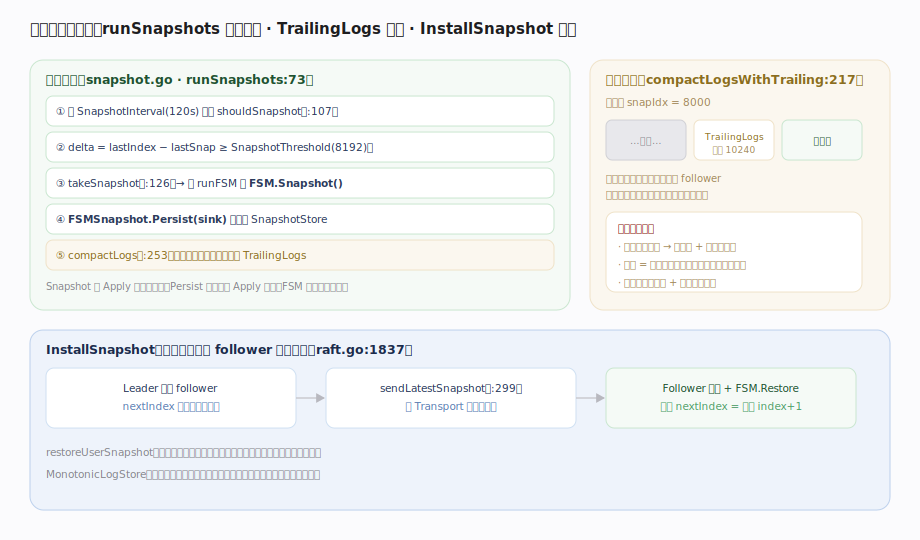

# HashiCorp raft 核心原理 · 支撑能力域 · 快照与日志压缩

> **定位**：防止日志无限增长——把状态机某点的全量状态存成快照、删掉其前的日志，只留 TrailingLogs 尾巴；落后过多的 follower 用 InstallSnapshot 追平。核实基准：`snapshot.go`（runSnapshots:73、shouldSnapshot:107、takeSnapshot:126、compactLogs:253）、`fsm.go`（FSMSnapshot）、`raft.go`（installSnapshot:1837、replication sendLatestSnapshot:299）。

## 一、阈值触发快照、压缩日志、InstallSnapshot 追平

**本地快照**（`runSnapshots`, `snapshot.go:73`）：后台协程每 `SnapshotInterval`（默认 120s）调 `shouldSnapshot`（`:107`）——`delta = lastIndex - lastSnap >= SnapshotThreshold`（默认 8192）则 `takeSnapshot`（`:126`）：请 runFSM 调宿主 `FSM.Snapshot()` 拿到 `FSMSnapshot`，再 `FSMSnapshot.Persist(sink)`（`fsm.go:74`）落盘到 SnapshotStore。**关键设计**：Snapshot() 应快速返回（只捕获状态指针），重 IO 放进 Persist，因为 Persist 可与后续 `FSM.Apply` 并发（FSM 需支持并发读，见 `fsm.go` 注释）。

**日志压缩**（`compactLogsWithTrailing`, `snapshot.go:217`）：快照落盘后删掉快照点之前的日志，但**保留 `TrailingLogs`（默认 10240）条尾巴**——让稍落后的 follower 仍能用日志增量追平，不必每次传整快照。

**InstallSnapshot**（`raft.go:1837`）：当 follower 的 `nextIndex` 落到快照点之前（日志已被压缩、拿不到），Leader `sendLatestSnapshot`（`replication.go:299`）经 Transport 流式推整快照；Follower 落盘后调 `FSM.Restore`（`fsm.go:Restore`），重置 `nextIndex = 快照 index+1`。此外 `restoreUserSnapshot`（`raft.go`）允许宿主从外部备份手动灌入快照、用当前配置恢复到新集群。

---

## 拓展 · 快照相关参数

| 参数 | 默认 | 作用 | 源码 |
|---|---|---|---|
| SnapshotInterval | 120s | 检查是否需快照的周期 | `config.go` |
| SnapshotThreshold | 8192 | 距上次快照的日志增量阈值 | `config.go` |
| TrailingLogs | 10240 | 快照后保留的尾部日志条数 | `config.go` |
| FSM.Snapshot | — | 生成快照（应快速，捕获指针） | `fsm.go:16` |
| FSMSnapshot.Persist | — | 重 IO 落盘，可与 Apply 并发 | `fsm.go:74` |
| FSM.Restore | — | 从快照恢复，丢弃旧状态 | `fsm.go:16` |

---

## 调优要点

- **SnapshotThreshold / Interval**：调大减少快照频率、降 IO，但重启回放的日志更多；调小反之。
- **TrailingLogs**：留大些让抖动的 follower 走增量而非整快照，代价是磁盘占用；留小省盘但更易触发 InstallSnapshot。
- **FSM.Snapshot 要快**：Snapshot 期间不能 Apply；实现应只捕获状态指针，重活放 Persist。
- **MonotonicLogStore**：存储实现声明后，快照恢复会删光旧日志而非留空洞（BoltDB 场景默认不删，避免性能损失）。

---

## 常见误区与工程要点

- **以为快照会阻塞 Apply 很久**：只有 `Snapshot()` 那一瞬阻塞，`Persist` 与 Apply 并发——前提是 FSM 支持并发读。
- **把 TrailingLogs 设 0**：任何落后的 follower 都得传整快照，网络开销陡增。
- **忘了快照要含配置**：快照元数据带 Index/Term/配置，恢复后成员信息不丢。
- **Restore 不清旧状态**：`FSM.Restore` 必须先丢弃全部旧状态再加载，否则脏数据。
- **快照就是备份**：快照是日志压缩机制；跨集群备份用 `restoreUserSnapshot` 路径。

---

## 一句话总纲

**快照与日志压缩防日志无限膨胀：runSnapshots 每 120s 检查、日志增量超 SnapshotThreshold(8192) 就 takeSnapshot——请 FSM.Snapshot() 快速捕获状态、FSMSnapshot.Persist 落盘（可与 Apply 并发），随后 compactLogs 删快照点之前日志、保留 TrailingLogs(10240) 尾巴供 follower 增量追平；落后到快照点之前的 follower 由 Leader 经 InstallSnapshot 流式推整快照、Follower 落盘后 FSM.Restore 并重置 nextIndex——快照替代其前所有日志，重启从快照恢复 + 回放尾部日志。**
