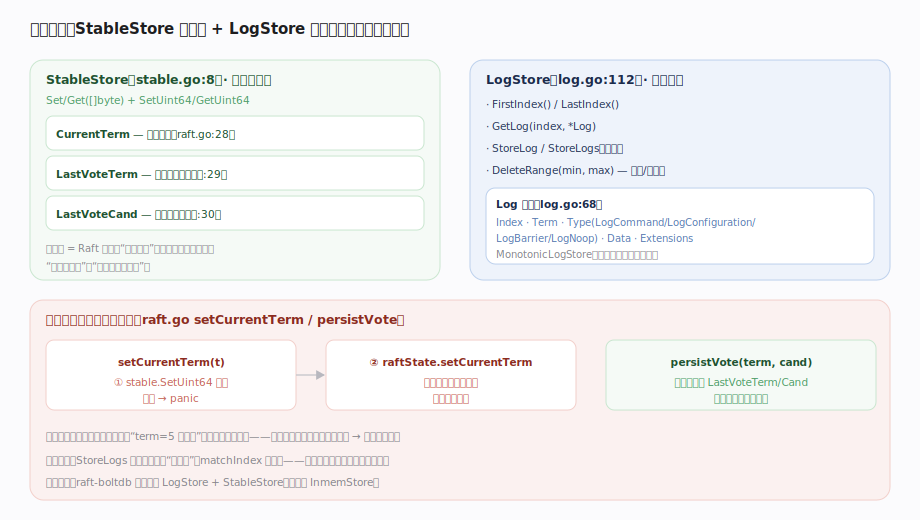

# HashiCorp raft 核心原理 · 支撑能力域 · 持久状态

> **定位**：共识安全的物理基础——把“任期、投票、日志”持久化，保证宕机重启后不违反 Raft 的安全性不变量。`StableStore` 存三项元数据（CurrentTerm/LastVoteTerm/LastVoteCand），`LogStore` 存日志条目；铁律是**先落盘再改内存**。核实基准：`stable.go:8`、`log.go`（LogStore:112、Log:68、LogType:14）、`raft.go`（keys:28-30、setCurrentTerm/persistVote）。

## 一、StableStore 元数据、LogStore 日志、先落盘再改内存

**StableStore**（`stable.go:8`）：`Set/Get`（`[]byte`）+ `SetUint64/GetUint64`，持久化 Raft 论文所称的“持久状态”三项——`CurrentTerm`（`raft.go:28`）、`LastVoteTerm`（`:29`）、`LastVoteCand`（`:30`）。它们保证重启后任期单调不回退、一任期只投一票。

**LogStore**（`log.go:112`）：`FirstIndex/LastIndex/GetLog/StoreLog/StoreLogs/DeleteRange`。日志条目 `Log`（`log.go:68`）含 `Index/Term/Type/Data/Extensions`，`LogType`（`log.go:14`）有 `LogCommand`(iota)/`LogNoop`/`LogBarrier`(`:38`)/`LogConfiguration`(`:43`) 等。可选 `MonotonicLogStore` 声明“不容忍 Index 空洞”，影响快照恢复后是否删光旧日志。

**铁律：先落盘再改内存**。`setCurrentTerm(t)`（`raft.go`）先 `stable.SetUint64(keyCurrentTerm, t)`——**落盘失败直接 panic**——成功后才 `raftState.setCurrentTerm` 更新内存原子变量；`persistVote(term, cand)` 投票前先写 `LastVoteTerm/LastVoteCand`。若颠倒顺序（先改内存后落盘失败），内存说“term=5 已投票”而磁盘停在旧值，重启回退就可能一任期投两票、破坏安全性。日志同理：`StoreLogs` 落盘成功才算“已持有”、matchIndex 才推进。生产用 `raft-boltdb` 同时充当 LogStore + StableStore，测试用 `InmemStore`。

---

## 拓展 · 持久化的三类状态

| 类别 | 存哪 | 内容 | 为何必须持久 |
|---|---|---|---|
| 任期 | StableStore | CurrentTerm | 任期不能回退，否则接受过期 Leader |
| 投票 | StableStore | LastVoteTerm / LastVoteCand | 一任期一票，防重启后重复投票 |
| 日志 | LogStore | Log[]（Index/Term/Type/Data） | 已复制日志重启不丢，matchIndex 可信 |
| 配置 | 日志 + 快照元数据 | LogConfiguration | 成员信息随日志/快照持久 |
| 快照点 | SnapshotStore | Index/Term/配置 | 恢复起点 |

---

## 调优要点

- **LogStore/StableStore 选型**：生产用 `raft-boltdb`（可开 `MonotonicLogStore`）；追求性能可加 `LogCache` 包一层内存缓存。
- **fsync 策略**：底层存储的刷盘同步性直接决定安全与延迟——BoltDB 默认同步写，保证落盘。
- **StoreLogs 批量**：复制路径用批量写降低磁盘往返；MaxAppendEntries 决定单批规模。
- **DeleteRange 效率**：日志压缩与删冲突后缀频繁调用，存储实现应高效支持区间删。

---

## 常见误区与工程要点

- **先改内存后落盘**：绝对禁止——本库先落盘再改内存，落盘失败 panic 而非静默。
- **以为日志在内存**：日志是持久的；只有 commitIndex/lastApplied 这类易失游标在内存，靠日志+快照重建。
- **StableStore 当通用 KV**：它只存少量单调元数据，不是业务存储。
- **忽略 fsync**：存储层不真正落盘，宕机会丢“已确认”的日志——违反持久性承诺。
- **MonotonicLogStore 随便开**：开了后快照恢复会删光旧日志，需存储实现高效支持全删。

---

## 一句话总纲

**持久状态是共识安全的物理基础：StableStore 存 CurrentTerm/LastVoteTerm/LastVoteCand 三项元数据（保任期单调、一任期一票），LogStore 存日志条目（Index/Term/Type/Data，支持 Get/StoreLogs/DeleteRange）；铁律是先落盘再改内存——setCurrentTerm/persistVote 都先写 StableStore（失败即 panic）再更新内存原子变量，StoreLogs 落盘成功才算已持有、matchIndex 才推进；颠倒顺序会让重启后回退、一任期投两票而破坏安全性——生产用 raft-boltdb 兼任两存储，一切以真正 fsync 落盘为准。**
