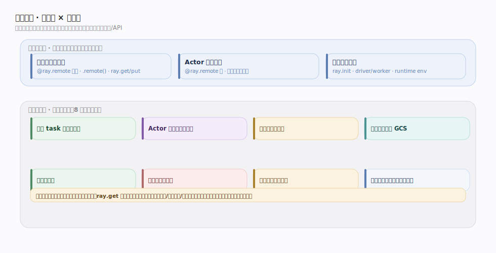
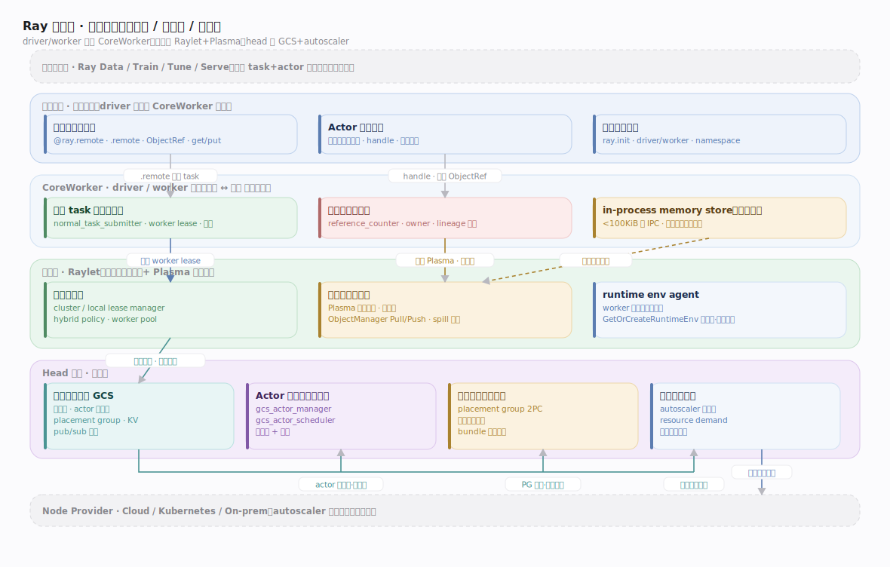
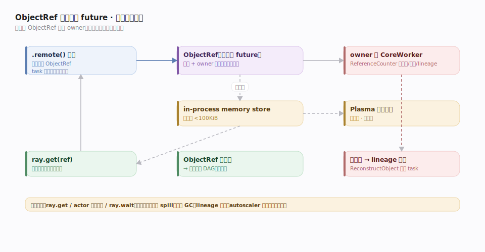
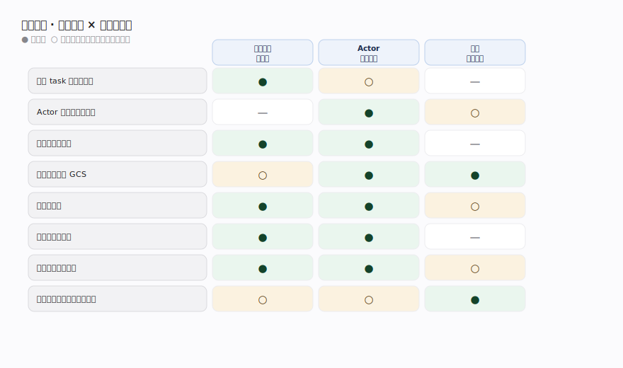

# Ray 核心原理 · 全景主线框架

> **定位**：统领全部原理文档。Ray 是**通用分布式计算框架**——把单机的函数调用与对象引用透明地扩展到集群，用 **task（无状态远程函数）+ actor（有状态远程对象）** 两种原语承载一切负载。核实基准为源码 `github.com/ray-project/ray`（`commit 2a70ac4`，C++ 核心在 `src/ray/`、Python 前端在 `python/ray/`）。在原型库属**新家族（分布式计算框架 / 通用分布式运行时，family 11）**，走元模式判型（接触面 × 能力域 × 执行时机）。灵魂三条：**共享内存对象存储（Plasma）**、**owner-based 分布式引用计数与 lineage 重建**、**去中心化（worker lease）调度**。

Ray 的 3 条接口主线 + 8 条支撑能力域，既无遗漏也无越界。

## 一、双维模型：接触面 × 能力域

Ray 的认知结构是两个正交维度的叉乘：

- **接触面主线（外部怎么用）**：应用只面对三样东西——① **远程任务与对象**（`@ray.remote` 装饰函数、`.remote()` 异步提交、`ray.get`/`ray.put` 与 `ObjectRef`）；② **Actor 编程模型**（`@ray.remote` 装饰类，得到有状态远程对象）；③ **集群与运行时**（`ray.init` 起集群、driver/worker 进程、runtime env、namespace）。
- **支撑能力域（内部靠什么）**：8 条内部公共机制支撑上述接口——远程 task 提交与依赖、Actor 生命周期与调度、分布式对象存储、全局控制存储 GCS、分布式调度、引用计数与容错、资源管理与放置组、集群自动伸缩与运行时环境（autoscaler + runtime env agent）。

一条铁律贯穿归属判断：**一个知识点属于哪条主线，看它的能力域，而非它出现在哪个文件/API 里**。例如 `ray.get` 阻塞等待值就绪，虽从"远程任务"接口触发，但"值存哪、怎么取回、丢了怎么办"属于"分布式对象存储"与"引用计数与容错"。

## 二、总架构：进程拓扑与数据面/控制面

一个 Ray 集群是若干 **node（节点）** 的集合，每节点跑一个 **Raylet**（`src/ray/raylet/`，含本地调度器 + 对象管理器）和一个 **Plasma 共享内存对象存储**（`src/ray/object_manager/plasma/`，随 Raylet 进程内起）。head 节点额外跑 **GCS（Global Control Store，`src/ray/gcs/`）** 与 **autoscaler**。用户的 **driver** 与被调度出的 **worker** 都嵌入一份 **CoreWorker**（`src/ray/core_worker/core_worker.cc`），它是"应用 ↔ 系统"的唯一门户：提交 task（`SubmitTask:1995`）、建 actor（`CreateActor:2076`）、`Put:1055`/`Get:1326`。

- **控制面**：GCS 保存集群全局状态（节点列表、actor 注册表、placement group、KV 元数据），是集群的"真源之书"。
- **数据面**：对象在各节点 Plasma 间通过 ObjectManager 的 **Pull/Push**（`object_manager.cc:221/369`）传输；调度靠 CoreWorker 向 Raylet **请求 worker lease**（`RequestWorkerLease`），拿到租约后**直接把 task 推给被租 worker**（`PushNormalTask:515`）——绕开中央调度器，这是 Ray 去中心化调度的核心。

## 三、贯穿层：ObjectRef 是分布式 future

**`ObjectRef` 横切一切主线**，是理解 Ray 的总钥匙：

1. 每个 `.remote()` 调用**立即**返回一个 `ObjectRef`（分布式 future），task 异步执行，调用方不阻塞。
2. 谁创建 ObjectRef，谁就是它的 **owner**；owner 的 CoreWorker 在 `ReferenceCounter` 里记录它的元数据、引用计数与值所在节点（`AddOwnedObject:223`）。
3. 真正的值存在 Plasma（大对象）或 in-process memory store（小对象 <100KiB，`max_direct_call_object_size`，`common/ray_config_def.h:245`）。
4. `ray.get(ref)` 阻塞直到值就绪；ObjectRef 可作为下一个 task 的参数，形成**隐式依赖 DAG**。
5. 值所在节点宕机、对象丢失时，owner 依据 **lineage（创建它的 task 谱系）重新提交 task 重算**（`ReconstructObject:140`）。

**执行时机**分前台/后台：前台是同步阻塞路径（`ray.get`、actor 方法结果、`ray.wait`）；后台是异步守护（对象 spill 到磁盘、引用计数 GC、lineage 重建、autoscaler 扩缩、心跳与资源上报）。

## 四、依赖矩阵：接触面 × 能力域

下表把"每条接口主线强依赖哪些能力域"显式化（●强依赖 / ○弱依赖），三角一致性以此为准：

| 能力域＼接口 | 远程任务与对象 | Actor 编程模型 | 集群与运行时 |
|---|---|---|---|
| 远程 task 提交与依赖 | ● | ○(actor task) | — |
| Actor 生命周期与调度 | — | ● | ○ |
| 分布式对象存储 | ● | ● | — |
| 全局控制存储 GCS | ○ | ● | ● |
| 分布式调度 | ● | ● | ○ |
| 引用计数与容错 | ● | ● | — |
| 资源管理与放置组 | ● | ● | ○ |
| 集群自动伸缩与运行时环境 | ○ | ○ | ● |

## 五、主线清单与源码锚点

| 类别 | 主线 | 核心机制 | 源码锚点 |
|---|---|---|---|
| 接口 | 远程任务与对象 | `@ray.remote`/`.remote()`/`ray.get`/`ray.put`/ObjectRef | `core_worker.cc:1995/1326/1055` |
| 接口 | Actor 编程模型 | 有状态远程对象、actor handle、方法调用串行化 | `core_worker.cc:2076/2415` |
| 接口 | 集群与运行时 | `ray.init`、driver/worker、runtime env、namespace | `core_worker.cc`、`python/ray/` |
| 支撑 | 远程 task 提交与依赖 | TaskSpec → worker lease → 直推 worker；参数依赖解析 | `normal_task_submitter.cc:34/270/515` |
| 支撑 | Actor 生命周期与调度 | GCS 注册/创建、gcs_actor_scheduler 调度、重启 | `gcs_actor_manager.cc:794`、`gcs_actor_scheduler.cc:50` |
| 支撑 | 分布式对象存储 | Plasma 共享内存 + 两级 store + Pull/Push + spill | `plasma/store.cc:174`、`object_manager.cc:221`、`local_object_manager.cc:253` |
| 支撑 | 全局控制存储 GCS | 集群元数据、actor 注册表、KV、pub/sub | `gcs/gcs_server.cc`、`gcs_table_storage.cc` |
| 支撑 | 分布式调度 | Raylet 本地 + cluster resource scheduler + 混合策略 | `cluster_lease_manager.cc:45`、`scheduling/policy/hybrid_scheduling_policy` |
| 支撑 | 引用计数与容错 | owner-based ref counting + lineage 重建 | `reference_counter.cc:223`、`object_recovery_manager.cc:140` |
| 支撑 | 资源管理与放置组 | 逻辑资源、placement group、bundle 放置策略（PACK/SPREAD） | `gcs_placement_group_manager.cc`、`gcs_placement_group_scheduler.cc:41` |
| 支撑 | 集群自动伸缩与运行时环境 | autoscaler 按资源需求扩缩节点 + runtime env agent 预备依赖 | `autoscaler.py`、`gcs_autoscaler_state_manager.cc:51`、`runtime_env_agent.py` |

## 六、三条贯穿全库的声明

1. **task 无状态、actor 有状态，二者都编译成 TaskSpec 经同一调度与对象体系执行。** actor 方法本质是"路由到固定 worker 的 task"（`SubmitActorTask:2415`），差别只在调度目标固定、方法按提交序串行。
2. **owner 拥有对象的元数据与命运。** 引用计数、lineage、GC、重建全由 owner 的 CoreWorker 本地决策（`reference_counter.cc`），GCS 不记录对象级引用——这是 Ray 能扩展到百万级细粒度 task 的关键（对比集中式方案）。
3. **改集群全局状态走 GCS，传对象值走 Plasma/ObjectManager，调度走 worker lease。** 三条路径正交：控制面（GCS）、数据面（对象存储）、调度面（去中心化租约）各司其职。

## 调优要点

- **小对象内联阈值** `max_direct_call_object_size=100KiB`（`ray_config_def.h:245`）：小返回值走 in-process memory store 免 Plasma IPC，大对象进共享内存零拷贝。避免海量中等对象刚好卡在阈值上抖动。
- **对象 spill**：Plasma 满时按 `SpillObjectUptoMaxThroughput` spill 到磁盘/远端；给足对象存储内存或配好 spill 目录，避免 spill 风暴拖慢。
- **调度局部性**：`ray.get` 前尽量让依赖对象与消费 task 同节点，减少 Pull 跨网。
- **actor 并发**：默认单线程串行；CPU-bound 用 task、IO-bound actor 配 `max_concurrency` 或 async actor。

## 常见误区

- ❌ "Ray 像 Spark 那样有中央 driver 调度所有 task" → Ray 是**去中心化**：CoreWorker 向 Raylet 租 worker 后直推，只有 actor/placement 走 GCS。
- ❌ "ObjectRef 就是数据" → ObjectRef 只是**指针 + owner 地址**，值在对象存储；ref 可跨节点传递、被借用。
- ❌ "对象靠副本复制容错" → Ray 对象**不可变、按 lineage 重算**容错，不是多副本持久化（对比 HDFS）。
- ❌ "actor 方法能并行" → 默认按提交顺序**串行**执行，除非显式 async/并发组。

## 一句话总纲

**Ray = 把「task/actor + ObjectRef 分布式 future」这套单机语义，靠「共享内存对象存储 + owner-based 引用计数与 lineage 容错 + 去中心化 worker-lease 调度」透明扩展到集群，控制面(GCS)/数据面(Plasma)/调度面(lease)三路正交。**
