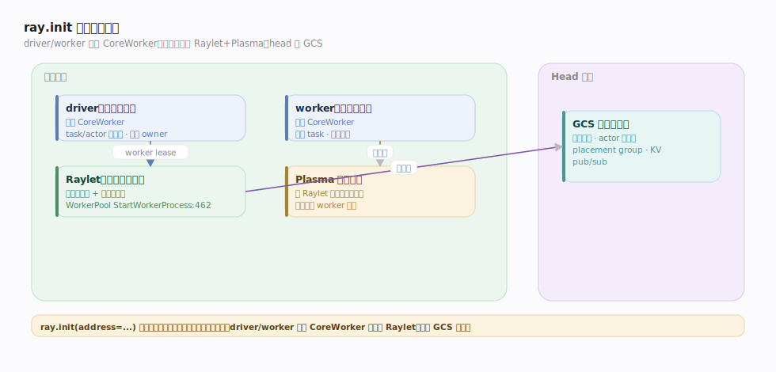
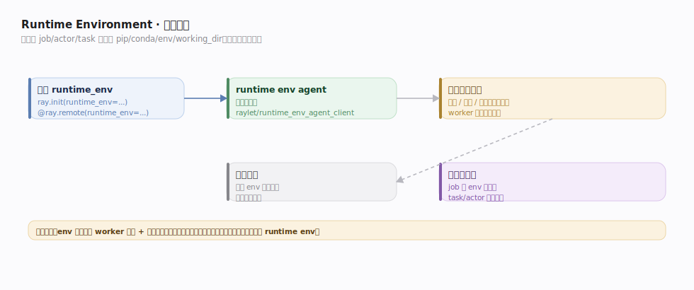

# Ray 接口主线 · 集群与运行时

> **定位**：应用与 Ray 集群的"起点与容器"。`ray.init` 连上（或拉起）集群，确立 **driver / worker 进程模型**，用 **runtime env** 隔离依赖、用 **namespace** 隔离命名。这条主线管"程序在哪跑、依赖怎么带、名字怎么分隔"，是另外两条接口主线的运行容器。核实基准 `src/ray/core_worker/`、`python/ray/`（commit 2a70ac4）。

## 一、进程拓扑：driver / raylet / worker / GCS

`ray.init()` 后一个节点上的进程构成：

- **driver**：用户脚本主进程，内嵌一份 CoreWorker（`core_worker.cc`），是 task/actor 的提交源与多数 ObjectRef 的 owner。
- **Raylet**（每节点一个，`raylet/`）：本地调度器 + 对象管理器 + worker 池管理者。是节点的"系统守护"。
- **worker**：由 Raylet 的 `WorkerPool` 按需拉起（`StartWorkerProcess:462`）、租借给 CoreWorker 执行 task 的进程，同样内嵌 CoreWorker。空闲 worker 复用（`PushWorker:1123`/`PopWorker:1437`）。
- **Plasma 对象存储**：随 Raylet 起的共享内存段。
- **GCS**（head 节点）：集群控制面真源。

`ray.init(address=...)` 连到已有集群；无参则本地拉起单节点集群。driver/worker 都通过各自 CoreWorker 与本地 Raylet、远端 GCS 通信。

## 二、Runtime Environment：依赖隔离

Runtime env 让不同 job/actor/task 带各自的 pip 包、conda 环境、环境变量、工作目录，而无需污染集群基础镜像：

- 声明在 `ray.init(runtime_env=...)` 或 `@ray.remote(runtime_env=...)`。
- Raylet 侧由 **runtime env agent** 负责在 worker 启动前**准备环境**（下载/安装/解压到隔离目录），worker 起在该环境里（`raylet/runtime_env_agent_client.*`）。
- 支持继承与层叠：job 级 env 作默认，task/actor 可覆盖。

## 三、Namespace 与 Job：命名与生命周期隔离

- **namespace**：actor 命名的作用域。同 namespace 内 detached actor 可按 name 互相发现，跨 namespace 隔离。
- **job**：一次 driver 会话即一个 job（`gcs_job_manager.cc` 管理），有独立 JobID；job 结束触发其非 detached 资源回收。
- 二者配合实现"多租户共享一个物理集群、逻辑上互不干扰"。

## 深化表

| 技术点 | 机制 | 源码锚点 |
|---|---|---|
| 集群连接/拉起 | ray.init 连或起集群，建 driver CoreWorker | `python/ray/`、`core_worker.cc` |
| worker 池 | Raylet 按需启动、空闲复用 | `worker_pool.cc:462/1123/1437` |
| runtime env | agent 预备隔离依赖环境 | `raylet/runtime_env_agent_client.*` |
| job 管理 | JobID 生命周期、资源归属 | `gcs/gcs_job_manager.cc` |
| namespace | actor 命名作用域 | `gcs/actor/gcs_actor_manager.cc` |

## 调优要点

- **worker 复用**：同 runtime env + 同函数签名的 worker 可复用；env 频繁变化会触发反复重建 worker，代价高——固化基础依赖到镜像、只把差异放 runtime env。
- **`ray.init` 资源声明**：显式给 `num_cpus`/`num_gpus` 让本地集群资源准确。
- **detached + namespace** 做常驻服务的服务发现骨架。
- **避免超大 working_dir**：runtime env 上传工作目录有大小限制，剥离数据文件。

## 常见误区

- ❌ "driver 也能执行别人的 task" → driver 通常只提交；执行在 worker（除非 task 直接在 driver 内联的少数情况）。
- ❌ "runtime env 改一下很便宜" → 变更常触发 worker 重建与依赖安装，非零成本。
- ❌ "所有 actor 全集群可见" → 只有**同 namespace 的 named/detached actor**可跨 driver 发现。
- ❌ "worker 数 = CPU 数固定" → worker 由 WorkerPool 动态起停、按 lease 需求伸缩。

## 一句话总纲

**`ray.init` 拉起「driver + 每节点 Raylet/Plasma + 按需 worker + head 的 GCS」进程拓扑，用 runtime env 做依赖隔离、namespace/job 做命名与生命周期隔离——它是另外两条接口主线的运行容器。**
