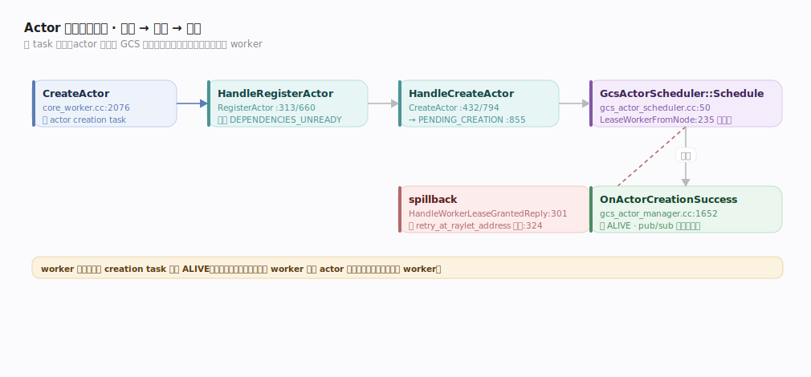
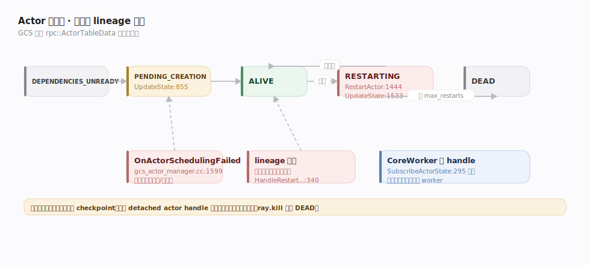

# Ray 支撑能力域 · Actor 生命周期与调度

> **定位**：把「有状态 actor」从注册到定居、从常驻到重建的**内部机制**讲透——这是「Actor 编程模型」接口主线的支撑面。与无状态 task 的**去中心化 worker-lease 调度**不同，actor 的创建**经 GCS 集中调度**：GCS 是 actor 的权威注册表与状态机拥有者。核实基准 `src/ray/gcs/actor/gcs_actor_manager.cc`、`gcs_actor_scheduler.cc`、`src/ray/core_worker/task_submission/actor_task_submitter.cc`（commit 2a70ac4）。依赖「全局控制存储 GCS」（注册表与 pub/sub）、「分布式调度」（租 worker）、「引用计数与容错」（handle 引用驱动回收）。

## 一、创建与集中调度：注册 → 选点 → 定居

一个 `Actor.remote()` 的出生链路横跨 CoreWorker 与 GCS：

1. **注册**：CoreWorker `CreateActor`（`core_worker.cc:2076`）构建 **actor creation task**，先经 `GcsActorManager::HandleRegisterActor`（`gcs_actor_manager.cc:313`）→ `RegisterActor`（`:660`）把 actor 元数据落入 GCS 注册表，初始状态 `DEPENDENCIES_UNREADY`。
2. **触发创建**：creation task 的依赖就绪后，`HandleCreateActor`（`:432`）→ `CreateActor`（`:794`）把状态推进到 `PENDING_CREATION`（`UpdateState`，`:855`），交给调度器。
3. **选点**：`GcsActorScheduler::Schedule`（`gcs_actor_scheduler.cc:50`）为 actor 挑一个可行节点，`LeaseWorkerFromNode`（`:235`）向该节点 Raylet 租一个 worker 作为 actor 的**常驻宿主**。
4. **spillback**：若目标节点回绝并给出改投地址，`HandleWorkerLeaseGrantedReply`（`:301`）读取 `retry_at_raylet_address`，对改投节点重新 `LeaseWorkerFromNode`（`:324`）——actor 调度同样支持 spillback。
5. **定居广播**：worker 启动并跑完 creation task 后，`OnActorCreationSuccess`（`gcs_actor_manager.cc:1652`）把状态置 `ALIVE`，通过 pub/sub 广播给所有持有该 actor handle 的引用者，方法调用才可发出。

**与 task 的关键差别**：task 每次向 Raylet 租新 worker、执行完归还；actor 只在创建时集中调度一次，之后 worker 被这个 actor 独占，方法直投这个固定 worker。

## 二、状态机、重启与 lineage 重建

GCS 持有 actor 的完整状态机（`rpc::ActorTableData` 状态枚举）：

- `DEPENDENCIES_UNREADY` → `PENDING_CREATION` → `ALIVE` → （故障）`RESTARTING` → `ALIVE` / `DEAD`。
- **故障重启**：宿主 worker/节点挂掉，`RestartActor`（`gcs_actor_manager.cc:1444`）依 `max_restarts` 把状态置 `RESTARTING`（`UpdateState`，`:1533`）并重新走调度定居；重启后**内存状态丢失**，除非应用自做 checkpoint。
- **lineage 重建**：actor 也可能因**下游对象丢失**、需重放其方法而被重建——`HandleRestartActorForLineageReconstruction`（`:340`）。这条路径把 actor 纳入了和 task 一致的 lineage 容错体系。
- **调度失败**：无可行节点时 `OnActorSchedulingFailed`（`:1599`）按策略重排队或置失败。
- **回收**：非 detached actor 的所有 handle 释放（引用计数归零）后销毁；`ray.kill` 强制置 `DEAD`。detached actor 脱离 driver 生命周期，靠 namespace+name 全局寻址。

CoreWorker 侧由 `ActorManager` 管 handle：`RegisterActorHandle`（`actor_manager.cc:27`）、`SubscribeActorState`（`:295`）订阅 GCS 广播的状态变化，据此在本地把方法调用路由到正确的（或重启后的新）worker。

## 三、方法调用的有序投递

actor 方法虽也编译成 TaskSpec，但投递路径独立于普通 task：`ActorTaskSubmitter::SubmitTask`（`actor_task_submitter.cc:167`）把方法按 **sequence number**（`ConcurrencyGroupSequenceNumber`，`:190`）放入 `actor_submit_queue_`（`:192`）。依赖就绪后 `SendPendingTasks`（`:227/345`）**按序**推给宿主 worker，保证同一 actor 的方法按提交顺序串行执行（状态一致性的根基）。`ConnectActor`（`:297`）在 actor ALIVE 后建立到宿主 worker 的直连通道。

## 深化表

| 技术点 | 机制 | 源码锚点 |
|---|---|---|
| 注册 actor | 落 GCS 注册表，DEPENDENCIES_UNREADY | `gcs_actor_manager.cc:313/660` |
| 触发创建 | 依赖就绪 → PENDING_CREATION | `gcs_actor_manager.cc:432/794/855` |
| 集中选点租 worker | Schedule → LeaseWorkerFromNode | `gcs_actor_scheduler.cc:50/235` |
| actor spillback | 读 retry_at_raylet_address 改投 | `gcs_actor_scheduler.cc:301/324` |
| 定居广播 ALIVE | OnActorCreationSuccess + pub/sub | `gcs_actor_manager.cc:1652` |
| max_restarts 重启 | RestartActor → RESTARTING 重调度 | `gcs_actor_manager.cc:1444/1533` |
| lineage 重建 actor | 为重放方法重建 | `gcs_actor_manager.cc:340` |
| handle 状态订阅 | CoreWorker 侧路由方法 | `actor_manager.cc:27/295` |
| 方法有序投递 | sequence number + submit queue | `actor_task_submitter.cc:167/190/227` |

## 调优要点

- **max_restarts / max_task_retries**：长驻 actor 设合适重启上限；重启丢状态，关键状态自行 checkpoint。
- **并发模型**：默认单线程串行；`max_concurrency` 开线程池处理阻塞调用，async actor 用协程处理海量 IO-bound 请求。
- **actor 池而非单点高并发**：把并行度需求拆成多 actor 组池，避免单 actor 成瓶颈。
- **detached + namespace**：常驻服务用 detached actor 做服务发现骨架，及时释放普通 actor handle 促回收。
- **就近创建**：用 `scheduling_strategy`（NodeAffinity/PlacementGroup）把 actor 定居到数据或 GPU 所在节点。

## 常见误区

- ❌ "actor 调度和 task 一样去中心化" → actor 创建**经 GCS 集中调度**，只有方法调用才直投宿主 worker。
- ❌ "actor 重启会恢复状态" → 只重建进程，**内存状态丢失**。
- ❌ "actor 方法能乱序/并行" → 默认按 sequence number **串行**投递。
- ❌ "GCS 记录每个对象的引用" → GCS 只管 actor 注册表与状态；对象级引用计数在 owner 的 CoreWorker 本地。

## 一句话总纲

**Actor = 「向 GCS 注册 → 依赖就绪进 PENDING_CREATION → GCS 集中调度租一个 worker 定居 → 广播 ALIVE」的有状态远程对象，故障按 max_restarts 重启（丢状态）、可为重放方法走 lineage 重建，方法调用按 sequence number 有序直投宿主 worker。**
