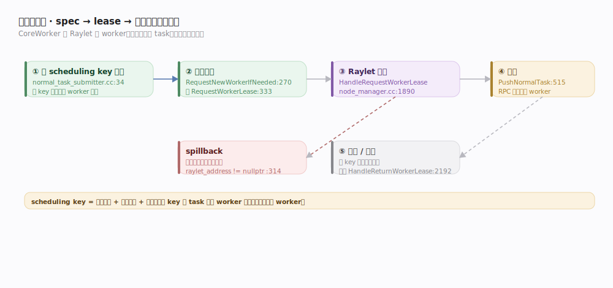

# Ray 支撑能力域 · 远程 task 提交与依赖

> **定位**：把一次 `.remote()` 从"构建规格"落到"某个 worker 上真正执行"的完整机制。核心是 Ray 的**去中心化 worker-lease 调度**：CoreWorker 直接向 Raylet 租 worker、拿到后**直投 task**，不经中央调度器。核实基准 `src/ray/core_worker/task_submission/normal_task_submitter.cc`、`task_manager.cc`（commit 6ff3a75）。

## 一、提交流水线：spec → lease → 直投

1. **入队**：`NormalTaskSubmitter::SubmitTask`（`normal_task_submitter.cc:34`）按 **scheduling key**（资源需求 + 调度策略 + 依赖）把 task 归类排队。相同 scheduling key 的 task 复用同类 worker 租约。
2. **申请租约**：`RequestNewWorkerIfNeeded`（`:270`）向合适节点的 Raylet 发 `RequestWorkerLeaseRequest`（`:64`）。选点由 lease policy 决定（默认本地优先，可 spillback 到别的 raylet：`raylet_address != nullptr` 即 spillback，`:45`）。
3. **Raylet 授租**：Raylet `HandleRequestWorkerLease`（`node_manager.cc:1890`）走本地/集群调度选出可运行的节点，从 WorkerPool 取 worker，回授一个 lease（含 worker 地址）。
4. **直投**：`OnWorkerIdle`（`:141`）/`PushNormalTask`（`:515`）把 task 直接 RPC 推给被租 worker 执行——**不再经调度器中转**。
5. **归还/续租**：worker 执行完，若同 scheduling key 还有排队 task 则继续复用该租约，否则归还（`HandleReturnWorkerLease`，`node_manager.cc:2192`）。

## 二、依赖解析：task 何时可跑

task 的参数含未就绪 ObjectRef 时不能执行。解析分两处：

- **owner 侧**：提交前把本地已知的小对象值内联进 spec，减少远程等待。
- **raylet 侧**：worker 要跑 task 前，Raylet 的 lease dependency manager（`raylet/lease_dependency_manager.*`）确保所有参数对象已 **Pull 到本地 Plasma**（触发 `ObjectManager::Pull`，`object_manager.cc:221`）才放行执行。

依赖 ObjectRef 构成隐式 DAG，无需预先声明；task 内动态派生的 task 也走同一路径。

## 三、lineage 与重试登记

`AddPendingTask`（`task_manager.cc:319`）在 owner 本地登记 task spec 与返回 ref，作为**容错 lineage**。task 失败/对象丢失时 `ResubmitTask`（`:433`）按登记的 spec 重放；成功则 `CompletePendingTask`（`:1158`）落值、按需清 lineage。`max_retries`/`retry_exceptions` 控制应用级重试次数（写在 spec 里，`core_worker.cc:2058`）。

## 深化表

| 技术点 | 机制 | 源码锚点 |
|---|---|---|
| scheduling key 排队 | 按资源+策略+依赖归类复用租约 | `normal_task_submitter.cc:34/71` |
| 申请 worker 租约 | RequestWorkerLease → Raylet | `normal_task_submitter.cc:270`、`node_manager.cc:1890` |
| spillback | 本地不够转投别节点 raylet | `normal_task_submitter.cc:45` |
| 直投执行 | PushNormalTask 绕过调度器 | `normal_task_submitter.cc:515` |
| 依赖 Pull | 参数对象拉到本地才放行 | `raylet/lease_dependency_manager`、`object_manager.cc:221` |
| lineage 登记/重放 | AddPendingTask / ResubmitTask | `task_manager.cc:319/433` |

## 调优要点

- **合并同类 task**：相同资源需求的 task 共享 scheduling key 与 worker 租约，减少反复起 worker。
- **就近依赖**：让消费 task 与其大参数对象同节点，避免依赖 Pull 跨网。
- **控制 task 粒度**：微秒级 task 的租约/RPC 开销占比过高。
- **retry 与幂等**：`max_retries` 依赖 task 幂等假设；有副作用的 task 慎重设重试。

## 常见误区

- ❌ "每个 task 都问中央调度器" → 只在**租 worker** 时问 Raylet，task 本身**直投**被租 worker。
- ❌ "依赖 DAG 要预先构建" → ObjectRef 作参数即隐式声明，运行时成形。
- ❌ "task 失败自动无脑重试到成功" → 受 `max_retries` 限制，且假设幂等。
- ❌ "worker 每个 task 新起一个" → 同 scheduling key **复用租约与 worker**。

## 一句话总纲

**远程 task = 「按 scheduling key 排队 → 向 Raylet 租 worker（可 spillback）→ 直投被租 worker 执行」的去中心化流水线，依赖靠参数对象 Pull-就绪后放行，lineage 在 owner 本地登记以备重放。**
