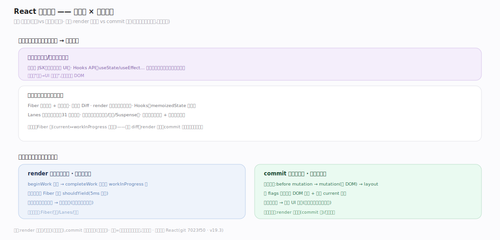
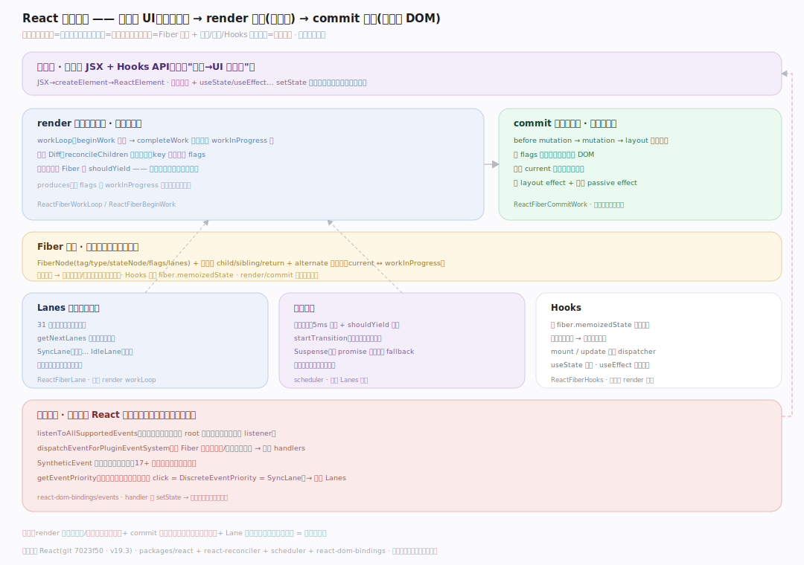
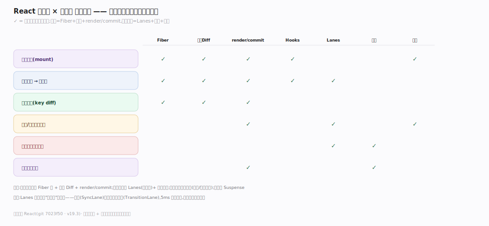
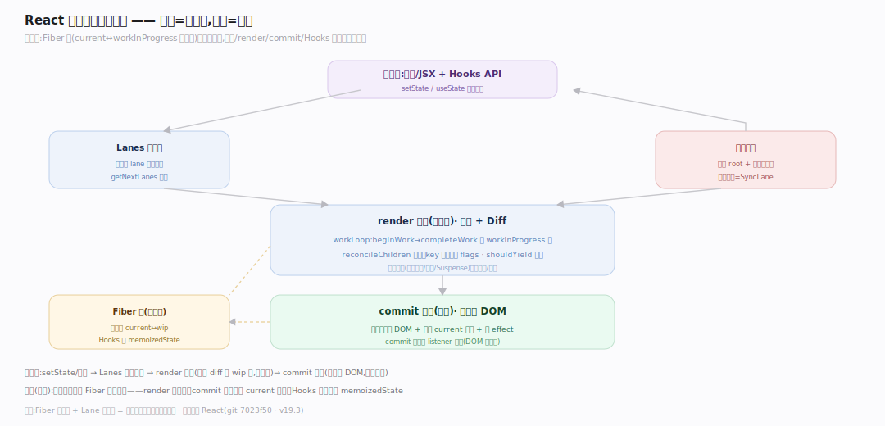

# React 原理 · 全景主线框架

> 统领全部原理文档:React 是**声明式 UI 框架**(新家族:前端 UI 框架/声明式渲染——你声明"状态→UI 长啥样",React 用 Fiber 架构 diff 出最小 DOM 变更并可中断地提交)。源码基准 **React(git 7023f50)**(`~/workdir/react`,packages/react + react-reconciler + scheduler)。

React 的世界观:**UI = f(state)**。你写组件(函数返回 JSX 描述 UI),改 state 触发重渲染;React 不是命令式操作 DOM,而是算出新旧 UI 树的差异(reconciliation/diff)、只改变化的 DOM。核心是 **Fiber**(可中断的工作单元树 + 双缓冲)、**Hooks**(函数组件的状态/副作用)、**Lanes + Scheduler**(优先级 + 时间切片可中断渲染)。理解"Fiber + Hooks + 可中断调度"三点,就懂了 React。

> **结构提示(写文档必看)**:① element 不可变(DEV Object.freeze),ref/key 从 props 读(RFC-107);② Fiber(ReactInternalTypes.js:89)双缓冲 current↔workInProgress(alternate);③ diff 按 key+elementType,列表用 last-placed-index 判移动;④ render 分 beginWork/completeWork,commit 三相(before-mutation/mutation/layout);⑤ Hooks 是 fiber.memoizedState 上的链表(mount/update 两 dispatcher);⑥ Lanes 31 位优先级,Scheduler 最小堆 + 5ms 时间片让出;⑦ useLayoutEffect 同步(paint 前)vs useEffect 异步(paint 后);⑧ 事件系统源码本 checkout 缺失(仅测试)——委托到 root 的模型从测试推断,标注。

---

## 一、双维模型:能力域 × 执行时机

- **能力域**:接触面(组件 + JSX + Hooks API)面向开发者;支撑侧——Fiber 架构、协调与 Diff、render 与提交、Hooks 实现、Lanes 与调度、并发特性、事件系统。
- **执行时机**:render 阶段(可中断:beginWork/completeWork 构建 workInProgress 树、被 Scheduler 时间切片打断)vs commit 阶段(不可中断:三相同步改 DOM)vs 空闲(passive effect 异步 paint 后跑)。

---

## 二、总架构图(位置即语义)

state 变化 → 调度更新(Lanes 定优先级)→ **render 阶段**(Scheduler 时间切片驱动 workLoop:beginWork 自顶向下 diff/协调子节点、Hooks 求值,completeWork 自底向上建 DOM 实例;可被高优先级打断重来)→ 得 workInProgress Fiber 树 → **commit 阶段**(三相:before-mutation→mutation 改真实 DOM→layout;同步不可中断)→ current 树切换成 workInProgress(双缓冲)→ requestPaint 让浏览器绘制 → passive effect(useEffect)异步跑。事件经根容器委托分发。

---

## 三、主线的分层归位(接触面 + 7 支撑域)

| 层 | 主线 | 一句话职责 |
|---|---|---|
| 接触面 | **组件与 JSX/Hooks API** | 函数组件 + JSX + useState/useEffect |
| 核心 | **Fiber 架构** | 可中断工作单元树 + 双缓冲 alternate |
| 协调 | **协调与 Diff** | key+type 比对,列表 last-placed-index |
| 渲染 | **render 与提交** | beginWork/completeWork + commit 三相 |
| 灵魂 | **Hooks** | fiber.memoizedState 链表 + dispatcher |
| 调度 | **Lanes 与调度** | 31 位优先级 + 最小堆 5ms 时间片 |
| 并发 | **并发特性 + 事件** | Suspense/transition + 事件委托 |

---

## 四、接触面 × 能力域 依赖矩阵

渲染组件依赖 Fiber(工作单元)+ 协调 Diff(算变更)+ render 提交(建 DOM)+ Hooks(状态);setState 触发依赖 Lanes 调度(优先级)+ Scheduler(时间切片);并发特性依赖 Lanes(低优先级 lane)+ Suspense。

---

## 五、能力域依赖关系图

实线=数据流/调用,虚线=约束。贯穿层:**Fiber 树 + Lanes** 横切协调/渲染/调度——每次更新在 Fiber 树上按 lane 优先级 diff、Hooks 挂 Fiber、Scheduler 按 lane 调度可中断 render。

---

## 六、三条贯穿声明(React 区别于命令式/其它框架)

1. **声明式 UI = f(state),不手动操作 DOM**:你声明状态对应的 UI(JSX),改 state 触发重渲染;React 算新旧树差异(reconciliation)、只改变化的 DOM——开发者不写 `document.getElementById().innerHTML=`。

2. **Fiber:可中断的工作单元树 + 双缓冲**:UI 树的每个节点是一个 Fiber(工作单元),render 阶段构建 workInProgress 树(与 current 树双缓冲,alternate 链接)、可被 Scheduler 按优先级打断/恢复;commit 阶段一次性同步提交——这是 React 并发渲染的架构基础。

3. **Hooks + Lanes 优先级调度**:Hooks(useState/useEffect)让函数组件有状态/副作用(挂 fiber.memoizedState 链表);Lanes(31 位)给更新分优先级、Scheduler 最小堆 + 5ms 时间片让高优先级(用户输入)插队、低优先级(transition)可延后——可中断渲染保交互流畅。

---

**一句话定位**:React 是声明式 UI 框架(UI=f(state))——核心 Fiber(可中断工作单元树 + current↔workInProgress 双缓冲 alternate),render 阶段 Scheduler 时间切片驱动 beginWork/completeWork diff 协调(key+elementType 比对、列表 last-placed-index 判移动)、可被高优先级打断,commit 阶段三相(before-mutation/mutation/layout)同步改 DOM;Hooks(fiber.memoizedState 链表 + mount/update dispatcher)给函数组件状态副作用;Lanes(31 位优先级)+ Scheduler(最小堆 5ms 让出)实现可中断并发渲染(Suspense/transition);声明式、不手动操作 DOM。
