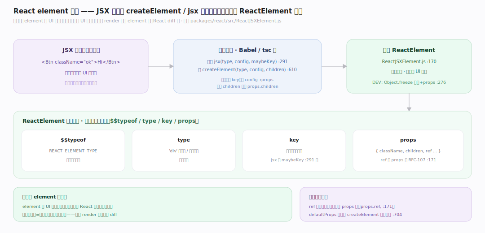
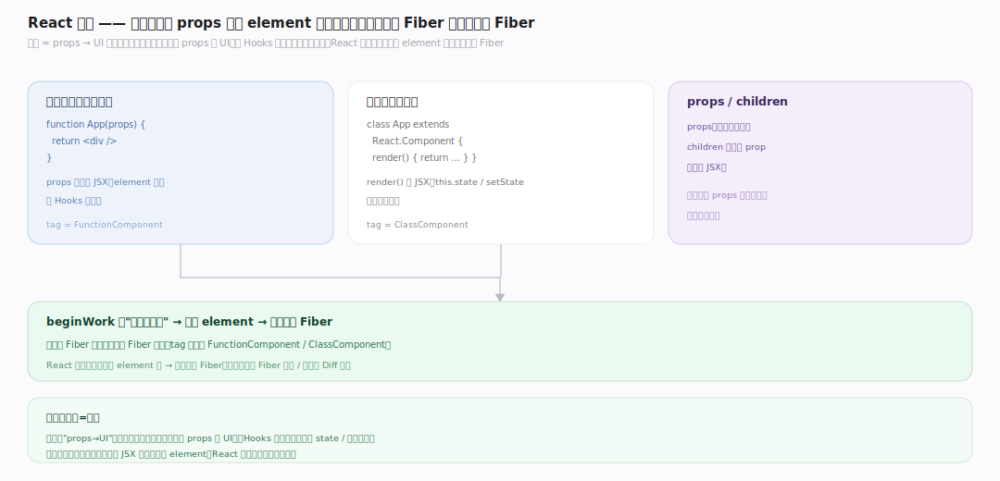
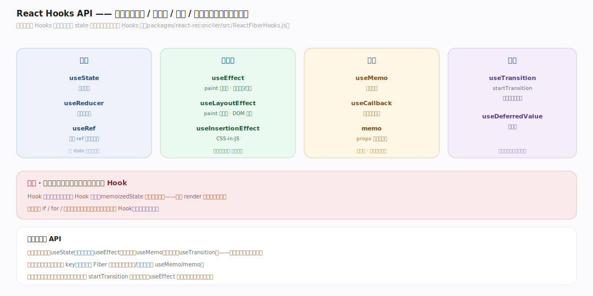

# React 原理 · 接触面主线 · 组件、JSX 与 Hooks API

> **定位**：属"接触面主线"(开发者可见)。React 的接触面是**组件 + JSX + Hooks API**:函数组件返回 JSX 描述 UI、useState/useEffect 管状态副作用、props/children 传数据。是开发者写 UI 的入口。JSX 编译成 element、组件成 Fiber。源码基准 **React(7023f50)**(`packages/react/src/`)。

开发者用 React:写函数组件(返回 JSX)、用 Hooks 管状态。JSX(`
{x}
`)编译成 `createElement`/`jsx` 调用产 **ReactElement**(不可变对象描述 UI);组件是函数(props→JSX)。改 state(useState)触发重渲染。理解 element 模型 + 组件 + Hooks API,就懂了 React 怎么写 UI。

---

## 一、element 模型:JSX → ReactElement

- **ReactElement**(`ReactJSXElement.js:170`):普通对象,`$$typeof: REACT_ELEMENT_TYPE` + `type`/`key`/`props`;DEV 下 `Object.freeze` 元素和 props——**element 不可变**(:276)。
- **JSX 编译**:现代 `jsx(type, config, maybeKey)`(:291)从专用参数取 key;旧 `createElement(type, config, children)`(:610)提 key、拷 config 到 props、变长 children 折进 props.children。
- **ref/key 从 props 读**(RFC-107,:171):不再是 element 顶层字段;`props.ref`。
- `defaultProps` 只在旧 createElement 路径解析(:704)。

**为什么 element 不可变**:element 是"UI 的声明快照";不可变让 React 能安全比较新旧(引用不同=可能变)、缓存、并发——你每次 render 产新 element 树,React diff 它。

---

## 二、组件:函数/类 → Fiber

- **函数组件**:`function App(props){ return 
 }`——props 入、返 JSX(element 树)。最常用,配 Hooks 有状态。
- **类组件**:`class App extends React.Component`——render() 返 JSX,this.state/setState,生命周期方法。老式。
- 组件在 Fiber 树里是一个 Fiber(tag=FunctionComponent/ClassComponent);beginWork 时"跑组件函数"得子 element、协调成子 Fiber。
- **props/children**:父传子的数据;children 是特殊 prop(嵌套 JSX)。

**为什么组件=函数**:组件是"props→UI"的映射;函数组件直白(输入 props 返 UI),Hooks 补状态;React 调用组件函数得 element 树、再协调成 Fiber。

---

## 三、Hooks API:状态与副作用

开发者常用 Hooks(实现见 Hooks 篇):

- **状态**:`useState`(简单状态)、`useReducer`(复杂状态机)、`useRef`(可变 ref 不触发渲染)。
- **副作用**:`useEffect`(paint 后异步,数据获取/订阅)、`useLayoutEffect`(paint 前同步,DOM 测量)、`useInsertionEffect`(CSS-in-JS)。
- **性能**:`useMemo`(缓存计算)、`useCallback`(缓存函数引用)、`memo`(组件 props 未变跳渲染)。
- **并发**:`useTransition`/`startTransition`(标低优先级更新)、`useDeferredValue`(值滞后)。
- **规则**:顶层无条件调(靠顺序对应 Hook 链表,见 Hooks 篇)。

**为什么这套 API**:声明式管状态(useState)、副作用(useEffect)、性能(useMemo)、并发(useTransition)——覆盖组件的全部需求,函数组件靠它们取代类组件的 state/生命周期。

---

## 拓展 · 接触面关键结构一览

| 结构 | 定义 | 职责 |
|---|---|---|
| ReactElement | `ReactJSXElement.js:170` | JSX 产的不可变 UI 描述 |
| jsx / createElement | `ReactJSXElement.js:291/610` | JSX 编译目标 |
| 函数组件 | (用户代码) | props→JSX,配 Hooks |
| useState/useEffect | `ReactFiberHooks.js` | 状态/副作用 API |
| useTransition/memo | `ReactFiberHooks.js` | 并发/性能 API |

## 调优要点（理解要点）

- **key 稳定**:列表项给稳定 key(非 index),协调复用 Fiber 保状态。
- **useMemo/memo 按需**:重计算/大列表用;小组件滥用反增开销。
- **useTransition**:非紧急更新(搜索结果、大列表过滤)包 startTransition,让输入优先。
- **effect 清理**:useEffect 返回清理函数(取消订阅/定时器),避免泄漏。

## 常见误区与工程要点

- **误区:JSX 是字符串模板。** JSX 编译成 createElement/jsx 调用产 ReactElement 对象(不可变 UI 描述),非字符串。
- **误区:组件可条件调 Hook。** Hook 必须顶层无条件调(靠顺序对应链表);放 if 里错位。
- **误区:改 state 立即重渲染。** setState 入队按 lane 调度;同值可能 bail-out;异步批处理。
- **误区:useEffect = componentDidMount。** 类似但 useEffect 是 paint 后异步、可多次(deps 变),清理函数处理卸载;非精确对应。
- **归属提醒**:element 协调成 Fiber 在【Fiber 架构】;Hooks 实现在【Hooks】;diff element 树在【协调与 Diff】;useTransition 语义在【并发特性】。

## 一句话总纲

**React 接触面是组件+JSX+Hooks API:JSX 编译成 createElement/jsx 调用产 ReactElement(不可变 UI 描述,ref/key 从 props 读),组件(函数返 JSX 配 Hooks / 类 render)是 props→UI 的映射、在 Fiber 树里是一个 Fiber;Hooks API 覆盖状态(useState/useReducer/useRef)、副作用(useEffect paint 后/useLayoutEffect paint 前)、性能(useMemo/useCallback/memo)、并发(useTransition/useDeferredValue),规则是顶层无条件调;声明式写 UI、改 state 触发重渲染。**
