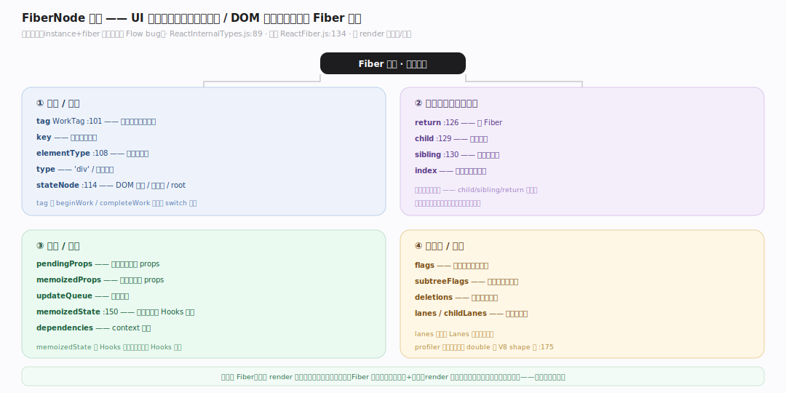
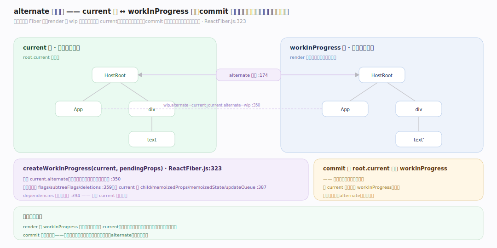
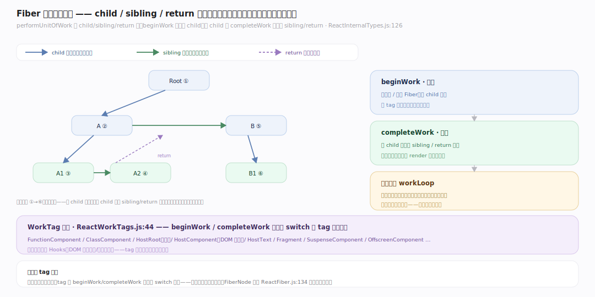

# React 原理 · 支撑主线 · Fiber 架构

> **定位**：属"核心能力域"——React 的架构基石。管 UI 树的表示与双缓冲:Fiber 节点结构、alternate 双缓冲(current↔workInProgress)、树链接(child/sibling/return)。是可中断渲染的基础。被【协调与 Diff】操作、【render 与提交】遍历。源码基准 **React(7023f50)**(`packages/react-reconciler/src/`)。

React 的立身之本:**Fiber**——把 UI 树的每个节点(组件/DOM)表示成一个 Fiber 对象(工作单元),这让渲染可**中断/恢复**(不是一口气递归到底)。关键是**双缓冲**:同时存两棵树 current(屏上)和 workInProgress(构建中),alternate 互链;render 在 workInProgress 上做、commit 后切换。理解 Fiber 结构 + 双缓冲,就懂了 React 并发渲染的架构。

---

## 一、Fiber 节点:UI 树的工作单元

`Fiber`(`ReactInternalTypes.js:89`,扁平对象——instance+fiber 字段合并绕 Flow bug):

- **身份/类型**:`tag WorkTag`(:101,FunctionComponent=0/ClassComponent=1/HostRoot=3/HostComponent=5/HostText=6/Fragment=7/SuspenseComponent=13)、`key`、`elementType`(:108,协调身份用)、`type`、`stateNode`(:114,DOM 节点/类实例/root)。
- **树链接**(单链表树):`return`(父,:126)、`child`(:129)、`sibling`(:130)、`index`。
- **工作/状态**:`pendingProps`/`memoizedProps`、`updateQueue`、`memoizedState`(:150,函数组件挂 Hooks 链表)、`dependencies`(context 订阅)。
- **副作用/调度**:`flags`/`subtreeFlags`/`deletions`、`lanes`/`childLanes`。

**为什么 Fiber**:传统 render 是递归(一旦开始不能停);Fiber 把每节点做成对象 + 链接(child/sibling/return),render 变成可遍历、可暂停、可恢复的循环——并发渲染的基础。

---

## 二、双缓冲:current ↔ workInProgress

**双缓冲**同时存两棵 Fiber 树:

- **current**:当前屏幕上显示的树。**workInProgress**:正在构建的新树。`alternate`(:174)互链两版本。
- `createWorkInProgress(current, pendingProps)`(`ReactFiber.js:323`):复用 `current.alternate`(存在则),否则懒建、双向配对 `wip.alternate=current; current.alternate=wip`(:350);复用时重置 flags/subtreeFlags/deletions(:359)、从 current 拷 child/memoizedProps/memoizedState/updateQueue(:387);dependencies **克隆非共享**(:394)。
- commit 后 root.current 指向 workInProgress——**切换**(原 current 变下次的 workInProgress,复用)。

**为什么双缓冲**:render 在 workInProgress 上改(不碰屏上的 current),构建中可中断丢弃重来不影响显示;commit 一次性切换——用户不会看到半成品树。两棵树复用(alternate),省分配。

---

## 三、WorkTag 与树遍历

- **WorkTag**(`ReactWorkTags.js:44`)标 Fiber 类型:FunctionComponent/ClassComponent/HostRoot(根)/HostComponent(DOM 元素)/HostText/Fragment/SuspenseComponent/OffscreenComponent 等——beginWork 按 tag 分派不同处理。
- **遍历**:render 阶段 `performUnitOfWork` 用 child/sibling/return 深度优先走——beginWork 下探到 child、无 child 则 completeWork 上溯经 sibling/return(见 render 篇)。
- `FiberNode` 构造(`ReactFiber.js:134`)初始化全字段;profiler 字段初始化为 double 避 V8 shape-transition 性能坑(:175)。

**为什么 tag 分派**:不同节点(函数组件要跑 Hooks、DOM 元素要建/改真实节点)处理不同;tag 让 beginWork/completeWork 用一个 switch 分派——统一遍历、分类处理。

---

## 拓展 · Fiber 关键结构一览

| 结构 | 定义 | 职责 |
|---|---|---|
| Fiber | `ReactInternalTypes.js:89` | UI 工作单元(tag/链接/state) |
| WorkTag | `ReactWorkTags.js:44` | 节点类型(Function/Host/Suspense…) |
| alternate | `ReactInternalTypes.js:174` | 双缓冲互链 current↔wip |
| createWorkInProgress | `ReactFiber.js:323` | 建/复用 wip Fiber |
| child/sibling/return | `ReactInternalTypes.js:126` | 单链表树链接 |

## 调优要点（理解要点）

- **key 稳定**:列表项 key 稳定让协调复用 Fiber(见 Diff 篇);key 乱变导致重建、丢状态。
- **组件拆分**:细粒度组件让 diff 范围小、可中断粒度细;巨组件难中断。
- **memo/useMemo**:减无谓重渲染(props 未变跳过 beginWork);但别过度。
- **不可变更新**:state 不可变更新(新对象)让 React 靠引用比较判变化;原地改检测不到。

## 常见误区与工程要点

- **误区:React 直接操作 DOM 树。** 操作 Fiber 树(内存中的 UI 表示),diff 后才最小改真实 DOM;Fiber 是中间层。
- **误区:render 一口气递归完。** Fiber 让 render 是可中断循环(workLoop),高优先级更新可打断;非不可停的递归。
- **误区:每次渲染重建整棵树。** 双缓冲复用 Fiber(alternate),协调复用未变节点——只重建/更新变化部分。
- **误区:workInProgress 是 current 的深拷贝。** alternate 复用 + 从 current 拷部分字段(child/memoizedState 等),dependencies 克隆;非全深拷。
- **归属提醒**:Fiber 上的 diff 在【协调与 Diff】;遍历(beginWork/completeWork)在【render 与提交】;Hooks 挂 memoizedState 在【Hooks】;lanes 字段由【Lanes 与调度】用。

## 一句话总纲

**Fiber 是 React 可中断渲染的架构基石:UI 树每节点是一个 Fiber(ReactInternalTypes.js:89 扁平对象,tag 标类型 + child/sibling/return 单链表树 + memoizedState 挂 Hooks + lanes 调度),让 render 从递归变可暂停恢复的循环;双缓冲同时存 current(屏上)和 workInProgress(构建中)两棵树、alternate 互链(createWorkInProgress 复用+配对),render 在 wip 上改不碰 current、可中断重来,commit 后 root.current 切换到 wip——用户不见半成品,两树复用省分配。**
