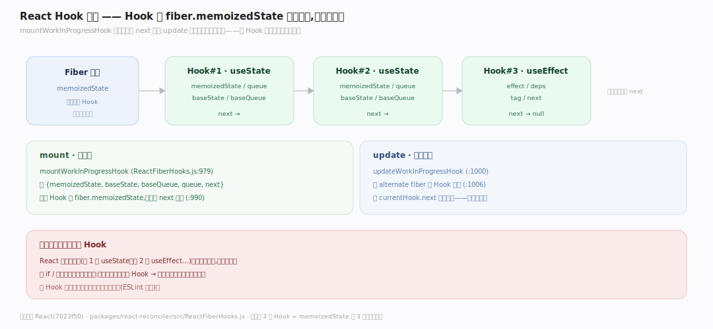
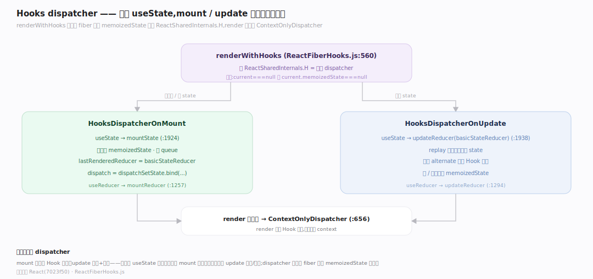
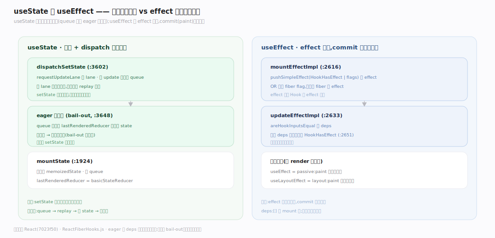

# React 原理 · 支撑主线 · Hooks

> **定位**：属"状态能力域"——React 函数组件的灵魂。管函数组件的状态与副作用:Hook 链表(挂 fiber.memoizedState)、mount/update dispatcher、useState/useReducer/useEffect 实现。让无状态函数有状态。依赖【Fiber 架构】挂链表。源码基准 **React(7023f50)**(`packages/react-reconciler/src/ReactFiberHooks.js`)。

函数组件本是无状态的纯函数,**Hooks** 让它有状态(useState)、副作用(useEffect)——秘密在:每个 Hook 是 `fiber.memoizedState` 上一条**链表**的节点,按调用顺序挂。mount 时建链表、update 时按序遍历复用——这就是"Hooks 调用顺序必须稳定"(不能放 if 里)的原因。理解 Hook 链表 + dispatcher + 依赖比较,就懂了 Hooks。

---

## 一、Hook 链表:挂 fiber.memoizedState

**Hook 是 fiber.memoizedState 上的单链表节点**:

- `mountWorkInProgressHook`(`ReactFiberHooks.js:979`)建 `{memoizedState, baseState, baseQueue, queue, next}`——首个 Hook 成 `fiber.memoizedState`,后续经 `next` 链接(:990)。
- **update 遍历**:`updateWorkInProgressHook`(:1000)从 alternate fiber 的 Hook 链表(:1006)按 `currentHook.next` **锁步**克隆——这就是为何 Hook 调用顺序必须稳定。
- 一个函数组件调 3 个 Hook → memoizedState 上 3 节点链表,顺序固定。

**为什么链表+顺序**:React 靠调用顺序(第 1 个 useState、第 2 个 useEffect…)对应链表位置,不靠名字;放 if 里条件调用会错位(第 n 次渲染少调一个,后面全对错)——故 Hook 必须顶层无条件调。

---

## 二、dispatcher:mount vs update

**dispatcher 切换**决定 Hook 是首挂还是更新:

- `renderWithHooks`(`ReactFiberHooks.js:560`)设 `ReactSharedInternals.H`:`current===null || current.memoizedState===null` 时用 `HooksDispatcherOnMount`,否则 `HooksDispatcherOnUpdate`;render 后重置 `ContextOnlyDispatcher`(:656)。
- **mount**:`useState`→`mountState`(:1924)初始化 memoizedState、建 queue(lastRenderedReducer=basicStateReducer)、`dispatch=dispatchSetState.bind(...)`。
- **update**:`useState`=`updateReducer(basicStateReducer)`(:1938)——replay 更新队列算新 state。
- `useReducer` mountReducer(:1257)/updateReducer(:1294)同理。

**为什么两 dispatcher**:mount 首次建 Hook 状态,update 复用+重算——同一个 `useState` 调用,首渲染走 mount 版建状态、后续走 update 版取/更新;dispatcher 按当前 fiber 有无 memoizedState 切换。

---

## 三、useState 与 useEffect 实现

- **useState/dispatchSetState**(`:3602`):`requestUpdateLane` 取 lane、建 update 对象入 queue;queue 空时**eager 提前算**新 state(`lastRenderedReducer`)以支持 bail-out(值没变跳过重渲染,:3648)。
- **useEffect**:`mountEffectImpl`(:2616)push 一个 effect 到 Hook(`pushSimpleEffect(HookHasEffect|flags)`)+ OR fiber flag;`updateEffectImpl`(:2633)用 `areHookInputsEqual` 比 deps,只在 deps 变时才重挂 `HookHasEffect`(:2651)——依赖数组控是否重跑。
- effect 分阶段(见并发/effects):useEffect 是 passive(paint 后异步)、useLayoutEffect 是 layout(paint 前同步)。

**为什么 eager+deps**:eager state 让 setState 相同值时提前 bail-out 省渲染;deps 比较让 effect 只在依赖变时重跑(空 deps 只 mount 跑一次)——都是性能优化。

---

## 拓展 · Hooks 关键结构一览

| 结构 | 定义 | 职责 |
|---|---|---|
| mountWorkInProgressHook | `ReactFiberHooks.js:979` | 建 Hook 链表节点 |
| updateWorkInProgressHook | `ReactFiberHooks.js:1000` | 按序克隆遍历(锁步) |
| renderWithHooks | `ReactFiberHooks.js:560` | 切 mount/update dispatcher |
| dispatchSetState | `ReactFiberHooks.js:3602` | setState 入队 + eager bail-out |
| mountEffectImpl/updateEffectImpl | `ReactFiberHooks.js:2616/2633` | useEffect + deps 比较 |

## 调优要点（理解要点）

- **Hook 顶层无条件调**:不能放 if/循环/嵌套函数里——靠调用顺序对应链表,错位则状态错乱。
- **useEffect deps**:空 `[]` 只 mount 跑;有 deps 仅变时跑;省略则每渲染跑——按需给。
- **useMemo/useCallback**:缓存计算/函数引用减子组件重渲染;但有成本别滥用。
- **函数式 setState**:`setX(x=>x+1)` 避闭包旧值;依赖前值的更新用函数式。

## 常见误区与工程要点

- **误区:Hook 能条件调用。** 不能——靠调用顺序对应 memoizedState 链表位置;放 if 里会错位(ESLint 强制)。
- **误区:useEffect 同步在 render 后跑。** useEffect 是 passive、paint 后异步跑;要 paint 前同步用 useLayoutEffect。
- **误区:setState 立即更新。** 入 queue、按 lane 调度重渲染后才更新;同值 eager bail-out 可能跳过。
- **误区:deps 省略和空数组一样。** 省略=每渲染跑;`[]`=只 mount 跑一次——不同。
- **归属提醒**:Hook 链表挂【Fiber 架构】的 memoizedState;dispatchSetState 的 lane 由【Lanes 与调度】;effect 的 passive/layout 时机在【render 与提交】/并发;useTransition 等在【并发特性】。

## 一句话总纲

**Hooks 让函数组件有状态/副作用:每个 Hook 是 fiber.memoizedState 上单链表节点(mountWorkInProgressHook 建、按调用顺序挂 next),update 时 updateWorkInProgressHook 从 alternate 锁步克隆遍历——故 Hook 必须顶层无条件调(靠顺序对应链表位置);renderWithHooks 按 fiber 有无 memoizedState 切 mount/update dispatcher;useState 的 dispatchSetState 入队+queue 空时 eager 算新值支持 bail-out,useEffect 用 areHookInputsEqual 比 deps 只在变时重挂 HookHasEffect;这是函数组件状态的实现根基。**
