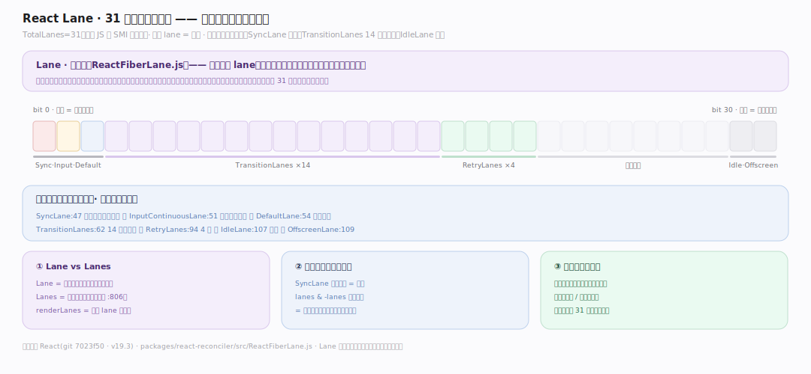
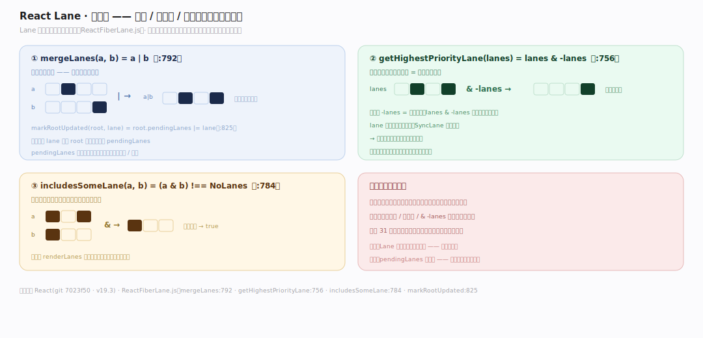
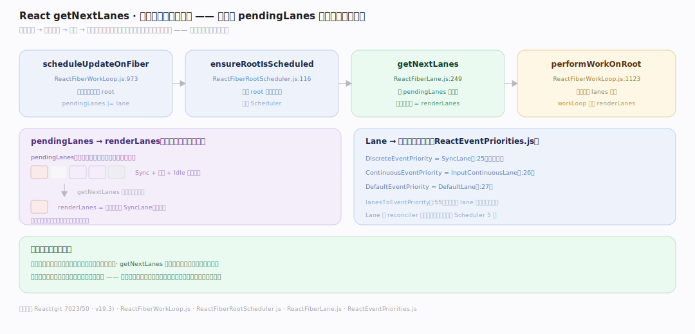

# React 原理 · 支撑主线 · Lanes 与优先级调度

> **定位**：属"调度能力域"——React 可中断渲染的优先级基石。管更新的优先级:31 位 Lane 位掩码表达优先级、getNextLanes 选下批渲染的车道、Lane 映射到 Scheduler 优先级。是并发特性的底层机制。被【render 与提交】的 workLoop 消费。源码基准 **React(git 7023f50)**(`packages/react-reconciler/src/ReactFiberLane.js`)。

React 怎么知道"哪个更新更急"?用 **Lane(车道)模型**——一个 31 位整数,每一位代表一种优先级(点击=SyncLane 最急、过渡=TransitionLane 可延后、Idle=最闲)。更新打上 lane,调度器挑最高优先级的 lane 先渲染,低优先级让路。理解"位掩码表优先级 + getNextLanes 选批 + lane→Scheduler 映射",就懂了 React 怎么排更新的优先级。

---

## 一、Lane:31 位掩码表优先级

**Lane** 是位掩码(`ReactFiberLane.js`):

- `TotalLanes = 31`(:41)——31 位,正好塞进 JS 的 SMI(小整数),一个 lane = 一位。
- 常量按优先级从高到低:`SyncLane`(:47,最急,离散事件)、`InputContinuousLane`(:51,连续事件如拖拽)、`DefaultLane`(:54,普通更新)、`TransitionLanes`(:62,14 条过渡车道)、`RetryLanes`(:94,4 条重试)、`IdleLane`(:107,最闲)、`OffscreenLane`(:109)。
- **Lane vs Lanes**:`Lane` = 单个位(一个更新的优先级);`Lanes` = 位掩码组(一批一起刷,:806)。

**为什么用位掩码**:优先级要能"合并多个"(一批渲染含多种更新)、"快速取最高"、"快速判包含";位运算(或合并、与判交、`lanes & -lanes` 取最低位=最高优先级)极快,一个整数表达 31 种优先级的任意组合。

---

## 二、位运算:合并 / 取最高 / 判包含

Lane 的核心操作都是位运算:

- `mergeLanes(a, b)`(:792)= `a | b`——合并两组车道(累积待处理更新)。
- `getHighestPriorityLane(lanes)`(:756)= `lanes & -lanes`——隔离最低位(数值最小=优先级最高)。
- `includesSomeLane(a, b)`(:784)= `(a & b) !== NoLanes`——判两组有无交集。
- `markRootUpdated(root, lane)`(:825)= `root.pendingLanes |= lane`——更新时把 lane 记进 root 的待处理集。

**为什么 `& -lanes` 取最高优先级**:补码下 `-lanes` 是取反加一,`lanes & -lanes` 恰好隔离出最低的置位位;而 lane 的位越低优先级越高(SyncLane 在低位)——所以这一个位运算就取到最急的车道。

---

## 三、getNextLanes:选下一批渲染的车道

调度决定"这次渲染哪些车道":

- `scheduleUpdateOnFiber`(`ReactFiberWorkLoop.js:973`):更新触发,标记 root。
- `ensureRootIsScheduled`(`ReactFiberRootScheduler.js:116`):确保 root 被排进调度。
- `getNextLanes(root, wipLanes)`(`ReactFiberLane.js:249`):从 pendingLanes 里挑**最高优先级**的一批作为本次渲染的 renderLanes。
- `performWorkOnRoot`(`ReactFiberWorkLoop.js:1123`):按选出的 lanes 渲染。
- **Lane→事件优先级**(`ReactEventPriorities.js`):DiscreteEventPriority=SyncLane(:25)、ContinuousEventPriority=InputContinuousLane(:26)、DefaultEventPriority=DefaultLane(:27);`lanesToEventPriority`(:55)反查。

**为什么每次只选一批**:低优先级更新(过渡)不该阻塞高优先级(点击);getNextLanes 每轮挑最高优先级的车道先渲染,高优先级更新可打断进行中的低优先级渲染——这是并发可中断的调度基础。

---

## 拓展 · Lane 关键一览

| 项 | 定义 | 说明 |
|---|---|---|
| TotalLanes | `ReactFiberLane.js:41` | 31 位(塞进 SMI) |
| SyncLane | `:47` | 最高优先级(离散事件) |
| TransitionLanes | `:62` | 14 条过渡车道(可延后) |
| IdleLane | `:107` | 最低优先级 |
| getNextLanes | `:249` | 选下批渲染车道 |
| getHighestPriorityLane | `:756` | `lanes & -lanes` |
| mergeLanes | `:792` | `a \| b` |

## 调优要点（理解要点）

- **过渡降优先级**:`startTransition` 把更新放进 TransitionLanes——大列表渲染不阻塞输入响应。
- **离散 vs 连续**:点击(离散)=SyncLane 同步急、滚动/拖拽(连续)=InputContinuousLane 可稍缓;事件类型决定 lane。
- **饥饿保护**:低优先级 lane 长期得不到执行会被"提升"(过期),避免饿死。
- **一次一批**:renderLanes 是一批 lane;同批更新一起渲染,跨批可被打断。

## 常见误区与工程要点

- **误区:Lane 是数字大小比优先级。** 是位掩码,位越低优先级越高(`& -lanes` 取最高);不是数值大小。
- **误区:所有更新一个优先级。** 点击/过渡/idle 不同 lane;高优先级可打断低优先级渲染。
- **误区:Lane 就是 Scheduler 优先级。** Lane 是 reconciler 内部模型,经 lanesToEventPriority 映射到 Scheduler 的 5 级优先级(见并发特性)。
- **误区:pendingLanes 是队列。** 是位掩码(一个整数),用位运算合并/取最高,不是列表。
- **归属提醒**:lane 驱动的 workLoop 在【render 与提交】;时间切片/过渡/Suspense 在【并发特性】;事件按类型定 lane 在【事件系统】;更新入队在【Hooks】的 dispatch。

## 一句话总纲

**React 用 Lane 位掩码表优先级:31 位整数(TotalLanes=31 塞进 SMI),每位一种优先级(SyncLane 最急:47/TransitionLanes 14 条可延后:62/IdleLane 最闲:107),Lane=单更新位、Lanes=一批位掩码;核心是位运算(mergeLanes=a|b 合并、getHighestPriorityLane=lanes&-lanes 取最高、includesSomeLane 判交);getNextLanes(:249)每轮从 pendingLanes 挑最高优先级一批作 renderLanes,高优先级可打断低优先级渲染;经 ReactEventPriorities 映射到 Scheduler 5 级优先级——这是并发可中断调度的底层机制。**
